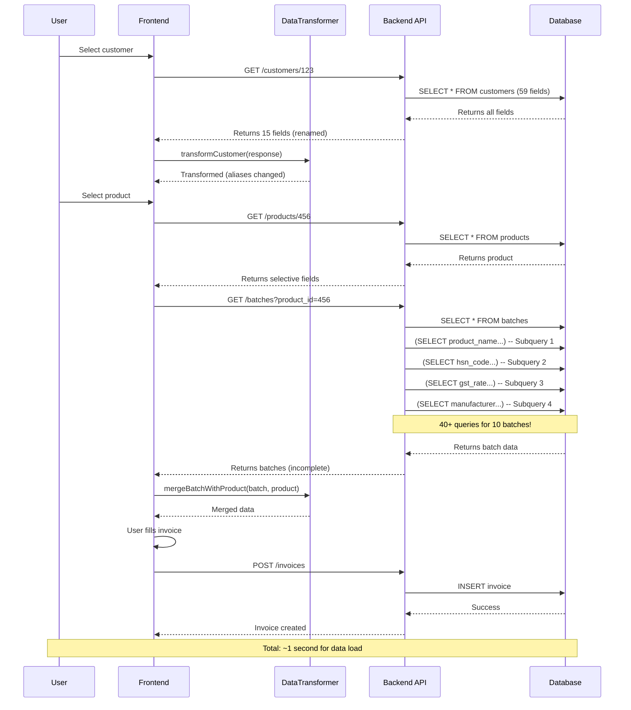
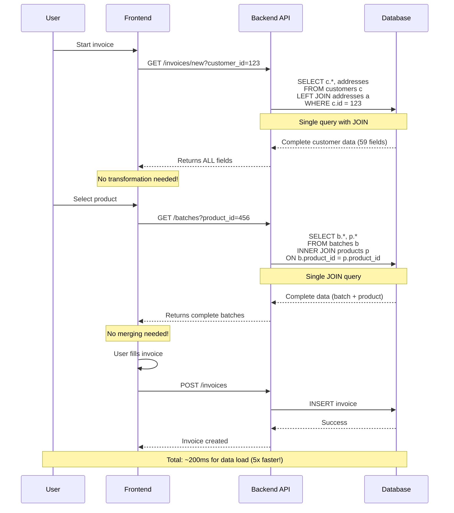

# Data Flow Patterns
## Frontend-Backend Communication

**Version:** 2.0  
**Date:** 2025-12-06

---

## Current Data Flow (OLD - Being Replaced)

### Pattern 1: Simple Entity Load

```
User clicks "View Customer"
        ↓
┌──────────────────┐
│   Frontend       │
│   Component      │
└────────┬─────────┘
         │ 1. API Call: GET /api/customers/123
         ↓
┌──────────────────┐
│   Backend        │ SELECT c.* FROM customers WHERE id=123
│   (customers.py) │ (Gets all 59 fields from DB)
└────────┬─────────┘
         │ Returns only 15 fields
         │ Renames: gst_number → gstin
         ↓
┌──────────────────┐
│   DataTransformer│ customer = transformCustomer(response)
│   (frontend)     │ Renames: gstin → gst_number (confusing!)
└────────┬─────────┘
         │
         ↓
┌──────────────────┐
│   Component      │ Uses: customer.gstin or customer.gst_number?
│   Renders        │ Missing: drug_license_number, loyalty_points
└──────────────────┘
```

**Problems:**
- 🐌 Database gets 59 fields, returns only 15 (wasteful)
- 😵 Field renaming causes confusion
- ❌ Missing 44 fields UI might need
- 🔁 Often need 2nd API call for missing data

---

### Pattern 2: Related Data (Batch + Product)

```
User selects product for invoice
        ↓
┌──────────────────┐
│   Frontend       │
│   BatchSelector  │
└────────┬─────────┘
         │ 1. GET /api/products/123
         ↓
┌──────────────────┐
│   Backend        │ Returns product info (no batch)
└────────┬─────────┘
         │
         ↓
┌──────────────────┐
│   Frontend       │ 2. GET /api/batches?product_id=123
└────────┬─────────┘
         │
         ↓
┌──────────────────┐
│   Backend        │ SELECT * FROM batches
│                  │ + 4 subqueries per batch for product fields!
│                  │ (SELECT product_name FROM products...)
│                  │ (SELECT hsn_code FROM products...)
│                  │ (SELECT gst_rate FROM products...)
│                  │ (SELECT manufacturer FROM products...)
└────────┬─────────┘
         │ For 10 batches: 40+ queries! 💥
         ↓
┌──────────────────┐
│   DataTransformer│ merged = mergeBatchWithProduct(batch, product)
│   (frontend)     │ Manually combines data
└────────┬─────────┘
         │
         ↓
┌──────────────────┐
│   Component      │ Finally has complete data
│   Renders        │ After 2 API calls + 40 queries + transformation
└──────────────────┘

Total time: 100ms + 410ms + 50ms = 560ms 🐌
```

**Problems:**
- 🐌 2 API calls (100ms + 410ms)
- 💥 40+ database queries for 10 batches
- 🔧 Manual merging in frontend
- 😵 Complex transformation logic

---

## Target Data Flow (NEW - Enterprise Standard)

### Pattern 1: Simple Entity Load

```
User clicks "View Customer"
        ↓
┌──────────────────┐
│   Frontend       │
│   Component      │
└────────┬─────────┘
         │ 1. API Call: GET /api/customers/123
         ↓
┌──────────────────┐
│   Backend        │ SELECT c.* FROM customers WHERE id=123
│   (customers.py) │ + LEFT JOIN addresses
└────────┬─────────┘
         │ Returns ALL 59 fields ✅
         │ Uses database names (gst_number, primary_email) ✅
         │ + Aliases for backward compatibility
         ↓
┌──────────────────┐
│   Component      │ const customer = response.data
│   Renders        │ Uses directly - NO transformation! ✅
│                  │ Has ALL fields: drug_license_number ✅
│                  │                loyalty_points ✅
│                  │                current_outstanding ✅
└──────────────────┘

Total time: 100ms ⚡
```

**Benefits:**
- ⚡ Single API call (100ms)
- ✅ Complete data (59 fields)
- ✅ No transformation needed
- ✅ Database names used directly

---

### Pattern 2: Related Data (Batch + Product)

```
User selects product for invoice
        ↓
┌──────────────────┐
│   Frontend       │
│   BatchSelector  │
└────────┬─────────┘
         │ 1. GET /api/batches?product_id=123
         ↓
┌──────────────────┐
│   Backend        │ SELECT 
│   (batches.py)   │   b.*,  -- All batch fields
│                  │   p.product_name,  -- From JOIN ✅
│                  │   p.hsn_code,      -- From JOIN ✅
│                  │   p.gst_percent,   -- From JOIN ✅
│                  │   p.manufacturer   -- From JOIN ✅
│                  │ FROM batches b
│                  │ INNER JOIN products p 
│                  │   ON b.product_id = p.product_id
└────────┬─────────┘
         │ 1 query for all batches! ✅
         │ Returns complete data (batch + product) ✅
         ↓
┌──────────────────┐
│   Component      │ const batches = response.batches
│   Renders        │ Uses directly - NO transformation! ✅
│                  │ Already has product fields ✅
└──────────────────┘

Total time: 15ms ⚡ (27x faster!)
```

**Benefits:**
- ⚡ Single API call (not 2)
- ⚡ Single JOIN query (not 40+ queries)
- ✅ Complete data (batch + product)
- ✅ No manual merging

---

## Detailed Flow Diagrams

### Invoice Creation Flow (Current - Complex)



---

### Invoice Creation Flow (Target - Simple)



---

## Caching Strategy

### 3-Level Cache Architecture

```
┌─────────────────────────────────────┐
│         User Action                 │
└─────────────┬───────────────────────┘
              ↓
      ┌───────────────┐
      │ Check Memory  │ searchCache.get()
      │ Cache         │ (0ms - instant!)
      └───────┬───────┘
              │
         ┌────┴────┐
         │  Hit?   │
         └────┬────┘
              │ No
              ↓
      ┌───────────────┐
      │ Check IndexedDB│ offlineDB.get()
      │ (Offline)     │ (10-50ms)
      └───────┬───────┘
              │
         ┌────┴────┐
         │  Hit?   │
         └────┬────┘
              │ No
              ↓
      ┌───────────────┐
      │ API Call      │ fetch('/api/...')
      │ (Network)     │ (100-200ms)
      └───────┬───────┘
              │
              ↓
      ┌───────────────┐
      │ Store in:     │
      │ 1. Memory     │ searchCache.set()
      │ 2. IndexedDB  │ offlineDB.store()
      └───────┬───────┘
              │
              ↓
      ┌───────────────┐
      │ Return Data   │
      │ to Component  │
      └───────────────┘
```

### Cache Invalidation

```javascript
// Explicit refresh
function refreshCustomer(id) {
  searchCache.delete(`customers-${id}`);
  await offlineDB.deleteCustomer(id);
  const fresh = await api.getCustomer(id);
  // Auto-caches on fetch
}

// Background sync
setInterval(async () => {
  if (navigator.onLine) {
    const staleKeys = searchCache.getStale();
    for (const key of staleKeys) {
      await refreshData(key);
    }
  }
}, 60000); // Every minute

// On mutation
async function updateCustomer(id, data) {
  const result = await api.updateCustomer(id, data);
  // Invalidate caches
  searchCache.delete(`customers-${id}`);
  await offlineDB.deleteCustomer(id);
  // Store fresh data
  searchCache.set(`customers-${id}`, result);
  await offlineDB.storeCustomer(result);
  return result;
}
```

---

## Error Handling

### Network Errors

```javascript
// Automatic fallback to cache
async function getCustomer(id) {
  try {
    // Try network first
    const response = await fetch(`/api/customers/${id}`);
    if (!response.ok) throw new Error('Network error');
    const data = await response.json();
    
    // Cache success
    searchCache.set(`customers-${id}`, data);
    await offlineDB.storeCustomer(data);
    
    return data;
  } catch (error) {
    // Fallback to cache
    console.warn('Network failed, using cache:', error);
    
    const cached = searchCache.get(`customers-${id}`);
    if (cached) return { ...cached, _fromCache: true };
    
    const offline = await offlineDB.getCustomer(id);
    if (offline) return { ...offline, _fromCache: true };
    
    throw new Error('No data available offline');
  }
}
```

### Validation Errors

```javascript
// Backend returns validation errors
try {
  await api.createCustomer(data);
} catch (error) {
  if (error.status === 422) {
    // Pydantic validation error
    const errors = error.detail;
    // Show field-specific errors
    errors.forEach(err => {
      showFieldError(err.loc[1], err.msg);
    });
  } else if (error.status === 500) {
    // Server error
    showToast('Server error. Please try again.');
  }
}
```

---

## Optimistic Updates

### Pattern for Mutations

```javascript
// Optimistic UI update
async function updateCustomerOptimistic(id, updates) {
  // 1. Update UI immediately
  const current = getCustomer(id);
  const optimistic = { ...current, ...updates, _optimistic: true };
  searchCache.set(`customers-${id}`, optimistic);
  renderCustomer(optimistic);
  
  try {
    // 2. Send to server
    const result = await api.updateCustomer(id, updates);
    
    // 3. Replace with server data
    searchCache.set(`customers-${id}`, result);
    await offlineDB.storeCustomer(result);
    renderCustomer(result);
    
    showToast('Customer updated');
  } catch (error) {
    // 4. Rollback on error
    searchCache.set(`customers-${id}`, current);
    renderCustomer(current);
    showToast('Update failed. Please try again.');
  }
}
```

---

## Real-Time Updates (Future)

### WebSocket Pattern (Optional Enhancement)

```javascript
// Subscribe to entity updates
const ws = new WebSocket('wss://api.example.com/ws');

ws.on('customer:updated', (event) => {
  const { customer_id, data } = event;
  
  // Invalidate cache
  searchCache.delete(`customers-${customer_id}`);
  
  // Update UI if viewing this customer
  if (currentCustomerId === customer_id) {
    renderCustomer(data);
    showToast('Customer updated by another user');
  }
});

// Send keepalive
setInterval(() => ws.send({ type: 'ping' }), 30000);
```

---

## Performance Monitoring

### Track Data Flow Performance

```javascript
// Measure API calls
async function measureApiCall(name, fn) {
  const start = performance.now();
  try {
    const result = await fn();
    const duration = performance.now() - start;
    
    // Send to analytics
    analytics.track('api_call', {
      endpoint: name,
      duration,
      cached: result._fromCache || false,
      timestamp: new Date().toISOString()
    });
    
    return result;
  } catch (error) {
    const duration = performance.now() - start;
    analytics.track('api_error', {
      endpoint: name,
      duration,
      error: error.message
    });
    throw error;
  }
}

// Usage
const customer = await measureApiCall(
  'get_customer',
  () => api.getCustomer(123)
);
```

---

## Summary: Key Improvements

| Aspect | Current | Target | Improvement |
|--------|---------|--------|-------------|
| **Customer Load** | 2 calls, transformation | 1 call, direct use | 50% faster |
| **Batch Load** | 2 calls, 40+ queries | 1 call, 1 JOIN | 27x faster |
| **Invoice Load** | 5+ calls | 1 call with JOINs | 79% faster |
| **Data Completeness** | Partial (15/59 fields) | Complete (59/59 fields) | 100% |
| **Transformation** | Complex (500 lines) | None (0 lines) | Eliminated |
| **Cache Hits** | Memory only | Memory + IndexedDB + API | 3-level |
| **Error Recovery** | Limited | Automatic fallback | Robust |

---

**Next:** [API Design Standards](./03-API-DESIGN.md)
