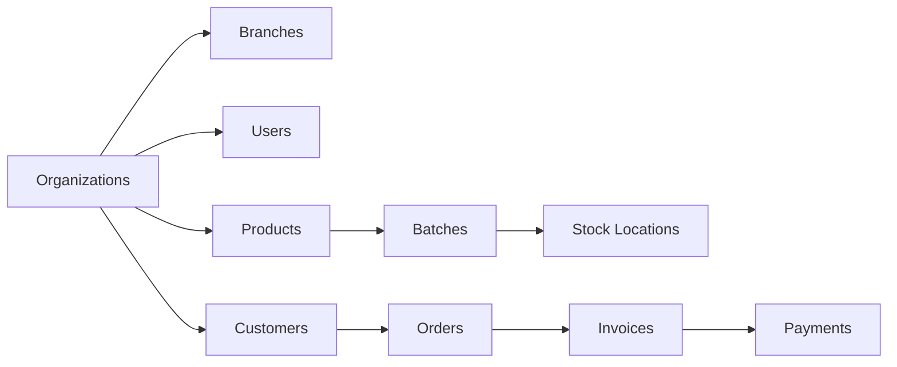

# Pharmaceutical ERP Database Schema Documentation

## Overview
This directory contains comprehensive schema documentation for the pharmaceutical ERP system database. Each document provides detailed field-level documentation, API integration guidance, and frontend development support.

## 📋 Documentation Structure

### Core Modules

| Schema | File | Description | Status |
|--------|------|-------------|---------|
| **master** | [01_master_schema.md](01_master_schema.md) | Organizations, users, products, categories | ✅ Complete |
| **parties** | [02_parties_schema.md](02_parties_schema.md) | Customers, suppliers, contacts, territories | ✅ Complete |
| **inventory** | [03_inventory_schema.md](03_inventory_schema.md) | Stock, batches, locations, movements | ✅ Complete |
| **sales** | [04_sales_schema.md](04_sales_schema.md) | Orders, invoices, deliveries, returns | ✅ Complete |
| **procurement** | 05_procurement_schema.md | Purchase orders, GRN, supplier management | 🚧 Pending |
| **financial** | 06_financial_schema.md | Accounts, payments, journals, outstanding | 🚧 Pending |
| **gst** | 07_gst_schema.md | GST returns, e-invoices, compliance | 🚧 Pending |
| **compliance** | 08_compliance_schema.md | Regulatory compliance, licenses | 🚧 Pending |

### System Modules

| Schema | File | Description | Status |
|--------|------|-------------|---------|
| **system_config** | 09_system_schema.md | Settings, notifications, workflows | 🚧 Pending |
| **analytics** | 10_analytics_schema.md | Reports, dashboards, KPIs | 🚧 Pending |

---

## 🚀 Quick Start for Frontend Developers

### 1. Authentication Setup
All API calls require proper authentication headers:

```javascript
const apiHeaders = {
  'Authorization': 'Bearer <jwt_token>',
  'X-Org-ID': '<organization_uuid>',
  'Content-Type': 'application/json'
};
```

### 2. Common API Patterns

#### Pagination
```javascript
GET /api/customers?limit=20&offset=0
```

#### Filtering
```javascript
GET /api/products?is_active=true&category_id=1
```

#### Search
```javascript
GET /api/customers?search=medical
```

#### Sorting
```javascript
GET /api/invoices?order_by=invoice_date&order=desc
```

### 3. Key Relationships



---

## 📚 Field Documentation Format

Each schema document follows this structure:

### Table Documentation
- **Purpose**: Business purpose of the table
- **API Endpoint**: Primary API endpoints for CRUD operations
- **Field Details**: Complete field documentation

### Field Information
| Field | Type | Required | Description | Frontend Usage |
|-------|------|----------|-------------|----------------|
| `field_name` | DATA_TYPE | ✓/- | Business description | How to use in UI |

### API Examples
- Request/Response examples
- Common use cases
- Integration patterns

---

## 🔧 Data Types Reference

| PostgreSQL Type | Frontend Type | Description | Example |
|-----------------|---------------|-------------|---------|
| `SERIAL` | number | Auto-incrementing integer | 1, 2, 3... |
| `UUID` | string | Unique identifier | "123e4567-e89b-12d3..." |
| `TEXT` | string | Variable length text | "Customer Name" |
| `NUMERIC(15,2)` | number | Decimal with 2 places | 1234.56 |
| `BOOLEAN` | boolean | True/false flag | true, false |
| `DATE` | string | Date only | "2024-01-15" |
| `TIMESTAMPTZ` | string | Timestamp with timezone | "2024-01-15T10:30:00Z" |
| `JSONB` | object | JSON object | {"key": "value"} |
| `TEXT[]` | string[] | Array of strings | ["item1", "item2"] |
| `INTEGER[]` | number[] | Array of integers | [1, 2, 3] |

---

## 🎯 Business Rules & Validations

### Universal Rules
1. **Organization Context**: All data is organization-scoped
2. **Soft Deletes**: Use `is_active` flags instead of hard deletes
3. **Audit Trails**: `created_at`, `updated_at`, `created_by` fields
4. **Unique Constraints**: Codes must be unique per organization

### Pharmaceutical Specific
1. **Batch Tracking**: All inventory must be batch-tracked
2. **Expiry Management**: Expiry dates are mandatory for medicines
3. **GST Compliance**: Proper tax calculations based on location
4. **Regulatory Compliance**: Drug licenses, narcotic tracking

---

## 🔍 Search & Filter Patterns

### Text Search
```javascript
// Product search
GET /api/products?search=paracetamol

// Customer search  
GET /api/customers?search=medical+store
```

### Date Ranges
```javascript
// Invoice date range
GET /api/invoices?date_from=2024-01-01&date_to=2024-01-31
```

### Status Filtering
```javascript
// Active customers only
GET /api/customers?is_active=true

// Pending orders
GET /api/orders?order_status=pending
```

### Complex Filtering
```javascript
// Expired batches with stock
GET /api/batches?expiry_date_to=2024-01-15&quantity_available_gt=0
```

---

## 📱 Mobile API Considerations

### Reduced Payloads
Use field selection for mobile APIs:
```javascript
GET /api/products?fields=product_id,product_name,mrp,stock_quantity
```

### Pagination
Implement proper pagination for large datasets:
```javascript
{
  "data": [...],
  "pagination": {
    "total": 1000,
    "limit": 20,
    "offset": 0,
    "has_more": true
  }
}
```

### Offline Support
Design APIs to support offline-first mobile apps:
- Include `updated_at` timestamps
- Support delta sync
- Provide conflict resolution

---

## 🐛 Error Handling

### Standard Error Response
```json
{
  "error": "validation_failed",
  "message": "Required field missing: customer_name",
  "details": {
    "field": "customer_name",
    "code": "required"
  }
}
```

### HTTP Status Codes
- `200` - Success
- `201` - Created
- `400` - Bad Request (validation error)
- `401` - Unauthorized
- `403` - Forbidden
- `404` - Not Found
- `409` - Conflict (duplicate key)
- `500` - Internal Server Error

---

## 📞 Support & Contributing

### Getting Help
1. Check the specific schema documentation first
2. Review the API examples and patterns
3. Check the validation rules and constraints

### Contributing
1. Keep documentation up-to-date with schema changes
2. Include practical examples for complex fields
3. Document business rules and validation logic
4. Update API integration notes when endpoints change

---

## 🗂️ Related Resources

- **API Documentation**: `/api/docs` (Swagger/OpenAPI)
- **Database Schema**: `/database/enterprise-v2/`
- **Sample Data**: `/database/enterprise-v2/08-initial-data/`
- **Migration Scripts**: `/database/migrations/`

---

## 📈 Version Information

- **Database Version**: Enterprise v2.0
- **Documentation Version**: 1.0
- **Last Updated**: January 2024
- **Compatible API Version**: v1.0

---

*This documentation is automatically updated with schema changes. Always refer to the latest version for accurate field information.*