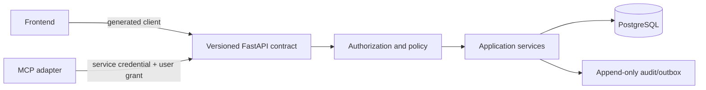

# MCP Readiness Architecture

## Decision

Build MCP as a separately deployable Python 3.11 service over a hidden,
allowlisted backend read contract. Keep the official SDK dependency set
isolated from the legacy FastAPI process.
MCP must never call PostgreSQL, database functions, or route implementation
helpers directly.



The requested Mozie-style pattern is a small, canonical operator surface:
route each task to a named system of record, read before write, resolve exact
IDs, and require a human decision before consequential actions. PharmaERP
enforces these rules in the backend rather than only in agent instructions.

## Implemented baseline

`backend/app/core/api_contract.py` is the current machine-readable operation
registry. It annotates OpenAPI only after verifying that the declared route,
HTTP method, `PermissionChecker`, and JWT-derived organization context agree.
The initial allowlist contains three bounded reads: product search, supplier
search, and GST settings. The isolated runtime exports exactly those three
tools and no write operation.

The registry remains the allowlist gate for the MCP server. Additions must pass
the registry tests and delivery gates below; another GET is not safe merely
because it appears in OpenAPI.

`backend/mcp_runtime` provides `/mcp`, `/health`, and fail-closed `/ready` in an
isolated Python 3.11 image. CI constructs the official SDK stateless Streamable
HTTP application and runs no-network auth, grant, and transport tests without
changing legacy dependency pins.

Supabase OAuth tokens are verified asymmetrically through issuer discovery and
JWKS. They are never forwarded to ERP. The backend mints a five-minute
`canonical_mcp_delegation_v1` token from `core` and `automation` UUID facts;
each hidden read revalidates active organization, user, membership, exact agent
capability, live RBAC permission, expiry, and branch scope before activating
canonical RLS and querying `catalog`, `parties`, or `tax` facts. Public legacy
routes are not part of this path.

Hosted readiness remains blocked: Supabase DCR is disabled, the repository has
no hosted consent/approval UI, canonical deployment is unverified, and real
ChatGPT/Claude staging tests have not run. See
[`render-mcp.md`](../deployment/render-mcp.md).

## Contract boundary

The backend owns validation, calculations, numbering, authorization,
transactions, audit, and side effects. The MCP adapter owns protocol transport,
tool descriptions, resource rendering, and conversion of backend errors into
structured MCP results. The frontend owns presentation only.

The target HTTP contract is `/api/v1`. OpenAPI is the source for generated
frontend and MCP DTOs, but it is not the MCP tool registry. Exported endpoints
must have stable `operationId` values and the following vendor metadata:

```yaml
x-erp-domain: sales
x-erp-permission: sales.invoice.create
x-erp-risk: consequential
x-erp-tenant-scope: organization
x-erp-branch-scope: required
x-erp-mcp-export: true
x-erp-idempotency: required
```

An allowlist generator may create tool schemas only for operations where
`x-erp-mcp-export` is true. CI must reject duplicate operation IDs, undocumented
side effects, unbounded list responses, missing error schemas, and an exported
write without risk/idempotency metadata.

Do not expose the existing schema documentation route, generic SQL, arbitrary
report builders, file paths, test routes, auth administration, raw sync, or a
one-tool-per-handler mirror.

## Tool taxonomy

Tools should express business outcomes and remain below roughly 40 in the
initial catalog. List/search tools must be paginated, explicitly bounded, and
return opaque canonical IDs for later writes.

The canonical user-intent-to-operation map and the rule that compatibility
routes never become additional tools are defined in
[`legacy-retirement.md`](legacy-retirement.md).

| Family | Initial examples | Default risk |
|---|---|---|
| Context | `erp_context_get`, `erp_branch_list` | Read |
| Master data | `erp_customer_search`, `erp_supplier_search`, `erp_product_search` | Read |
| Inventory | `erp_stock_get`, `erp_batch_expiry_list`, `erp_reorder_suggestion_list` | Read |
| Sales | `erp_order_get`, `erp_order_preview_create`, `erp_order_create`, `erp_invoice_get`, `erp_invoice_preview_create`, `erp_invoice_create` | Mixed |
| Procurement | `erp_purchase_order_get`, `erp_purchase_order_preview_create`, `erp_purchase_order_create`, `erp_grn_get` | Mixed |
| Finance | `erp_outstanding_get`, `erp_ledger_get`, `erp_payment_preview_record`, `erp_payment_record` | Mixed/high |
| GST | `erp_gst_summary_get`, `erp_gstr_reconciliation_get`, `erp_gst_export_preview` | Read/high |
| Compliance | `erp_compliance_alert_list`, `erp_recall_get`, `erp_expiry_risk_list` | Read |
| Audit | `erp_audit_event_list`, `erp_operation_status_get` | Read |

Tool names, schemas, and semantics are versioned independently of display copy.
A tool returns a consistent envelope:

```json
{
  "data": {},
  "context": {"organization_id": "opaque", "branch_ids": ["opaque"]},
  "trace_id": "trace_...",
  "as_of": "2026-08-19T12:00:00Z",
  "warnings": [],
  "next_actions": []
}
```

Money is a decimal string plus ISO currency, quantities are decimal strings
plus unit, tax rates are decimal strings, and dates include an explicit
timezone/period. Never send binary floating-point monetary values.

## Resource taxonomy

Resources provide stable, read-only context. They are not hidden mutation
channels and should not dump entire tables.

| URI template | Purpose |
|---|---|
| `erp://context/current` | Effective organization, user, role, branches, locale, currency, and fiscal period |
| `erp://policy/tool-catalog` | Allowed tools, risk class, approval rule, and limits for the current grant |
| `erp://policy/tax/{jurisdiction}/{effective_date}` | Versioned tax configuration used for explanations |
| `erp://organization/current/branches` | Authorized branch summaries |
| `erp://invoice/{invoice_id}` | Canonical invoice summary with status and version |
| `erp://payment/{payment_id}` | Canonical payment and allocations |
| `erp://compliance/calendar/{period}` | Due dates and state, filtered to the tenant |
| `erp://audit/operation/{operation_id}` | Outcome and audit reference for a prior write |

Resource templates must perform the same permission check as tools. Sensitive
fields such as credentials, password hashes, full audit payloads, health data,
bank details, and personally identifying data are omitted unless the exact
field is authorized and required.

## Authentication and scopes

Remote MCP uses Supabase's authorization server. For the current pilot its
access-token audience is the literal `authenticated`; a custom MCP audience is
invalid without a separately reviewed Custom Access Token Hook. Tokens remain
bound to a pre-registered installation/user, and the adapter never forwards the
OAuth bearer to internal reads.

`org_id`, user identity, branch access, and role come from the verified grant
and backend membership lookup. An LLM argument, header such as `X-Org-Id`,
prompt text, saved resource URI, or model memory can never select a tenant.

Supabase custom `erp.*` scopes are not supported. Require only the standard
`openid offline_access` scopes; `offline_access` permits reviewed clients to
refresh long-lived connections. OAuth scopes authenticate the client and user,
but never authorize an ERP operation. `automation.agent_grant_capabilities`
holds the exact operation consent, while `core.role_permissions` independently
holds live RBAC. Every call revalidates both.

## Organization and branch context

The effective context object is resolved once per call and propagated through
typed application services:

```text
actor_id, installation_id, organization_id, authorized_branch_ids,
active_branch_id, role_id, scopes, locale, timezone, fiscal_period, trace_id
```

Rules:

1. The backend rejects a record whose organization does not equal the effective
   organization even if its numeric ID exists.
2. A branch-bound operation requires an explicit `branch_id` that is a member
   of `authorized_branch_ids`; there is no silent default for writes.
3. Cross-branch reads require a distinct permission. Cross-branch stock
   transfers validate both endpoints.
4. Child records inherit tenant and branch through a validated parent FK. A
   child ID alone is never sufficient authorization.
5. Scheduled/queued work persists the grant snapshot and reauthorizes before
   execution.
6. Database RLS is defense in depth and uses the same transaction/connection as
   the query. A separate middleware session cannot establish query RLS state.

## Read, preview, commit

| Class | Examples | Behavior |
|---|---|---|
| R0 read | Search, get, list, calculate preview | Execute after authorization; log access to sensitive/exported data |
| W1 reversible | Draft note, draft order metadata | Require explicit intent, idempotency, audit, and optimistic concurrency |
| W2 consequential | Invoice, GRN, payment, allocation, stock adjustment | Mandatory preview then commit with user approval |
| W3 regulated/external | Post/cancel document, GST export/file, payment reversal, recall action | Strong approval, separation of duties where configured, immutable audit; keep filing/external submission out of v1 |

Do not rely on a host application's generic "approve tool" UI. For W2/W3, the
backend issues a short-lived, single-use command preview. The exact planned
business actions and schemas are checked in as
[`mcp-operator-actions.json`](mcp-operator-actions.json); they remain absent
from the live MCP registry until every release gate in that contract passes.
The same contract lists bounded resolution reads for customer, location,
stock/batch, source sales and purchase documents, open items, and explicit
branch/currency settlement choices. Natural operator language is resolved
through those reads to opaque canonical IDs without inventing a bank identity
for cash. Zero or multiple matches stop preparation instead of selecting a
likely row.

```json
{
  "command_request_id": "018f...",
  "preview_hash": "sha256:...",
  "expires_at": "2026-08-19T12:05:00Z",
  "financial_impact": {"currency": "INR", "total": "1180.00", "tax": "180.00"},
  "policy_warnings": [],
  "required_approvals": ["initiating_user"]
}
```

The shared approval tool binds an authorized human decision to exactly one
`command_request_id` and `preview_hash`; it cannot alter business input. The
execution tool accepts only `command_request_id`, `preview_hash`, and
`idempotency_key`. It reloads source versions, recomputes totals and policy,
verifies the hash and permission, consumes approval once, and commits the
business change, idempotency result, audit event, and outbox event in one
transaction. Changed or expired inputs require a new preview.

## Idempotency, concurrency, and audit

The checked-in idempotency guide is target behavior, not evidence of current
enforcement. Before any write tool ships, implement a server-side store keyed by
`(organization_id, actor_id, operation_id, idempotency_key)` with request hash,
state, response reference, and expiry. The same key plus a different hash is a
conflict; the same key plus the same hash returns the recorded result.

Financial and inventory writes also require database uniqueness constraints and
document-number allocation inside the transaction. Idempotency does not replace
business keys. Updates use `expected_version` or an equivalent row version and
return a structured conflict instead of last-write-wins.

Every tool invocation records:

- trace ID, tool name/version, start/end time, client and installation IDs;
- actor, organization, effective branches, scopes, and permission decision;
- risk class, preview/approval IDs, idempotency key hash, request schema version;
- affected entity IDs and before/after hashes, never raw secrets;
- calculation/tax ruleset version, outcome, error code, and latency.

Audit rows for regulated records are append-only with retention controls.
Corrections create reversals or adjustment documents. Audit reads are tenant
filtered, and access to them is itself audited.

## Errors and model behavior

Errors are typed and actionable: `AUTH_REQUIRED`, `SCOPE_DENIED`,
`BRANCH_DENIED`, `NOT_FOUND`, `VALIDATION_FAILED`, `STALE_VERSION`,
`PREVIEW_EXPIRED`, `APPROVAL_REQUIRED`, `IDEMPOTENCY_CONFLICT`,
`PERIOD_CLOSED`, `INSUFFICIENT_STOCK`, and `POLICY_BLOCKED`. Do not return SQL,
stack traces, credentials, or cross-tenant existence hints.

Tool descriptions must state side effects and preconditions, but prompt text is
not a security control. Treat all database text, uploaded documents, customer
names, and notes as untrusted content; never interpret them as tool
instructions.

## Delivery sequence and tests

1. **Contract gate:** inventory routes, assign stable operation IDs, normalize
   error/page/money schemas, and publish a diffed `/api/v1/openapi.json`.
2. **Policy gate:** centralize effective context and authorization. Add negative
   org/branch tests for every exportable operation.
3. **Write-safety gate:** implement idempotency, optimistic concurrency,
   preview/commit, immutable audit, and transactional outbox.
4. **Read-only MCP:** release context, master-data, inventory, finance summary,
   GST summary, and compliance resources/tools to an allowlisted pilot.
5. **Controlled writes:** add draft/order tools, then invoices/payments only
   after calculation parity and failure-injection tests pass.
6. **External actions:** evaluate filing, messages, and integrations separately;
   keep them disabled until W3 controls and operational runbooks are proven.

Required automated tests include schema validation, permission matrix tests,
cross-tenant/cross-branch property tests, prompt-injection fixtures,
pagination/limit tests, preview tampering/expiry, duplicate/reordered retries,
concurrent commits, rollback/failure injection, audit completeness, calculation
goldens, and frontend/REST/MCP parity over the same service operation.
