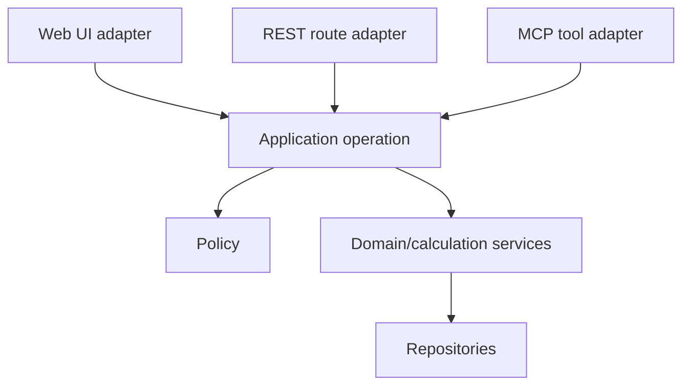

# Frontend and Backend Boundaries

## Decision

Keep the current monorepo while the backend contract is stabilized, then split
deployment ownership without duplicating domain logic. A physical repository
split is a release-engineering decision, not the first architecture fix.

The current root already separates `frontend/` and `backend/`, but the boundary
is porous: endpoint strings and response types are manually maintained, some UI
components call `fetch` directly, and documentation names endpoints that no
longer match route source. Splitting this state into two repositories would make
contract drift harder to see.

## Target ownership

| Area | Owns | Must not own |
|---|---|---|
| Frontend | React UI, view state, accessibility, offline presentation/cache, generated API client | Tax/discount totals, posting rules, permissions, document numbering, direct SQL |
| Backend | Authentication, authorization, domain services, calculations, validation, transactions, audit, integrations, OpenAPI | React types/components, UI-specific response shaping |
| MCP adapter | MCP transport, allowlisted tool/resource catalog, protocol auth exchange, result presentation | Database access, copied business rules, independent permissions |
| Database | Constraints, referential integrity, atomic persistence, RLS defense in depth | Client-specific workflows or free-form agent access |
| Contract artifact | Versioned OpenAPI, examples, compatibility policy, generated clients | Hand-written duplicate DTO definitions |

All three clients call the same backend application operation:



Routes remain thin. A REST route and an MCP tool must not call each other; they
adapt into a shared application service. Calculation modules take explicit
inputs and ruleset versions and contain no FastAPI, React, MCP, or database
transport code.

## Suggested end state

After the contract stabilizes, use three deployable repositories or three
independently released packages if the team can support them:

```text
aasopharma-backend/
  app/                 FastAPI adapters and application/domain services
  migrations/          ordered schema changes
  tests/               unit, contract, integration, tenant isolation
  openapi/             generated versioned artifact

aasopharma-frontend/
  src/                 React application
  generated/           pinned backend client, never hand edited
  tests/               UI, accessibility, offline and browser tests

aasopharma-mcp/
  src/                 MCP transport and tool/resource adapters
  catalog/             allowlist and risk metadata
  generated/           pinned backend client
  tests/               protocol, policy, approval and adversarial tests
```

Database SQL belongs to the backend. Shared source code across repositories is
avoided; share a released contract/client artifact instead. Backend and MCP can
deploy independently, but MCP declares the exact compatible backend contract
range.

## Migration phases

### Phase 0: establish one source repository

- Archive or rename other AasoPharma clones; do not delete unmerged work.
- Add a repository banner and CI check identifying this repository as canonical.
- Record production/staging deployment sources and owners.

Exit: every active deployment and pull request points to this repository.

### Phase 1: freeze the boundary in the monorepo

- Introduce `/api/v1` without changing existing routes immediately.
- Assign stable OpenAPI `operationId` values and canonical error/page types.
- Inventory direct frontend `fetch`/axios calls and route them through the API
  client layer.
- Generate the typed call graph and classify canonical, compatibility, dormant,
  and orphan surfaces using `legacy-retirement.md`.
- Generate TypeScript DTO/client code from OpenAPI and prohibit hand-edited
  duplicates for migrated domains.
- Add OpenAPI compatibility diff and frontend contract compilation in CI.

Exit: the frontend builds against a pinned generated contract; contract drift
fails CI.

### Phase 2: extract backend domain services

- Move calculations and workflows out of route functions into application
  operations grouped by `master`, `inventory`, `sales`, `procurement`,
  `finance`, `gst`, and `compliance`.
- Centralize effective tenant/branch context, authorization, transaction
  boundaries, idempotency, audit, and outbox behavior.
- Make route handlers validation/serialization adapters only.

Exit: REST and tests call the same operations that MCP will call; no business
calculation is duplicated in the frontend.

### Phase 3: add bounded MCP deployable

- Create the separate MCP service with its own credentials and deployment.
- Generate its backend client from the pinned contract.
- Export only the reviewed read and approval-gated write allowlist in
  `mcp-readiness.md`.
- Run tenant-isolation and adversarial tests through the deployed MCP transport.

Exit: the bounded pilot is observable, rate-limited, revocable, and audited.

### Phase 4: split repositories

- Split history with path-preserving tooling after Phase 2 is stable.
- Keep temporary monorepo mirrors read-only during cutover.
- Move environment definitions, secret ownership, CI, release, rollback, and
  on-call runbooks with each service.
- Publish OpenAPI/generated clients through an immutable artifact registry.

Exit: independent builds and deploys pass cross-repository compatibility tests.

### Phase 5: enable controlled MCP writes

Enable one risk class and domain at a time. Draft orders precede invoices;
invoices precede payments; regulated external submissions remain last. Each
promotion requires preview/commit, idempotency, concurrency, audit, calculation
parity, and rollback/failure tests.

## CI contract

Backend CI publishes OpenAPI only after unit, calculation, database integration,
tenant/branch, migration-up/down, and contract tests pass. Frontend and MCP CI
pin its digest, regenerate clients reproducibly, and reject an unreviewed digest
change. Production deployment verifies the expected contract digest at startup.

Breaking changes require a new API/tool version and a measured deprecation
window. Adding an optional response field is compatible; changing money scale,
enum meaning, authorization, side effects, or default branch behavior is not.

Dead code and compatibility removal follows
[`legacy-retirement.md`](legacy-retirement.md); a repository split must not be
used to silently discard unmeasured callers or persisted offline operations.
