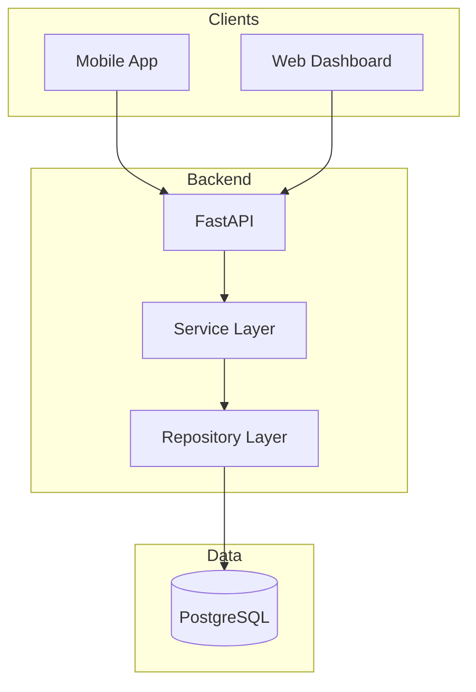

# Backend Documentation

FastAPI-based multi-tenant Pharmacy Management System.

---

## Quick Start

```bash
cd backend
pip install -r requirements.txt
alembic upgrade head
python start.py
# → http://localhost:8000/docs
```

---

## Documentation

| Section | Description |
|---------|-------------|
| [Services](services/) | Business logic by domain |
| [API](api/) | REST API reference |
| [Database](database/) | Schema & migrations |
| [Deployment](deployment/) | Production guides |

---

## Services

Organized by business domain, mirroring code structure:

| Domain | Location | Description |
|--------|----------|-------------|
| [Sales](services/sales/) | `services/sales/` | Orders, invoices, challans |
| [Purchase](services/purchase/) | `services/purchase/` | PO, GRN, supplier invoices |
| [Finance](services/finance/) | `services/finance/` | Payments, ledger, credit notes |
| [Inventory](services/inventory/) | `services/inventory/` | Stock, batches, movements |
| [Master](services/master/) | `services/master/` | Products, customers, suppliers |
| [Returns](services/returns/) | `services/returns/` | Sales & purchase returns |
| [Core](services/core/) | `services/` | Auth, compliance, utilities |

---

## Architecture



---

## Key Patterns

### Service-Repository
```
Route → Service → Repository → Database
(HTTP)   (Logic)    (SQL)
```

### Multi-Tenancy
Every query filtered by `org_id` automatically.

### Constants
Always use `constants.py` for status values:
```python
from app.core.utils.constants import OrderStatus
status = OrderStatus.PENDING.value
```

---

## Directory Structure

```
backend/app/
├── main.py                 # FastAPI entry
├── core/
│   ├── database.py         # Connection pool
│   ├── auth/               # JWT, tenant context
│   └── utils/constants.py  # ⚠️ Use this!
│
└── api/
    ├── routes/             # HTTP endpoints
    │   ├── sales/
    │   ├── purchase/
    │   └── ...
    │
    └── services/           # Business logic
        ├── sales/
        │   └── invoice/
        │       ├── invoice_service.py
        │       └── invoice_repository.py
        └── ...
```

---

## Technology Stack

- FastAPI 0.104+
- PostgreSQL 14+
- SQLAlchemy 2.0 (raw SQL)
- Alembic migrations
- Pydantic v2
- JWT authentication

---

**See also**: [Main Documentation](../README.md)
