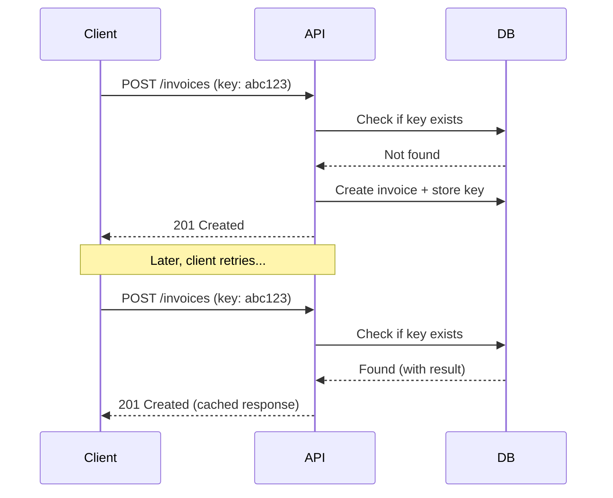

# Idempotency

Ensure safe retries and prevent duplicate operations.

---

## Overview

Idempotency ensures that making the same API request multiple times produces the same result. This is critical for:

- **Network failures** - Request may have succeeded but response was lost
- **Timeouts** - Client timed out but server completed the request
- **Retries** - Client automatically retries failed requests

---

## Idempotency Keys

For operations that create resources or modify state, include an idempotency key in the request header:

```http
POST /api/sales/invoices
X-Idempotency-Key: inv_create_cust123_20260109_abc123
Authorization: Bearer <token>
Content-Type: application/json

{...}
```

### Header

| Header | Type | Description |
|--------|------|-------------|
| `X-Idempotency-Key` | string | Unique key for this operation (max 255 chars) |

---

## How It Works



---

## Key Format

Use a unique, descriptive key format:

```
{operation}_{entity}_{identifier}_{timestamp}_{random}
```

### Examples

```
inv_create_cust123_20260109_a8f3c2d1
payment_recv_cust456_20260109_b7e4d5c2
grn_approve_grn789_20260109_c6f5e4d3
```

### Implementation

```python
import uuid
from datetime import datetime

def generate_idempotency_key(operation: str, entity_id: str) -> str:
    """Generate unique idempotency key"""
    timestamp = datetime.now().strftime("%Y%m%d%H%M%S")
    random = uuid.uuid4().hex[:8]
    return f"{operation}_{entity_id}_{timestamp}_{random}"

# Usage
key = generate_idempotency_key("inv_create", f"cust{customer_id}")
# Result: "inv_create_cust123_20260109142530_a8f3c2d1"
```

```javascript
function generateIdempotencyKey(operation, entityId) {
  const timestamp = new Date().toISOString().replace(/[-:T.Z]/g, '').slice(0, 14);
  const random = Math.random().toString(36).slice(2, 10);
  return `${operation}_${entityId}_${timestamp}_${random}`;
}

// Usage
const key = generateIdempotencyKey('inv_create', `cust${customerId}`);
// Result: "inv_create_cust123_20260109142530_a8f3c2d1"
```

---

## Endpoints Supporting Idempotency

| Endpoint | Method | Recommended |
|----------|--------|-------------|
| `/api/sales/invoices` | POST | ✅ Yes |
| `/api/sales/orders` | POST | ✅ Yes |
| `/api/purchase/orders` | POST | ✅ Yes |
| `/api/purchase/grn` | POST | ✅ Yes |
| `/api/finance/payments` | POST | ✅ **Critical** |
| `/api/finance/credit-notes` | POST | ✅ Yes |
| `/api/returns/sales` | POST | ✅ Yes |
| `*/approve` | POST | ✅ Yes |
| `*/cancel` | POST | ✅ Yes |
| GET endpoints | — | ❌ Not needed |
| PUT endpoints | — | ⚠️ Optional |

---

## Response Behavior

### First Request

```http
HTTP/1.1 201 Created
X-Idempotency-Key: inv_create_cust123_20260109_abc123
X-Idempotency-Replayed: false

{
  "success": true,
  "data": {
    "invoice_id": 1001,
    "invoice_number": "INV-2026-0001"
  }
}
```

### Replayed Request (same key)

```http
HTTP/1.1 201 Created
X-Idempotency-Key: inv_create_cust123_20260109_abc123
X-Idempotency-Replayed: true

{
  "success": true,
  "data": {
    "invoice_id": 1001,
    "invoice_number": "INV-2026-0001"
  }
}
```

> Same response body is returned. Note `X-Idempotency-Replayed: true` header.

---

## Key Expiration

Idempotency keys are stored for **24 hours** after the initial request.

After expiration:
- Same key will process as a new request
- Generate new key for intentionally duplicate operations

---

## Error Handling

### Key Already Processing

If a request with the same key is still processing:

```http
HTTP/1.1 409 Conflict
Content-Type: application/json

{
  "success": false,
  "error": {
    "code": "IDEMPOTENCY_KEY_IN_USE",
    "message": "A request with this idempotency key is already being processed"
  }
}
```

**Resolution**: Wait and check the original request status.

### Key Mismatch

If you reuse a key with different request body:

```http
HTTP/1.1 422 Unprocessable Entity
Content-Type: application/json

{
  "success": false,
  "error": {
    "code": "IDEMPOTENCY_KEY_MISMATCH",
    "message": "Request body does not match original request for this key"
  }
}
```

**Resolution**: Use a new unique key.

---

## Best Practices

### 1. Always Use for Payments

```python
# Critical: Always use idempotency for payments
def create_payment(api, payment_data):
    key = generate_idempotency_key(
        "payment_recv",
        f"cust{payment_data['party_id']}"
    )
    return api.post(
        "/api/finance/payments",
        json=payment_data,
        headers={"X-Idempotency-Key": key}
    )
```

### 2. Store Keys for Retry

```python
# Store key before making request
def safe_create_invoice(api, invoice_data):
    key = generate_idempotency_key("inv_create", invoice_data['customer_id'])
    
    # Store key -> request mapping
    pending_requests[key] = invoice_data
    
    try:
        result = api.create_invoice(invoice_data, idempotency_key=key)
        del pending_requests[key]
        return result
    except NetworkError:
        # On retry, use same key
        return api.create_invoice(invoice_data, idempotency_key=key)
```

### 3. Client-Side Key Generation

Generate keys on the client, not the server. This ensures the same key across retries.

### 4. Include Meaningful Context

Keys should be traceable:
```
❌ "abc123" - Meaningless
✅ "inv_create_cust123_order456_20260109_f8a3b2c1" - Traceable
```

---

## Implementation Example

### Full Flow with Idempotency

```python
import requests
import time

def create_invoice_with_retry(api, invoice_data, max_retries=3):
    """Create invoice with idempotency and retry logic"""
    
    # Generate idempotency key ONCE
    idempotency_key = generate_idempotency_key(
        "inv_create",
        f"cust{invoice_data['customer_id']}"
    )
    
    for attempt in range(max_retries):
        try:
            response = requests.post(
                f"{api.base_url}/api/sales/invoices",
                headers={
                    "Authorization": f"Bearer {api.access_token}",
                    "X-Idempotency-Key": idempotency_key
                },
                json=invoice_data,
                timeout=30
            )
            
            if response.status_code == 201:
                return response.json()["data"]
            
            if response.status_code == 409:
                # Key in use - wait and retry
                time.sleep(2)
                continue
                
            # Other errors - don't retry
            response.raise_for_status()
            
        except requests.Timeout:
            # Timeout - safe to retry with same key
            time.sleep(1)
            continue
            
        except requests.ConnectionError:
            # Network error - safe to retry
            time.sleep(1)
            continue
    
    raise Exception("Max retries exceeded")
```

---

## See Also

- [API Reference](README.md)
- [Error Codes](errors.md)
- [Best Practices](best-practices.md)
