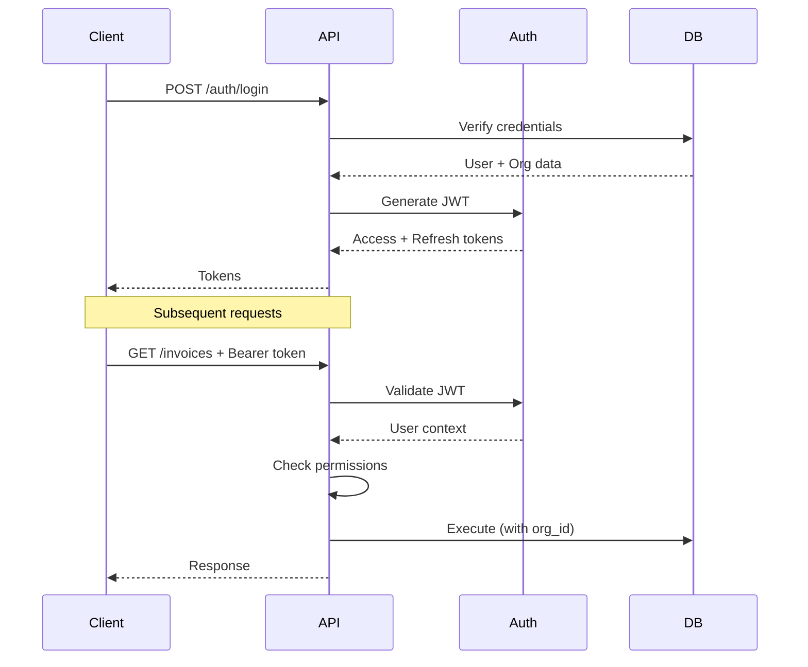
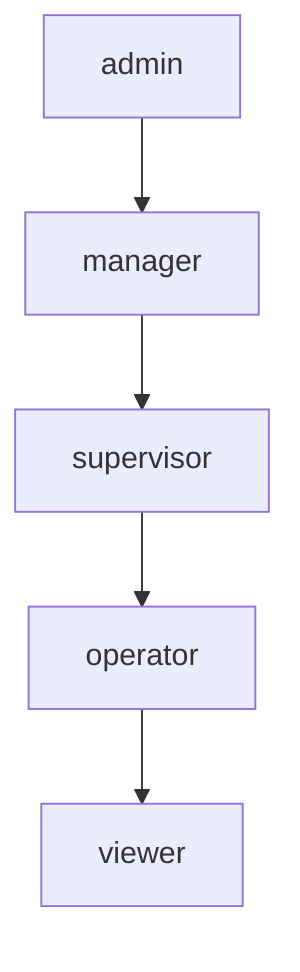

# Authentication & Authorization

JWT-based authentication and role-based access control.

---

## Overview

The system uses JWT (JSON Web Tokens) for authentication and RBAC (Role-Based Access Control) for authorization.



---

## JWT Structure

### Access Token Payload

```json
{
  "sub": "123",
  "username": "john.doe",
  "email": "john@example.com",
  "org_id": "550e8400-e29b-41d4-a716-446655440000",
  "branch_id": 1,
  "role": "sales_manager",
  "permissions": [
    "sales:view",
    "sales:create",
    "sales:edit",
    "inventory:view"
  ],
  "iat": 1704672000,
  "exp": 1704675600
}
```

### Token Expiration

| Token | Duration | Purpose |
|-------|----------|---------|
| Access Token | 1 hour | API authentication |
| Refresh Token | 7 days | Obtain new access token |

---

## Authentication Flow

### Login

```python
# routes/auth.py
@router.post("/login")
async def login(credentials: LoginRequest, db: Session = Depends(get_db)):
    # 1. Find user
    user = db.execute(
        "SELECT * FROM master.org_users WHERE username = :username",
        {"username": credentials.username}
    ).fetchone()
    
    if not user:
        raise HTTPException(401, "Invalid credentials")
    
    # 2. Verify password
    if not verify_password(credentials.password, user.password_hash):
        log_failed_attempt(user.user_id)
        raise HTTPException(401, "Invalid credentials")
    
    # 3. Check account status
    if not user.is_active:
        raise HTTPException(403, "Account disabled")
    
    # 4. Generate tokens
    access_token = create_access_token(user)
    refresh_token = create_refresh_token(user)
    
    # 5. Log successful login
    log_login(user.user_id)
    
    return {
        "access_token": access_token,
        "refresh_token": refresh_token,
        "token_type": "bearer",
        "expires_in": ACCESS_TOKEN_EXPIRE_MINUTES * 60,
        "user": {
            "user_id": user.user_id,
            "username": user.username,
            "role": user.role,
            "org_id": str(user.org_id)
        }
    }
```

### Token Generation

```python
# core/security.py
from jose import jwt
from datetime import datetime, timedelta

SECRET_KEY = os.environ["JWT_SECRET_KEY"]
ALGORITHM = "HS256"
ACCESS_TOKEN_EXPIRE_MINUTES = 60

def create_access_token(user) -> str:
    expire = datetime.utcnow() + timedelta(minutes=ACCESS_TOKEN_EXPIRE_MINUTES)
    
    payload = {
        "sub": str(user.user_id),
        "username": user.username,
        "org_id": str(user.org_id),
        "branch_id": user.branch_id,
        "role": user.role,
        "permissions": get_role_permissions(user.role),
        "iat": datetime.utcnow(),
        "exp": expire
    }
    
    return jwt.encode(payload, SECRET_KEY, algorithm=ALGORITHM)
```

### Token Validation

```python
# core/auth.py
from fastapi import Depends, HTTPException
from fastapi.security import HTTPBearer
from jose import jwt, JWTError

security = HTTPBearer()

async def get_current_user(
    credentials: HTTPAuthorizationCredentials = Depends(security)
) -> dict:
    token = credentials.credentials
    
    try:
        payload = jwt.decode(token, SECRET_KEY, algorithms=[ALGORITHM])
    except JWTError:
        raise HTTPException(401, "Invalid or expired token")
    
    # Check expiration
    if datetime.fromtimestamp(payload["exp"]) < datetime.utcnow():
        raise HTTPException(401, "Token expired")
    
    return payload
```

---

## Role-Based Access Control

### Role Hierarchy



### Role Definitions

| Role | Description | Typical Permissions |
|------|-------------|---------------------|
| `admin` | Full access | All permissions |
| `manager` | Department manager | Module management + reporting |
| `supervisor` | Shift supervisor | Approvals + operations |
| `operator` | Day-to-day operations | Create + edit |
| `viewer` | Read-only access | View only |

### Permission Structure

Permissions follow `module:action` format:

```python
PERMISSIONS = {
    "admin": ["*"],  # All permissions
    
    "manager": [
        "sales:*",
        "purchase:*",
        "inventory:*",
        "finance:view",
        "finance:create",
        "reports:*"
    ],
    
    "sales_exec": [
        "sales:view",
        "sales:create",
        "sales:edit",
        "inventory:view",
        "customers:view",
        "customers:create"
    ],
    
    "viewer": [
        "sales:view",
        "purchase:view",
        "inventory:view",
        "finance:view"
    ]
}
```

---

## Permission Checking

### PermissionChecker Dependency

```python
# core/permissions.py
class PermissionChecker:
    def __init__(self, module: str, action: str):
        self.required = f"{module}:{action}"
    
    def __call__(self, user: dict = Depends(get_current_user)) -> dict:
        permissions = user.get("permissions", [])
        
        # Check for wildcard
        if "*" in permissions:
            return user
        
        # Check for module wildcard
        module = self.required.split(":")[0]
        if f"{module}:*" in permissions:
            return user
        
        # Check exact permission
        if self.required in permissions:
            return user
        
        raise HTTPException(
            status_code=403,
            detail=f"Permission denied: {self.required}"
        )
```

### Usage in Routes

```python
@router.post("/invoices")
async def create_invoice(
    data: InvoiceCreate,
    user: dict = Depends(PermissionChecker("sales", "create")),
    db: TenantAwareSession = Depends(get_tenant_aware_db)
):
    # Only users with sales:create can reach here
    return InvoiceService.create(db, data)

@router.delete("/invoices/{invoice_id}")
async def delete_invoice(
    invoice_id: int,
    user: dict = Depends(PermissionChecker("sales", "delete")),
    db: TenantAwareSession = Depends(get_tenant_aware_db)
):
    # Only users with sales:delete can reach here
    return InvoiceService.cancel(db, invoice_id)
```

---

## Password Security

### Password Hashing

```python
from passlib.context import CryptContext

pwd_context = CryptContext(schemes=["bcrypt"], deprecated="auto")

def hash_password(password: str) -> str:
    return pwd_context.hash(password)

def verify_password(plain: str, hashed: str) -> bool:
    return pwd_context.verify(plain, hashed)
```

### Password Requirements

```python
def validate_password(password: str) -> bool:
    """Validate password meets requirements"""
    if len(password) < 8:
        raise ValueError("Password must be at least 8 characters")
    
    if not re.search(r"[A-Z]", password):
        raise ValueError("Password must contain uppercase letter")
    
    if not re.search(r"[a-z]", password):
        raise ValueError("Password must contain lowercase letter")
    
    if not re.search(r"\d", password):
        raise ValueError("Password must contain digit")
    
    return True
```

---

## Security Best Practices

### 1. Token Storage

```javascript
// ❌ Bad - localStorage (XSS vulnerable)
localStorage.setItem('token', accessToken);

// ✅ Good - HttpOnly cookie (web)
// Set by server with HttpOnly, Secure, SameSite flags

// ✅ Good - Secure storage (mobile)
// iOS: Keychain
// Android: Keystore
```

### 2. Token Transmission

```python
# ❌ Bad - token in URL
GET /api/invoices?token=eyJhbG...

# ✅ Good - Authorization header
GET /api/invoices
Authorization: Bearer eyJhbG...
```

### 3. Rate Limiting Login

```python
# Prevent brute force
LOGIN_RATE_LIMIT = "5/minute"

@router.post("/login")
@rate_limit(LOGIN_RATE_LIMIT)
async def login(credentials: LoginRequest):
    ...
```

### 4. Account Lockout

```python
MAX_FAILED_ATTEMPTS = 5
LOCKOUT_DURATION = timedelta(minutes=30)

def check_account_lockout(user_id: int):
    failed_attempts = get_failed_attempts(user_id)
    
    if failed_attempts >= MAX_FAILED_ATTEMPTS:
        last_attempt = get_last_failed_attempt(user_id)
        if datetime.utcnow() - last_attempt < LOCKOUT_DURATION:
            raise HTTPException(403, "Account temporarily locked")
```

---

## Audit Logging

```python
# Log all authentication events
def log_auth_event(user_id: int, event_type: str, details: dict = None):
    db.execute("""
        INSERT INTO system_config.audit_logs (
            org_id, user_id, action, entity_type, 
            details, ip_address, user_agent
        ) VALUES (
            :org_id, :user_id, :action, 'auth',
            :details, :ip, :ua
        )
    """, {
        "org_id": get_org_id(),
        "user_id": user_id,
        "action": event_type,  # login, logout, failed_login, password_change
        "details": json.dumps(details or {}),
        "ip": get_client_ip(),
        "ua": get_user_agent()
    })
```

---

## Session Management

### Active Sessions

```python
def get_active_sessions(user_id: int):
    """Get all active sessions for a user"""
    return db.execute("""
        SELECT session_id, created_at, last_active, ip_address, user_agent
        FROM master.user_sessions
        WHERE user_id = :user_id AND is_active = true
        ORDER BY last_active DESC
    """, {"user_id": user_id}).fetchall()

def revoke_session(user_id: int, session_id: str):
    """Revoke a specific session"""
    db.execute("""
        UPDATE master.user_sessions
        SET is_active = false, revoked_at = NOW()
        WHERE user_id = :user_id AND session_id = :session_id
    """, {"user_id": user_id, "session_id": session_id})
```

### Logout All Sessions

```python
@router.post("/logout-all")
async def logout_all_sessions(user: dict = Depends(get_current_user)):
    """Logout from all devices"""
    revoke_all_sessions(user["sub"])
    return {"message": "All sessions terminated"}
```

---

## API Key Authentication

For service-to-service or external integrations:

```python
async def get_api_key_user(
    api_key: str = Header(..., alias="X-API-Key")
) -> dict:
    """Validate API key and return context"""
    key_hash = hash_api_key(api_key)
    
    result = db.execute("""
        SELECT * FROM system_config.api_keys
        WHERE key_hash = :key_hash 
          AND is_active = true
          AND (expires_at IS NULL OR expires_at > NOW())
    """, {"key_hash": key_hash}).fetchone()
    
    if not result:
        raise HTTPException(401, "Invalid API key")
    
    # Log API key usage
    log_api_key_usage(result.key_id)
    
    return {
        "org_id": str(result.org_id),
        "permissions": result.permissions,
        "key_name": result.key_name
    }
```

---

## See Also

- [System Design](system-design.md)
- [Multi-Tenancy](multi-tenancy.md)
- [API Reference](../api/auth/)
