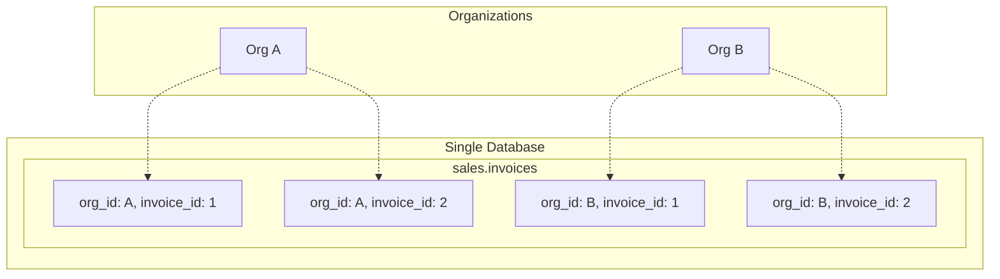

# Multi-Tenancy

How the system isolates data between organizations.

---

## Overview

The Pharmacy Management System uses **shared-schema multi-tenancy** where all organizations share the same database tables but are isolated at the row level using `org_id`.

---

## Architecture



---

## Data Isolation

### Row-Level Isolation

Every table includes `org_id` as a column:

```sql
CREATE TABLE sales.invoices (
    invoice_id SERIAL,
    org_id UUID NOT NULL,  -- Tenant identifier
    invoice_number TEXT NOT NULL,
    ...
    PRIMARY KEY (invoice_id),
    FOREIGN KEY (org_id) REFERENCES master.organizations(org_id)
);
```

### Automatic Filtering

All queries are filtered by `org_id`:

```python
# Service layer - org_id always applied
def get_invoices(org_id: str, customer_id: int = None):
    query = """
        SELECT * FROM sales.invoices
        WHERE org_id = :org_id
    """
    if customer_id:
        query += " AND customer_id = :customer_id"
    
    return db.execute(query, {"org_id": org_id, "customer_id": customer_id})
```

---

## Tenant Context

### Context Extraction

Tenant context is extracted from the JWT token:

```python
# dependencies.py
from fastapi import Depends
from app.core.auth import get_current_user

class OrgContext:
    def __init__(self, org_id: str, branch_id: int, user_id: int):
        self.org_id = org_id
        self.branch_id = branch_id
        self.user_id = user_id

def get_org_context(user: dict = Depends(get_current_user)) -> OrgContext:
    return OrgContext(
        org_id=user["org_id"],
        branch_id=user["branch_id"],
        user_id=user["user_id"]
    )
```

### Usage in Routes

```python
@router.get("/invoices")
async def list_invoices(
    context: OrgContext = Depends(get_org_context),
    db: TenantAwareSession = Depends(get_tenant_aware_db)
):
    # org_id automatically scoped
    return InvoiceService.list(db, context.org_id)
```

---

## TenantAwareSession

### Implementation

```python
class TenantAwareSession:
    """Database session that enforces tenant isolation"""
    
    def __init__(self, session, org_id: str):
        self._session = session
        self.org_id = org_id
    
    def execute(self, query: str, params: dict = None):
        """Execute query with org_id validation"""
        params = params or {}
        
        # Ensure org_id is always in params
        if ":org_id" in query and "org_id" not in params:
            params["org_id"] = self.org_id
        
        # Validate no cross-tenant access
        if "org_id" in params and params["org_id"] != self.org_id:
            raise SecurityException("Cross-tenant access denied")
        
        return self._session.execute(text(query), params)
```

### Dependency Injection

```python
def get_tenant_aware_db(
    db: Session = Depends(get_db),
    context: OrgContext = Depends(get_org_context)
) -> TenantAwareSession:
    return TenantAwareSession(db, context.org_id)
```

---

## Cross-Tenant Prevention

### Insert Protection

```python
def create_invoice(db: TenantAwareSession, context: OrgContext, data: dict):
    # org_id injected automatically
    query = """
        INSERT INTO sales.invoices (
            org_id, invoice_number, customer_id, ...
        ) VALUES (
            :org_id, :invoice_number, :customer_id, ...
        )
    """
    # org_id comes from context, not from user input
    params = {
        "org_id": context.org_id,  # ✅ From auth context
        "invoice_number": data["invoice_number"],
        "customer_id": data["customer_id"],
    }
    return db.execute(query, params)
```

### Query Protection

```python
def get_invoice(db: TenantAwareSession, context: OrgContext, invoice_id: int):
    query = """
        SELECT * FROM sales.invoices
        WHERE org_id = :org_id AND invoice_id = :invoice_id
    """
    # Must match both org_id AND invoice_id
    result = db.execute(query, {
        "org_id": context.org_id,
        "invoice_id": invoice_id
    })
    
    if not result:
        raise NotFoundException("Invoice not found")
    
    return result
```

### Foreign Key Validation

```python
def validate_customer_belongs_to_org(
    db: TenantAwareSession, 
    context: OrgContext, 
    customer_id: int
):
    """Ensure referenced customer belongs to same org"""
    query = """
        SELECT 1 FROM parties.customers
        WHERE org_id = :org_id AND customer_id = :customer_id
    """
    result = db.execute(query, {
        "org_id": context.org_id,
        "customer_id": customer_id
    })
    
    if not result.scalar():
        raise ValidationError("Customer not found or belongs to another organization")
```

---

## Document Numbering

Document numbers are unique per organization:

```sql
-- Number series per org
CREATE TABLE master.number_series (
    series_id SERIAL PRIMARY KEY,
    org_id UUID NOT NULL,
    document_type TEXT NOT NULL,  -- 'invoice', 'order', 'grn'
    prefix TEXT NOT NULL,         -- 'INV-', 'PO-'
    current_number INTEGER DEFAULT 0,
    financial_year TEXT,
    UNIQUE (org_id, document_type, financial_year)
);
```

```python
def generate_invoice_number(db: TenantAwareSession, context: OrgContext) -> str:
    """Generate unique invoice number for this org"""
    query = """
        UPDATE master.number_series
        SET current_number = current_number + 1
        WHERE org_id = :org_id 
          AND document_type = 'invoice'
          AND financial_year = :fy
        RETURNING prefix || current_number::TEXT
    """
    return db.execute(query, {
        "org_id": context.org_id,
        "fy": get_current_fy()
    }).scalar()
```

---

## Query Patterns

### List with Pagination

```python
def list_invoices(
    db: TenantAwareSession,
    org_id: str,
    limit: int = 50,
    offset: int = 0,
    customer_id: int = None
):
    query = """
        SELECT * FROM sales.invoices
        WHERE org_id = :org_id
    """
    params = {"org_id": org_id, "limit": limit, "offset": offset}
    
    if customer_id:
        query += " AND customer_id = :customer_id"
        params["customer_id"] = customer_id
    
    query += " ORDER BY invoice_date DESC LIMIT :limit OFFSET :offset"
    
    return db.execute(query, params).fetchall()
```

### Aggregate Queries

```python
def get_sales_summary(db: TenantAwareSession, org_id: str, date_from, date_to):
    query = """
        SELECT 
            COUNT(*) as invoice_count,
            SUM(total_amount) as total_sales
        FROM sales.invoices
        WHERE org_id = :org_id
          AND invoice_date BETWEEN :date_from AND :date_to
          AND invoice_status != 'cancelled'
    """
    return db.execute(query, {
        "org_id": org_id,
        "date_from": date_from,
        "date_to": date_to
    }).fetchone()
```

---

## Testing Multi-Tenancy

```python
def test_cross_tenant_access_blocked():
    """Verify users cannot access other org's data"""
    # Create invoice for Org A
    invoice = create_invoice(org_a_context, {...})
    
    # Try to access from Org B
    with pytest.raises(NotFoundException):
        get_invoice(org_b_context, invoice.invoice_id)

def test_data_isolation():
    """Verify query results only from own org"""
    # Create invoices for both orgs
    create_invoice(org_a_context, {...})
    create_invoice(org_b_context, {...})
    
    # List should only return own org's invoices
    org_a_invoices = list_invoices(org_a_context)
    assert all(inv.org_id == org_a_context.org_id for inv in org_a_invoices)
```

---

## Branch-Level Filtering

Within an organization, data can be filtered by branch:

```python
def list_invoices_by_branch(
    db: TenantAwareSession,
    context: OrgContext,
    branch_only: bool = False
):
    query = """
        SELECT * FROM sales.invoices
        WHERE org_id = :org_id
    """
    params = {"org_id": context.org_id}
    
    if branch_only:
        query += " AND branch_id = :branch_id"
        params["branch_id"] = context.branch_id
    
    return db.execute(query, params).fetchall()
```

---

## Best Practices

### 1. Never Trust Client org_id

```python
# ❌ Bad - org_id from request body
invoice_data = request.json()
create_invoice(org_id=invoice_data["org_id"], ...)

# ✅ Good - org_id from authenticated context
create_invoice(org_id=context.org_id, ...)
```

### 2. Always Include org_id in Queries

```python
# ❌ Bad - missing org_id filter
SELECT * FROM invoices WHERE invoice_id = :id

# ✅ Good - includes org_id
SELECT * FROM invoices WHERE org_id = :org_id AND invoice_id = :id
```

### 3. Validate Foreign Keys

```python
# Before creating invoice, verify customer belongs to same org
validate_customer_belongs_to_org(context, data["customer_id"])
```

### 4. Use TenantAwareSession

```python
# ❌ Bad - raw session
db: Session = Depends(get_db)

# ✅ Good - tenant-aware session
db: TenantAwareSession = Depends(get_tenant_aware_db)
```

---

## See Also

- [System Design](system-design.md)
- [Authentication](authentication.md)
- [Database Schema](../database/)
