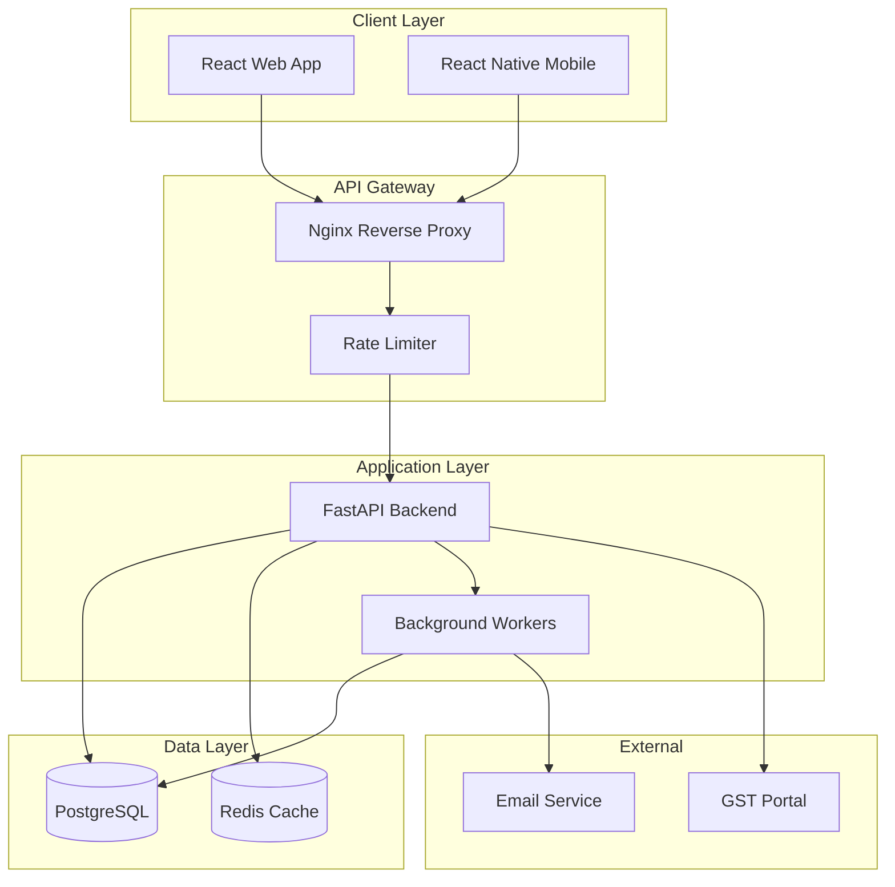
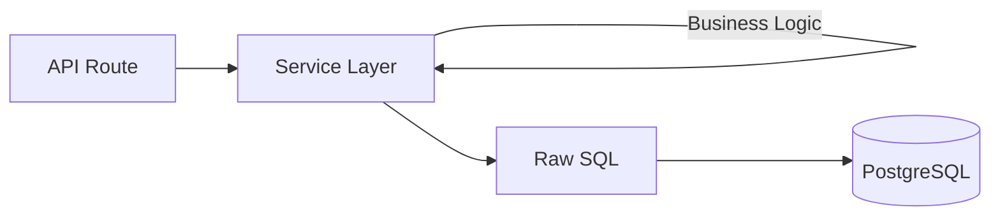
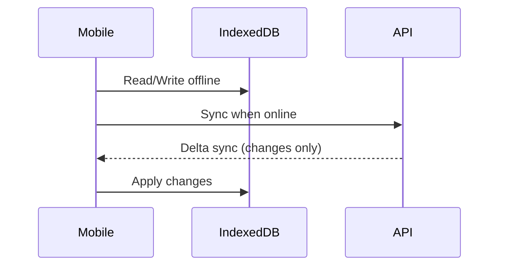
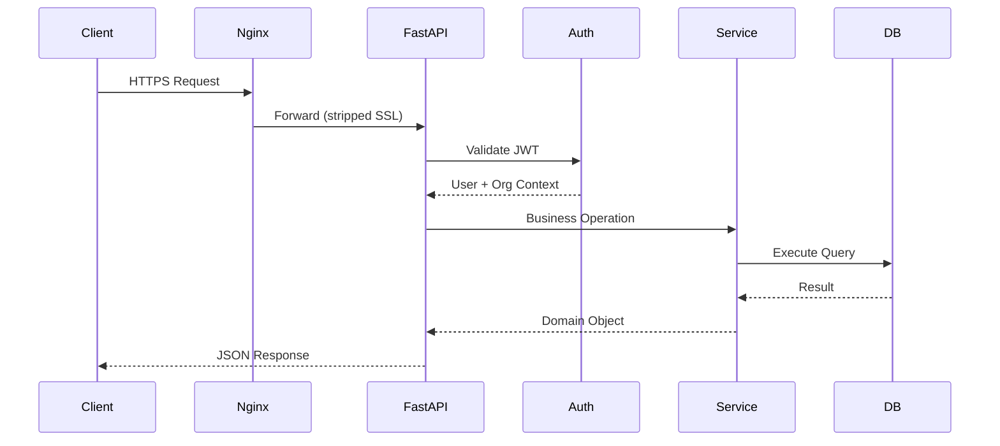
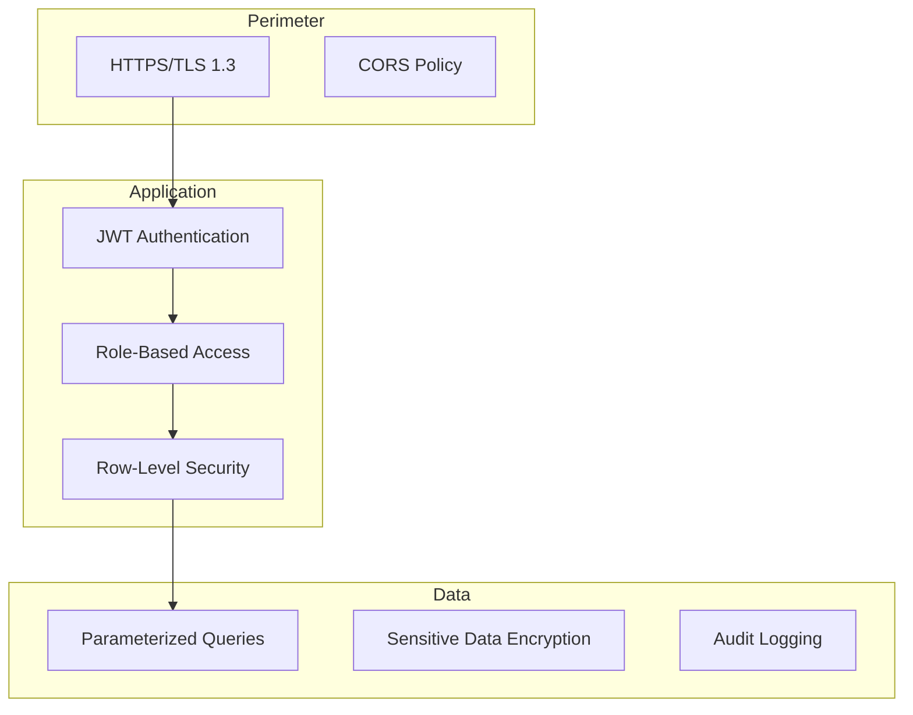
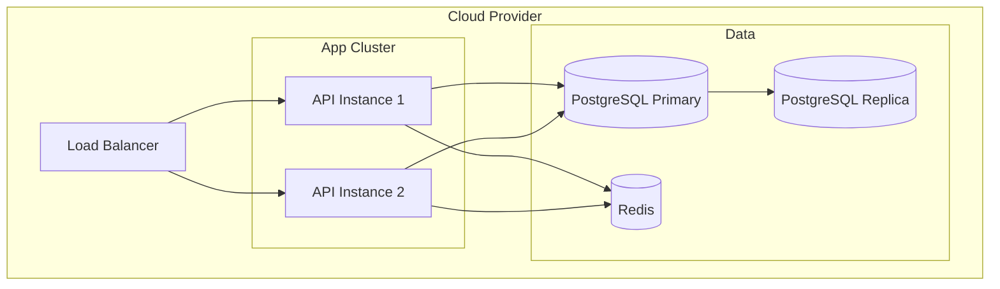

# System Design

High-level architecture and design principles.

---

## Architecture Overview



---

## Component Overview

| Component | Technology | Purpose |
|-----------|------------|---------|
| **Web App** | React 18 | Browser-based interface |
| **Mobile App** | React Native | iOS/Android with offline |
| **API Server** | FastAPI (Python) | REST API, business logic |
| **Database** | PostgreSQL 14+ | Primary data store |
| **Cache** | Redis | Session, rate limits, cache |
| **Background** | Celery (optional) | Async tasks |
| **Reverse Proxy** | Nginx | SSL, routing, static files |

---

## Key Design Principles

### 1. Multi-Tenancy First

Every operation is scoped to an organization:

```python
# All queries include org_id
SELECT * FROM sales.invoices 
WHERE org_id = :org_id AND invoice_id = :invoice_id
```

### 2. Service-Repository Pattern



- **Routes**: HTTP adapter, validation, response formatting
- **Services**: Business logic, orchestration
- **Repository**: Direct SQL queries (no ORM)

### 3. Offline-First Mobile



### 4. Event-Driven Side Effects

```python
# Main operation returns immediately
invoice = create_invoice(data)

# Side effects in background
background_tasks.add_task(
    update_inventory,
    invoice_id=invoice.id
)
background_tasks.add_task(
    update_customer_outstanding,
    customer_id=invoice.customer_id
)
```

---

## Request Flow



---

## Database Architecture

### Schema Organization

```
PostgreSQL
├── master          # Orgs, users, branches
├── parties         # Customers, suppliers
├── inventory       # Products, batches, stock
├── sales           # Orders, invoices, returns
├── procurement     # PO, GRN, supplier invoices
├── financial       # Payments, ledger
├── gst             # Tax compliance
├── compliance      # Regulatory
├── analytics       # BI, dashboards
└── system_config   # Audit, settings
```

### Multi-Tenancy Strategy

- **Shared Schema**: All tenants in same tables
- **Row-Level Isolation**: `org_id` on every row
- **Connection Pool**: Shared across tenants

See [Multi-Tenancy](multi-tenancy.md) for implementation details.

---

## Security Layers



See [Authentication](authentication.md) for details.

---

## Scalability Considerations

### Horizontal Scaling

| Component | Scaling Strategy |
|-----------|------------------|
| API Servers | Stateless, add instances |
| Database | Read replicas, connection pooling |
| Cache | Redis Cluster |
| Background | Celery workers |

### Vertical Limits

| Metric | Current Capacity |
|--------|------------------|
| Concurrent Users | ~1000 per instance |
| Requests/sec | ~500 per instance |
| Database Connections | 100 pooled |
| Invoices/day | 10,000+ |

---

## Technology Choices

### Why FastAPI?

- **Async native** - High concurrency
- **Type hints** - Self-documenting, validation
- **OpenAPI auto-gen** - Swagger docs free
- **Performance** - Top-tier Python framework

### Why Raw SQL (No ORM)?

- **Performance** - No N+1, optimal queries
- **Control** - Complex joins, CTEs, window functions
- **Transparency** - Know exactly what runs
- **Bulk operations** - Efficient batch inserts

### Why PostgreSQL?

- **Multi-schema** - Clean tenant separation
- **JSONB** - Flexible metadata storage
- **Full-text search** - Product search
- **Extensions** - pg_trgm for fuzzy search

---

## Deployment Architecture

### Production



See [Deployment Guide](../../deployment/) for details.

---

## Related Documentation

- [Multi-Tenancy](multi-tenancy.md)
- [Authentication](authentication.md)
- [Performance](performance.md)
- [Database Schema](../database/)
- [API Reference](../api/)
