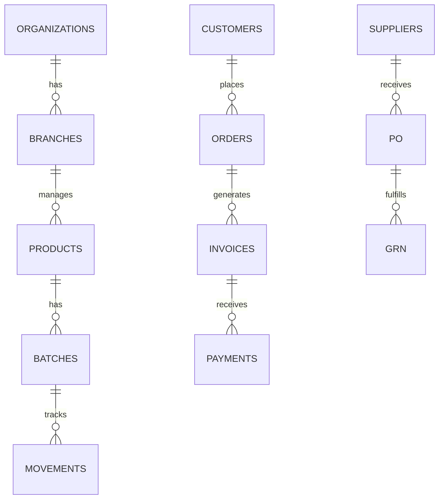

# Database Documentation

PostgreSQL multi-schema database.

---

## Schemas

| Schema | Tables | Description |
|--------|--------|-------------|
| [sales](schemas/sales.md) | 25 | Orders, invoices, challans, returns |
| inventory | 16 | Products, batches, movements |
| procurement | 14 | PO, GRN, supplier invoices |
| financial | 16 | Payments, ledger, accounting |
| parties | 4 | Customers, suppliers |
| master | 13 | Orgs, branches, users, employees |
| gst | 15 | Tax settings, returns, HSN |
| compliance | 28 | Licenses, inspections, QC |
| analytics | 13 | Dashboards, KPIs, reports |
| system_config | 22 | Audit logs, settings |

**Total**: 166 tables

---

## ERD Overview



---

## Key Indexes

```sql
-- Foreign keys
idx_batches_product ON inventory.batches(product_id)
idx_order_items_product ON sales.order_items(product_id)

-- Composite
idx_invoices_status_date ON sales.invoices(status, date DESC)
idx_batches_status_expiry ON inventory.batches(status, expiry_date)
```

---

## Migrations

```bash
alembic current      # Check version
alembic upgrade head # Apply all
alembic revision -m "name"  # Create new
```

---

**See also**: [Backend Overview](../README.md) · [Services](../services/)
