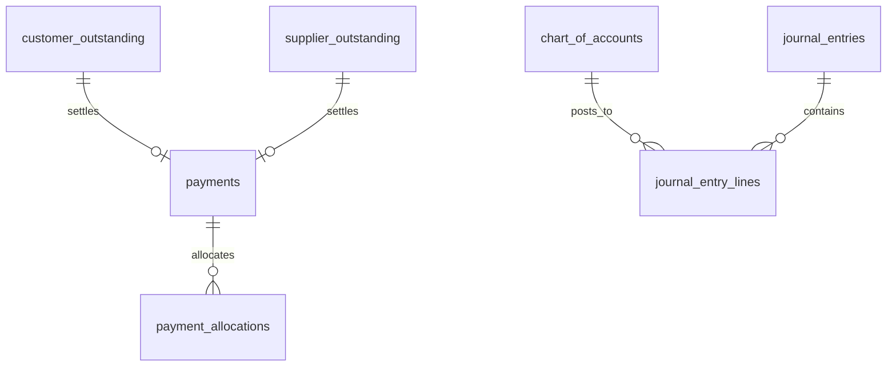

# Financial Schema

Tables for payments, ledger, and accounting.

**Schema**: `financial`  
**Tables**: 16

---

## ERD



---

## Core Tables

### financial.payments

Payment records.

| Column | Type | Description |
|--------|------|-------------|
| `payment_id` | integer | PK |
| `org_id` | uuid | Tenant FK |
| `payment_number` | text | e.g., PAY-2026-0001 |
| `payment_date` | date | Payment date |
| `payment_type` | text | receipt, payment |
| `party_type` | text | customer, supplier |
| `party_id` | integer | Customer/Supplier ID |
| `payment_amount` | numeric | Amount received/paid |
| `payment_method_id` | integer | FK to payment_methods |
| `reference_number` | text | Cheque/UPI ref |
| `payment_status` | text | pending, cleared, bounced |
| `allocation_status` | text | unallocated, partial, full |
| `allocated_amount` | numeric | Allocated to invoices |
| `unallocated_amount` | numeric | Remaining advance |

**Indexes**:
- `idx_payments_party`
- `idx_payments_date`

---

### financial.payment_allocations

Payment to invoice mapping.

| Column | Type | Description |
|--------|------|-------------|
| `allocation_id` | integer | PK |
| `payment_id` | integer | FK to payments |
| `reference_type` | text | invoice, supplier_invoice |
| `reference_id` | integer | Invoice ID |
| `allocated_amount` | numeric | Amount allocated |
| `discount_amount` | numeric | Discount given |

---

### financial.journal_entries

Double-entry accounting.

| Column | Type | Description |
|--------|------|-------------|
| `journal_id` | integer | PK |
| `org_id` | uuid | Tenant FK |
| `journal_number` | text | Journal number |
| `journal_date` | date | Entry date |
| `journal_type` | text | sales, purchase, payment |
| `reference_type` | text | Source document type |
| `reference_id` | integer | Source document ID |
| `entry_status` | text | draft, posted |
| `narration` | text | Description |

---

### financial.journal_entry_lines

Journal line items.

| Column | Type | Description |
|--------|------|-------------|
| `line_id` | integer | PK |
| `journal_id` | integer | FK |
| `account_code` | text | Account code |
| `debit_amount` | numeric | Debit |
| `credit_amount` | numeric | Credit |
| `party_type` | text | customer, supplier |
| `party_id` | integer | Party ID |

---

### financial.chart_of_accounts

Account hierarchy.

| Column | Type | Description |
|--------|------|-------------|
| `account_id` | integer | PK |
| `org_id` | uuid | Tenant FK |
| `account_code` | text | Account code |
| `account_name` | text | Account name |
| `account_type` | text | asset, liability, equity, income, expense |
| `parent_account_id` | integer | Parent FK |
| `normal_balance` | text | debit, credit |
| `current_balance` | numeric | Current balance |

---

### financial.customer_outstanding

Receivables tracking.

| Column | Type | Description |
|--------|------|-------------|
| `outstanding_id` | integer | PK |
| `customer_id` | integer | FK |
| `document_type` | text | invoice |
| `document_id` | integer | Invoice ID |
| `original_amount` | numeric | Invoice amount |
| `outstanding_amount` | numeric | Unpaid amount |
| `due_date` | date | Payment due date |
| `days_overdue` | integer | Days past due |
| `aging_bucket` | text | 0-30, 31-60, 61-90, 90+ |

---

### financial.supplier_outstanding

Payables tracking.

| Column | Type | Description |
|--------|------|-------------|
| `outstanding_id` | integer | PK |
| `supplier_id` | integer | FK |
| `document_type` | text | supplier_invoice |
| `document_id` | integer | Invoice ID |
| `original_amount` | numeric | Invoice amount |
| `outstanding_amount` | numeric | Unpaid amount |
| `due_date` | date | Payment due date |

---

## Supporting Tables

| Table | Description |
|-------|-------------|
| `payment_methods` | UPI, cash, cheque, etc. |
| `bank_reconciliations` | Bank statement matching |
| `bank_reconciliation_items` | Reconciliation line items |
| `expense_claims` | Employee expense claims |
| `expense_claim_items` | Claim line items |
| `expense_categories` | Expense categorization |
| `pdc_management` | Post-dated cheques |
| `cash_flow_forecast` | Cash flow projections |

---

## Aging Bucket Calculation

```sql
-- Calculate aging bucket
CASE 
  WHEN days_overdue <= 0 THEN 'current'
  WHEN days_overdue <= 30 THEN '0-30'
  WHEN days_overdue <= 60 THEN '31-60'
  WHEN days_overdue <= 90 THEN '61-90'
  ELSE '90+'
END as aging_bucket
```

---

**See also**: [Finance Services](../services/finance/) · [Finance API](../api/finance/)
