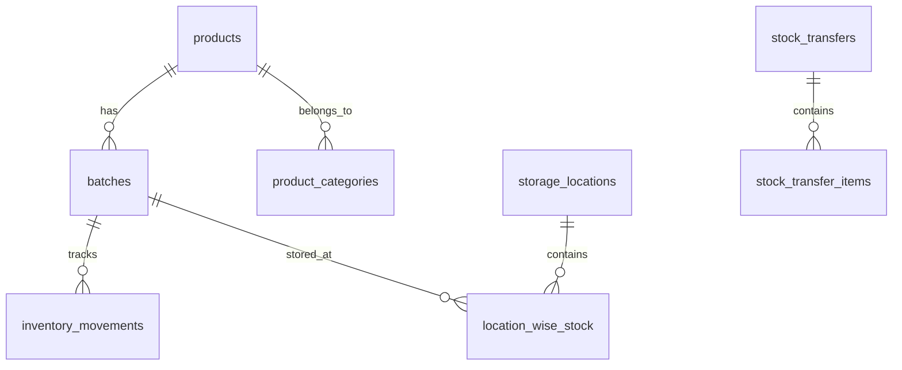

# Inventory Schema

Tables for products, batches, stock, and movements.

**Schema**: `inventory`  
**Tables**: 16

---

## ERD



---

## Core Tables

### inventory.products

Product catalog.

| Column | Type | Description |
|--------|------|-------------|
| `product_id` | integer | PK |
| `org_id` | uuid | Tenant FK |
| `product_code` | text | SKU code |
| `product_name` | text | Display name |
| `generic_name` | text | Generic/salt name |
| `manufacturer` | text | Manufacturer name |
| `category_id` | integer | FK to categories |
| `product_type` | text | tablet, syrup, etc. |
| `hsn_code` | text | GST HSN code |
| `gst_percent` | numeric | GST rate |
| `reorder_level` | numeric | Reorder point |
| `min_stock_quantity` | numeric | Minimum stock |
| `is_active` | boolean | Active flag |

**Indexes**:
- `idx_products_category_id`
- `idx_products_name` (GIN trigram)

---

### inventory.batches

Batch/lot tracking.

| Column | Type | Description |
|--------|------|-------------|
| `batch_id` | integer | PK |
| `org_id` | uuid | Tenant FK |
| `product_id` | integer | FK to products |
| `batch_number` | text | Batch number |
| `manufacturing_date` | date | Mfg date |
| `expiry_date` | date | Expiry date |
| `initial_quantity` | numeric | Received qty |
| `quantity_available` | numeric | Current stock |
| `quantity_reserved` | numeric | Reserved for orders |
| `cost_per_unit` | numeric | Cost price |
| `mrp_per_unit` | numeric | MRP |
| `sale_price_per_unit` | numeric | Selling price |
| `batch_status` | text | active, expired, recalled |
| `expiry_status` | text | valid, expiring_soon, expired |

**Indexes**:
- `idx_batches_product_id` ⚠️ **Critical**
- `idx_batches_status_expiry`
- `idx_batches_org_product`

---

### inventory.inventory_movements

Stock movement history.

| Column | Type | Description |
|--------|------|-------------|
| `movement_id` | integer | PK |
| `org_id` | uuid | Tenant FK |
| `movement_type` | text | grn, invoice, return, adjustment |
| `movement_direction` | text | in, out |
| `product_id` | integer | FK |
| `batch_id` | integer | FK |
| `quantity` | numeric | Movement qty |
| `reference_type` | text | Source document type |
| `reference_id` | integer | Source document ID |

**Indexes**:
- `idx_movements_product_batch`
- `idx_movements_reference`

---

### inventory.storage_locations

Warehouse locations.

| Column | Type | Description |
|--------|------|-------------|
| `location_id` | integer | PK |
| `org_id` | uuid | Tenant FK |
| `branch_id` | integer | FK to branches |
| `location_code` | text | Location code |
| `location_name` | text | Display name |
| `location_type` | text | warehouse, rack, bin |
| `temperature_controlled` | boolean | Cold storage |

---

### inventory.location_wise_stock

Stock by location.

| Column | Type | Description |
|--------|------|-------------|
| `stock_id` | integer | PK |
| `product_id` | integer | FK |
| `batch_id` | integer | FK |
| `location_id` | integer | FK |
| `quantity_available` | numeric | Available stock |
| `quantity_reserved` | numeric | Reserved |

**Indexes**:
- `idx_location_stock_product_batch_location` (unique)

---

## Supporting Tables

| Table | Description |
|-------|-------------|
| `product_categories` | Category hierarchy |
| `product_types` | Type definitions |
| `units_of_measure` | UOM definitions |
| `stock_transfers` | Inter-branch transfers |
| `stock_transfer_items` | Transfer line items |
| `stock_reservations` | Order reservations |
| `reorder_suggestions` | Auto-generated reorders |
| `price_history` | Price change log |

---

## Stock Deduction (FIFO)

```sql
-- Batches ordered by expiry for FIFO
SELECT batch_id, quantity_available
FROM inventory.batches
WHERE product_id = :product_id
  AND batch_status = 'active'
  AND quantity_available > 0
ORDER BY expiry_date ASC;
```

---

**See also**: [Inventory Services](../services/inventory/) · [Inventory API](../api/inventory/)
