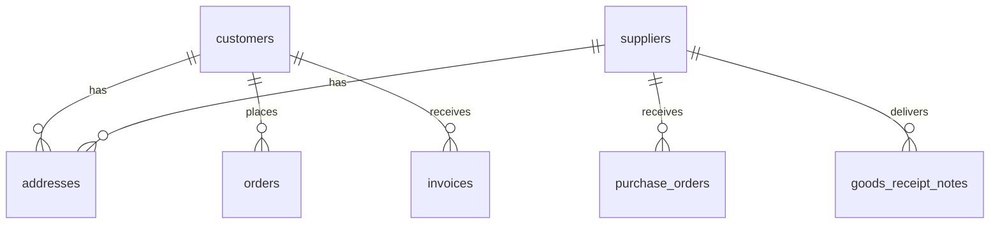

# Parties Schema

Tables for customers and suppliers.

**Schema**: `parties`  
**Tables**: 4

---

## ERD



---

## Core Tables

### parties.customers

Customer master.

| Column | Type | Description |
|--------|------|-------------|
| `customer_id` | integer | PK |
| `org_id` | uuid | Tenant FK |
| `customer_code` | text | Customer code |
| `customer_name` | text | Business/person name |
| `customer_type` | text | retail, wholesale, hospital |
| `gstin` | text | GST number |
| `pan_number` | text | PAN |
| `drug_license_number` | text | Drug license |
| `primary_phone` | text | Phone number |
| `email` | text | Email |
| `credit_limit` | numeric | Credit limit |
| `credit_days` | integer | Payment terms |
| `outstanding_amount` | numeric | Current balance |
| `is_active` | boolean | Active flag |

**Indexes**:
- `idx_customers_name` (GIN for search)
- `idx_customers_phone`
- `idx_customers_gstin`

---

### parties.suppliers

Supplier master.

| Column | Type | Description |
|--------|------|-------------|
| `supplier_id` | integer | PK |
| `org_id` | uuid | Tenant FK |
| `supplier_code` | text | Supplier code |
| `supplier_name` | text | Company name |
| `supplier_type` | text | manufacturer, distributor |
| `gstin` | text | GST number |
| `pan_number` | text | PAN |
| `drug_license_number` | text | Drug license |
| `primary_phone` | text | Phone |
| `email` | text | Email |
| `payment_terms` | text | Payment terms |
| `credit_limit` | numeric | Credit limit |
| `outstanding_amount` | numeric | Balance payable |
| `is_active` | boolean | Active flag |

**Indexes**:
- `idx_suppliers_name`
- `idx_suppliers_gstin`

---

### parties.customer_groups

Customer segmentation.

| Column | Type | Description |
|--------|------|-------------|
| `group_id` | integer | PK |
| `org_id` | uuid | Tenant FK |
| `group_name` | text | Group name |
| `discount_percent` | numeric | Default discount |
| `price_list_id` | integer | Assigned price list |

---

### parties.supplier_groups

Supplier categorization.

| Column | Type | Description |
|--------|------|-------------|
| `group_id` | integer | PK |
| `org_id` | uuid | Tenant FK |
| `group_name` | text | Group name |

---

## Addresses

Addresses are stored in `master.addresses` with polymorphic entity_type:

```sql
-- Customer addresses
SELECT * FROM master.addresses
WHERE entity_type = 'customer' AND entity_id = :customer_id;

-- Supplier addresses
SELECT * FROM master.addresses
WHERE entity_type = 'supplier' AND entity_id = :supplier_id;
```

---

## Customer Types

| Type | Description |
|------|-------------|
| `retail` | Walk-in retail customers |
| `wholesale` | B2B wholesale buyers |
| `hospital` | Hospitals/clinics |
| `clinic` | Doctor clinics |
| `distributor` | Sub-distributors |

---

**See also**: [Master Services](../services/master/) · [Master API](../api/master/)
