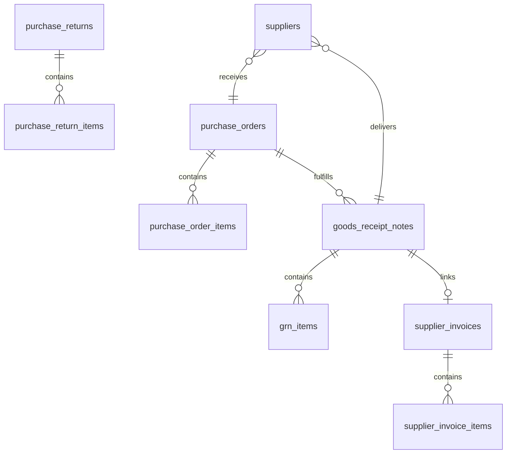

# Procurement Schema

Tables for purchase orders, GRN, and supplier invoices.

**Schema**: `procurement`  
**Tables**: 14

---

## ERD



---

## Core Tables

### procurement.purchase_orders

Purchase order headers.

| Column | Type | Description |
|--------|------|-------------|
| `purchase_order_id` | integer | PK |
| `org_id` | uuid | Tenant FK |
| `po_number` | text | e.g., PO-2026-0001 |
| `po_date` | date | Order date |
| `supplier_id` | integer | FK to suppliers |
| `supplier_name` | text | Denormalized |
| `expected_delivery_date` | date | Expected delivery |
| `total_amount` | numeric | Total value |
| `po_status` | text | draft, approved, partial, complete |
| `receipt_status` | text | pending, partial, received |

**Indexes**:
- `idx_po_supplier_id`
- `idx_po_status_date`

---

### procurement.purchase_order_items

PO line items.

| Column | Type | Description |
|--------|------|-------------|
| `po_item_id` | integer | PK |
| `purchase_order_id` | integer | FK |
| `product_id` | integer | FK to products |
| `product_name` | text | Denormalized |
| `ordered_quantity` | numeric | Ordered qty |
| `received_quantity` | numeric | Received so far |
| `pending_quantity` | numeric | Pending receipt |
| `unit_price` | numeric | Purchase price |
| `line_total` | numeric | Line value |

---

### procurement.goods_receipt_notes

GRN headers.

| Column | Type | Description |
|--------|------|-------------|
| `grn_id` | integer | PK |
| `org_id` | uuid | Tenant FK |
| `grn_number` | text | e.g., GRN-2026-0001 |
| `grn_date` | date | Receipt date |
| `purchase_order_id` | integer | FK (optional) |
| `supplier_id` | integer | FK |
| `supplier_invoice_number` | text | Supplier's invoice |
| `grn_status` | text | draft, approved, cancelled |
| `stock_updated` | boolean | Stock added flag |

**Indexes**:
- `idx_grn_supplier_id`
- `idx_grn_po_id`

---

### procurement.grn_items

GRN line items (creates batches).

| Column | Type | Description |
|--------|------|-------------|
| `grn_item_id` | integer | PK |
| `grn_id` | integer | FK |
| `product_id` | integer | FK |
| `batch_number` | text | New batch number |
| `manufacturing_date` | date | Mfg date |
| `expiry_date` | date | Expiry date |
| `received_quantity` | numeric | Received qty |
| `accepted_quantity` | numeric | Accepted qty |
| `rejected_quantity` | numeric | Rejected qty |
| `mrp` | numeric | MRP |
| `unit_price` | numeric | Cost price |
| `qc_status` | text | pending, approved, rejected |

---

### procurement.supplier_invoices

Supplier invoice headers (AP).

| Column | Type | Description |
|--------|------|-------------|
| `supplier_invoice_id` | integer | PK |
| `org_id` | uuid | Tenant FK |
| `supplier_invoice_number` | text | Supplier's number |
| `invoice_date` | date | Invoice date |
| `supplier_id` | integer | FK |
| `grn_ids` | integer[] | Linked GRNs |
| `invoice_total` | numeric | Total amount |
| `payment_status` | text | unpaid, partial, paid |
| `paid_amount` | numeric | Paid so far |
| `due_date` | date | Payment due date |

---

### procurement.purchase_returns

Return to supplier.

| Column | Type | Description |
|--------|------|-------------|
| `return_id` | integer | PK |
| `return_number` | text | e.g., PR-2026-0001 |
| `return_date` | date | Return date |
| `supplier_id` | integer | FK |
| `grn_id` | integer | Original GRN |
| `return_reason` | text | Reason |
| `debit_note_number` | text | Debit note |
| `total_amount` | numeric | Return value |

---

## Supporting Tables

| Table | Description |
|-------|-------------|
| `purchase_order_items` | PO line items |
| `supplier_invoice_items` | Invoice line items |
| `purchase_return_items` | Return line items |
| `purchase_requisitions` | Purchase requests |
| `purchase_requisition_items` | Request line items |
| `supplier_quotations` | Quotation from suppliers |
| `vendor_performance` | Supplier scorecard |

---

## GRN → Batch Creation

```sql
-- GRN approval creates batches
INSERT INTO inventory.batches (
  product_id, batch_number, expiry_date, 
  initial_quantity, quantity_available,
  cost_per_unit, mrp_per_unit, source_type
)
SELECT 
  product_id, batch_number, expiry_date,
  accepted_quantity, accepted_quantity,
  unit_price, mrp, 'grn'
FROM procurement.grn_items
WHERE grn_id = :grn_id;
```

---

**See also**: [Purchase Services](../services/purchase/) · [Purchase API](../api/purchase/)
