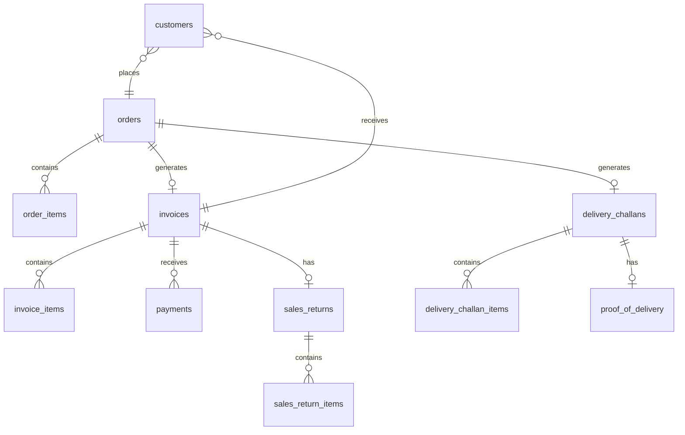

# Sales Schema

Tables for orders, invoices, challans, and returns.

**Schema**: `sales`  
**Tables**: 25

---

## ERD

---

## Core Tables

### sales.orders

Sales order headers.

| Column | Type | Description |
|--------|------|-------------|
| `order_id` | integer | PK |
| `org_id` | uuid | Tenant FK |
| `order_number` | text | e.g., SO-2026-0001 |
| `order_date` | date | Order date |
| `customer_id` | integer | FK to customers |
| `order_status` | text | draft, pending, confirmed, invoiced |
| `payment_status` | text | unpaid, partial, paid |
| `final_amount` | numeric | Total after tax |

**Indexes**:
- `idx_orders_customer_id`
- `idx_orders_status_date`

---

### sales.order_items

Order line items.

| Column | Type | Description |
|--------|------|-------------|
| `order_item_id` | integer | PK |
| `order_id` | integer | FK to orders |
| `product_id` | integer | FK to products |
| `batch_id` | integer | FK to batches |
| `quantity` | numeric | Ordered quantity |
| `unit_price` | numeric | Price per unit |
| `discount_percent` | numeric | Line discount |
| `line_total` | numeric | Final line amount |

**Indexes**:
- `idx_order_items_product_id`

---

### sales.invoices

Sales invoice headers.

| Column | Type | Description |
|--------|------|-------------|
| `invoice_id` | integer | PK |
| `org_id` | uuid | Tenant FK |
| `invoice_number` | text | e.g., INV-2026-0001 |
| `invoice_date` | date | Invoice date |
| `customer_id` | integer | FK to customers |
| `invoice_status` | text | draft, generated, issued |
| `payment_status` | text | unpaid, partial, paid |
| `total_amount` | numeric | Including GST |
| `paid_amount` | numeric | Received amount |
| `balance_due` | numeric | Outstanding |

**Indexes**:
- `idx_invoices_customer_id`
- `idx_invoices_status_date`
- `idx_invoices_payment_status`

---

### sales.invoice_items

Invoice line items.

| Column | Type | Description |
|--------|------|-------------|
| `invoice_item_id` | integer | PK |
| `invoice_id` | integer | FK to invoices |
| `product_id` | integer | FK to products |
| `batch_id` | integer | FK to batches |
| `quantity` | numeric | Invoiced quantity |
| `unit_price` | numeric | Price per unit |
| `hsn_code` | text | GST HSN code |
| `cgst_amount` | numeric | Central GST |
| `sgst_amount` | numeric | State GST |
| `igst_amount` | numeric | Integrated GST |
| `line_total` | numeric | Line total |

---

### sales.delivery_challans

Delivery challan headers.

| Column | Type | Description |
|--------|------|-------------|
| `challan_id` | integer | PK |
| `challan_number` | text | e.g., DC-2026-0001 |
| `challan_date` | date | Challan date |
| `customer_id` | integer | FK |
| `order_id` | integer | Optional FK |
| `challan_status` | text | draft, dispatched, delivered |
| `total_amount` | numeric | Total value |

---

### sales.sales_returns

Sales return headers.

| Column | Type | Description |
|--------|------|-------------|
| `return_id` | integer | PK |
| `return_number` | text | e.g., SR-2026-0001 |
| `return_date` | date | Return date |
| `invoice_id` | integer | Original invoice |
| `customer_id` | integer | FK |
| `return_reason` | text | Reason |
| `approval_status` | text | pending, approved |
| `credit_note_number` | text | Generated CN |

---

## Supporting Tables

| Table | Description |
|-------|-------------|
| `delivery_challan_items` | Challan line items |
| `sales_return_items` | Return line items |
| `proof_of_delivery` | POD records |
| `price_lists` | Price list masters |
| `price_list_items` | Product prices |
| `sales_schemes` | Promotional schemes |
| `scheme_products` | Scheme-product mapping |
| `scheme_customers` | Scheme-customer mapping |
| `sales_targets` | Sales targets |

---

## Status Values

### Order Status
- `draft` → `pending` → `confirmed` → `invoiced`
- `cancelled`

### Invoice Status
- `draft` → `generated` → `issued`
- `cancelled`

### Challan Status
- `draft` → `dispatched` → `delivered`

---

**See also**: [Sales Services](../services/sales/) · [Sales API](../api/sales/)
