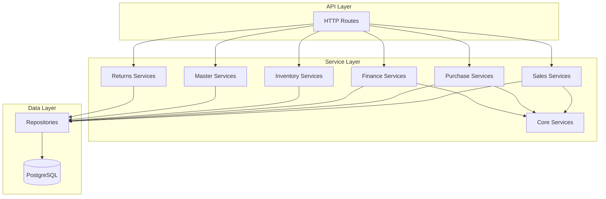

# Service Layer Documentation

Business logic services organized by domain.

**Code Location**: `app/api/services/`

---

## Architecture



---

## Services by Domain

| Domain | Services | Description |
|--------|----------|-------------|
| [Sales](sales/) | 4 | Orders, invoices, challans |
| [Purchase](purchase/) | 4 | PO, GRN, supplier invoices |
| [Finance](finance/) | 7 | Payments, ledger, credit notes |
| [Inventory](inventory/) | 2 | Stock, batches, movements |
| [Master](master/) | 5 | Products, customers, suppliers |
| [Returns](returns/) | 2 | Sales & purchase returns |
| [Core](core/) | 5 | Auth, compliance, utilities |

**Total**: 29 services

---

## Quick Reference

### Most Used Services

| Service | Location | Primary Use |
|---------|----------|-------------|
| `InvoiceService` | `sales/invoice/` | Invoice lifecycle |
| `GRNService` | `purchase/grn/` | Goods receipt |
| `PaymentService` | `finance/payment/` | Payment processing |
| `ProductService` | `master/product/` | Product management |
| `LedgerService` | `finance/ledger/` | Account statements |
| `DocumentNumberService` | `core/` | Auto-numbering |

---

## Patterns

### Service-Repository Pattern

```python
# Service: Business logic
class InvoiceService:
    @staticmethod
    def create_invoice(db, org_id, data):
        # Validate
        validate_customer(data["customer_id"])
        
        # Calculate
        totals = calculate_totals(data["items"])
        
        # Persist via repository
        invoice_id = InvoiceRepository.insert(db, {...})
        InvoiceRepository.insert_items_bulk(db, items)
        
        return invoice_id

# Repository: Data access
class InvoiceRepository:
    @staticmethod
    def insert(db, data):
        return db.execute(text("INSERT INTO...")).scalar()
```

### Multi-Tenancy

```python
@with_tenant_context
async def endpoint(context: OrgContext):
    # org_id automatically available
    result = InvoiceService.list(db, context.org_id)
```

### Constants Usage

```python
from app.core.utils.constants import OrderStatus

# Always use constants, not strings
status = OrderStatus.PENDING.value
```

---

## Performance Optimizations

Applied across all services:

| Optimization | Impact |
|--------------|--------|
| Bulk inserts | 98% fewer queries |
| LATERAL JOIN | N+1 elimination |
| Index usage | 60% faster filters |
| Caching | 90% faster dashboard |

---

**See also**: [Backend Overview](../README.md) · [API Reference](../api/)
