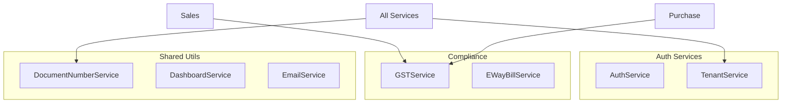
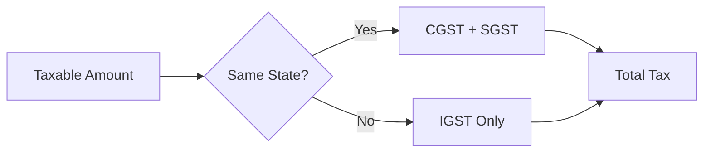

# Core Services

Shared services: authentication, compliance, document numbering, dashboard.

**Code Location**: `app/api/services/` (root level)

---

## Architecture



---

## Services

| Service | File | Description |
|---------|------|-------------|
| [DocumentNumberService](document-number.md) | `document_number_service.py` | Auto-numbering |
| [DashboardService](dashboard.md) | `dashboard_service.py` | Analytics |
| [GSTService](gst.md) | `compliance/gst_service.py` | GST calculations |
| [AuthService](auth.md) | `auth/auth_service.py` | Authentication |
| [EmailService](email.md) | `email/service.py` | Email sending |

---

## DocumentNumberService

**Location**: `app/api/services/document_number_service.py`

### Methods

| Method | Description |
|--------|-------------|
| `get_next_number()` | Get next sequence number |
| `generate_invoice_number()` | Generate INV-YYYY-NNNN |
| `generate_order_number()` | Generate SO-YYYY-NNNN |
| `generate_po_number()` | Generate PO-YYYY-NNNN |
| `generate_grn_number()` | Generate GRN-YYYY-NNNN |
| `generate_challan_number()` | Generate DC-YYYY-NNNN |

### Number Format

```
{PREFIX}-{YEAR}-{SEQUENCE}
Example: INV-2026-0001
```

### Example

```python
from app.api.services.document_number_service import DocumentNumberService

invoice_number = DocumentNumberService.generate_invoice_number(
    db=db,
    org_id=str(context.org_id)
)
# Returns: "INV-2026-0001"
```

---

## DashboardService

**Location**: `app/api/services/dashboard_service.py`

### Methods

| Method | Description |
|--------|-------------|
| `get_dashboard_stats()` | KPI summary |
| `get_sales_trend()` | Sales over time |
| `get_top_products()` | Best selling products |
| `get_outstanding_summary()` | Receivables/payables |
| `get_expiring_batches()` | Near-expiry items |
| `get_low_stock_alerts()` | Reorder alerts |

### Performance

- **Caching**: Dashboard stats cached for 5 minutes
- **Optimization**: 90% faster with in-memory caching

---

## GSTService

**Location**: `app/api/services/compliance/gst_service.py`

### Methods

| Method | Description |
|--------|-------------|
| `calculate_gst()` | Calculate GST components |
| `get_gst_type()` | CGST/SGST or IGST |
| `validate_gstin()` | Validate GST number |
| `generate_eway_bill()` | Create E-Way bill |

### GST Calculation



---

## AuthService

**Location**: `app/api/services/auth/auth_service.py`

### Methods

| Method | Description |
|--------|-------------|
| `authenticate()` | Validate credentials |
| `generate_tokens()` | Create JWT tokens |
| `refresh_token()` | Refresh access token |
| `logout()` | Invalidate tokens |
| `get_user_permissions()` | Get role permissions |

---

## Database Tables

| Table | Description |
|-------|-------------|
| `master.document_sequences` | Number sequences |
| `master.users` | User accounts |
| `gst.settings` | GST configuration |
| `compliance.eway_bills` | E-Way bill records |

---

## Dependencies

All services depend on:
- `TenantAwareSession` - Multi-tenant context
- `constants.py` - Status values, enums

---

**See also**: [Auth API](../../api/auth/) · [Compliance API](../../api/compliance/)
