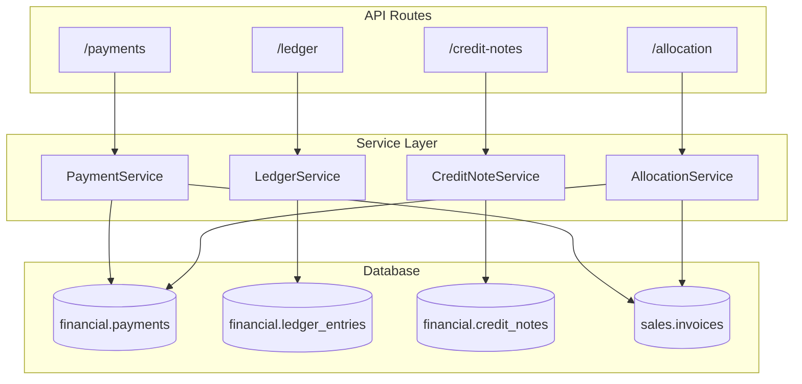
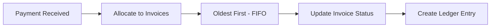

# Finance Services

Services for payments, ledger, credit notes, and accounting.

**Code Location**: `app/api/services/finance/`

---

## Architecture



---

## Services

| Service | File | Description |
|---------|------|-------------|
| [PaymentService](payment.md) | `payment/service.py` | Payment processing |
| [LedgerService](ledger.md) | `ledger/service.py` | Account statements |
| [CreditNoteService](credit-note.md) | `credit_note/service.py` | Credit notes |
| [AllocationService](allocation.md) | `allocation/service.py` | Payment allocation |
| [JournalService](journal.md) | `journal/service.py` | Journal entries |
| [ExpenseService](expense.md) | `expense/service.py` | Expense tracking |
| [OutstandingService](outstanding.md) | `outstanding/service.py` | Outstanding reports |

---

## PaymentService

**Location**: `app/api/services/finance/payment/service.py`

### Methods

| Method | Description |
|--------|-------------|
| `record_payment()` | Record new payment |
| `get_payment()` | Get payment details |
| `list_payments()` | List payments with filters |
| `get_party_payments()` | Payments by customer/supplier |
| `allocate_to_invoice()` | Link payment to invoice |

### Example

```python
from app.api.services.finance.payment.service import PaymentService

payment_id = PaymentService.record_payment(
    db=db,
    org_id=str(context.org_id),
    payment_data={
        "party_type": "customer",
        "party_id": customer_id,
        "amount": Decimal("5000.00"),
        "payment_mode": "upi",
        "reference": "UPI123456"
    }
)
```

---

## LedgerService

**Location**: `app/api/services/finance/ledger/service.py`

### Methods

| Method | Description |
|--------|-------------|
| `get_party_statement()` | Get account statement |
| `get_opening_balance()` | Calculate opening balance |
| `get_closing_balance()` | Calculate closing balance |
| `get_aging_report()` | Aging analysis |
| `get_outstanding_summary()` | Outstanding totals |

### Business Rules

1. **Double Entry**: Every transaction has debit and credit
2. **Balance Calculation**: Opening + Debits - Credits = Closing
3. **Aging Buckets**: 0-30, 31-60, 61-90, 90+ days

---

## CreditNoteService

**Location**: `app/api/services/finance/credit_note/service.py`

### Methods

| Method | Description |
|--------|-------------|
| `create_credit_note()` | Create credit note |
| `get_credit_note()` | Get with items |
| `list_credit_notes()` | List with filters |
| `apply_to_invoice()` | Apply CN to invoice |

---

## AllocationService

**Location**: `app/api/services/finance/allocation/service.py`

### Payment Allocation Flow



---

## Database Tables

| Table | Description |
|-------|-------------|
| `financial.payments` | Payment records |
| `financial.payment_allocations` | Payment to invoice links |
| `financial.ledger_entries` | Accounting entries |
| `financial.credit_notes` | Credit note headers |
| `financial.credit_note_items` | Credit note items |
| `financial.journal_entries` | Manual journal entries |

---

## Dependencies

```
PaymentService
├── LedgerService
└── InvoiceService (update payment status)

AllocationService
├── PaymentService
└── InvoiceService

CreditNoteService
├── ReturnService
└── LedgerService
```

---

## Error Codes

| Error | HTTP | Description |
|-------|------|-------------|
| `PAYMENT_NOT_FOUND` | 404 | Payment doesn't exist |
| `INVOICE_NOT_FOUND` | 404 | Invoice doesn't exist |
| `AMOUNT_EXCEEDS_DUE` | 400 | Payment > outstanding |
| `ALREADY_ALLOCATED` | 400 | Payment fully allocated |
| `INVALID_PARTY_TYPE` | 400 | Must be customer/supplier |

---

**See also**: [Finance API](../../api/finance/) · [Financial Schema](../../database/schemas/financial.md)
