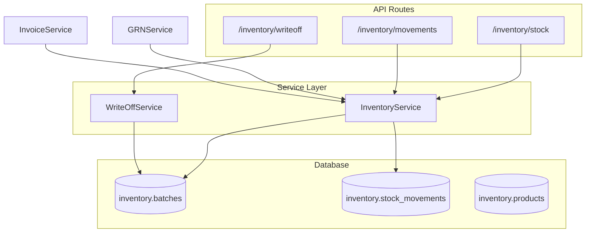
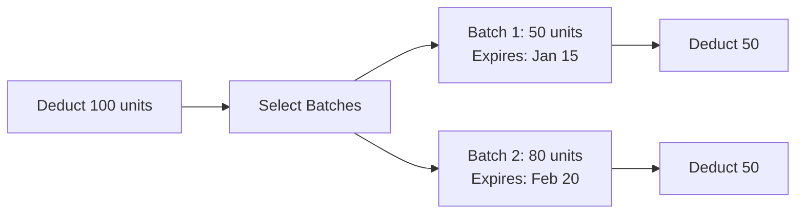

# Inventory Services

Services for stock management, batches, and movements.

**Code Location**: `app/api/services/inventory/`

---

## Architecture



---

## Services

| Service | File | Description |
|---------|------|-------------|
| [InventoryService](stock.md) | `inventory_service.py` | Stock operations |
| [WriteOffService](writeoff.md) | `writeoff_service.py` | Expiry/damage |

---

## InventoryService

**Location**: `app/api/services/inventory/inventory_service.py`

### Methods

| Method | Description |
|--------|-------------|
| `get_current_stock()` | Get stock by product |
| `get_available_batches()` | Get active batches |
| `deduct_stock()` | Deduct from batch (FIFO) |
| `add_stock()` | Add to batch (from GRN) |
| `get_expiring_batches()` | Get near-expiry items |
| `get_low_stock_products()` | Products below reorder |
| `create_stock_movement()` | Record movement |

### FIFO Batch Selection



### Example

```python
from app.api.services.inventory.inventory_service import InventoryService

# Deduct stock (FIFO)
InventoryService.deduct_stock(
    db=db,
    org_id=org_id,
    product_id=product_id,
    quantity=100,
    reference_type="invoice",
    reference_id=invoice_id
)
```

### Business Rules

1. **FIFO**: First expiry batches used first
2. **Negative Prevention**: Cannot deduct more than available
3. **Movement Tracking**: All changes recorded
4. **Expiry Alerts**: 7/30/90 day thresholds

---

## WriteOffService

**Location**: `app/api/services/inventory/writeoff_service.py`

### Methods

| Method | Description |
|--------|-------------|
| `create_writeoff()` | Create writeoff record |
| `get_writeoff()` | Get writeoff details |
| `list_writeoffs()` | List with filters |
| `get_expired_batches()` | Get expired for writeoff |

---

## Database Tables

| Table | Description |
|-------|-------------|
| `inventory.products` | Product catalog |
| `inventory.batches` | Batch records |
| `inventory.stock_movements` | Movement history |
| `inventory.writeoffs` | Writeoff records |

---

## Dependencies

```
InventoryService
└── Used by: GRNService, InvoiceService, ReturnService

WriteOffService
└── InventoryService
```

---

## Error Codes

| Error | HTTP | Description |
|-------|------|-------------|
| `PRODUCT_NOT_FOUND` | 404 | Product doesn't exist |
| `BATCH_NOT_FOUND` | 404 | Batch doesn't exist |
| `INSUFFICIENT_STOCK` | 400 | Not enough quantity |
| `BATCH_EXPIRED` | 400 | Cannot use expired batch |

---

**See also**: [Inventory API](../../api/inventory/) · [Inventory Schema](../../database/schemas/inventory.md)
