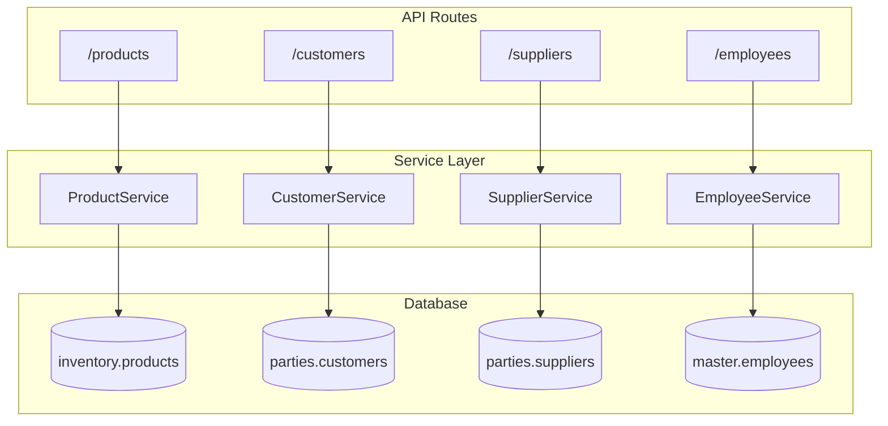

# Master Services

Services for core entities: products, customers, suppliers, employees.

**Code Location**: `app/api/services/master/`

---

## Architecture



---

## Services

| Service | File | Description |
|---------|------|-------------|
| [ProductService](product.md) | `product/service.py` | Product CRUD |
| [CustomerService](customer.md) | `customer/service.py` | Customer management |
| [SupplierService](supplier.md) | `supplier/service.py` | Supplier management |
| [EmployeeService](employee.md) | `employee/service.py` | Staff management |
| [BankAccountService](bank-account.md) | `bank_account_service.py` | Bank accounts |

---

## ProductService

**Location**: `app/api/services/master/product/service.py`

### Methods

| Method | Description |
|--------|-------------|
| `create_product()` | Create new product |
| `get_product()` | Get product details |
| `list_products()` | List with filters |
| `update_product()` | Update product |
| `search_products()` | Search by name/code |
| `get_product_stock()` | Get stock by product |

### Example

```python
from app.api.services.master.product.service import ProductService

product_id = ProductService.create_product(
    db=db,
    org_id=str(context.org_id),
    product_data={
        "product_name": "Paracetamol 500mg",
        "hsn_code": "30049099",
        "manufacturer_id": 1,
        "category_id": 5,
        "gst_rate": Decimal("12.00")
    }
)
```

---

## CustomerService

**Location**: `app/api/services/master/customer/service.py`

### Methods

| Method | Description |
|--------|-------------|
| `create_customer()` | Create customer |
| `get_customer()` | Get with addresses |
| `list_customers()` | List with filters |
| `update_customer()` | Update customer |
| `search_customers()` | Search by name/phone |
| `get_customer_balance()` | Get outstanding |
| `update_credit_limit()` | Update credit terms |

### Business Rules

1. **Credit Limit**: Enforced on order/invoice creation
2. **GSTIN Validation**: Required for wholesale customers
3. **Address Types**: Billing, shipping, or both
4. **Customer Types**: Retail, wholesale, hospital, clinic

---

## SupplierService

**Location**: `app/api/services/master/supplier/service.py`

### Methods

| Method | Description |
|--------|-------------|
| `create_supplier()` | Create supplier |
| `get_supplier()` | Get supplier details |
| `list_suppliers()` | List with filters |
| `update_supplier()` | Update supplier |
| `get_supplier_by_gstin()` | Find by GST number |

---

## EmployeeService

**Location**: `app/api/services/master/employee/service.py`

### Methods

| Method | Description |
|--------|-------------|
| `create_employee()` | Create employee |
| `get_employee()` | Get employee details |
| `list_employees()` | List with filters |
| `update_employee()` | Update employee |
| `assign_to_branch()` | Assign branch |

---

## Database Tables

| Table | Description |
|-------|-------------|
| `inventory.products` | Product catalog |
| `inventory.categories` | Product categories |
| `inventory.manufacturers` | Manufacturers |
| `parties.customers` | Customer records |
| `parties.suppliers` | Supplier records |
| `master.addresses` | Polymorphic addresses |
| `master.employees` | Employee records |
| `master.branches` | Branch/store locations |

---

## Error Codes

| Error | HTTP | Description |
|-------|------|-------------|
| `PRODUCT_NOT_FOUND` | 404 | Product doesn't exist |
| `CUSTOMER_NOT_FOUND` | 404 | Customer doesn't exist |
| `SUPPLIER_NOT_FOUND` | 404 | Supplier doesn't exist |
| `DUPLICATE_GSTIN` | 409 | GSTIN already exists |
| `INVALID_GSTIN` | 400 | Invalid GSTIN format |

---

**See also**: [Master API](../../api/master/) · [Parties Schema](../../database/schemas/parties.md)
