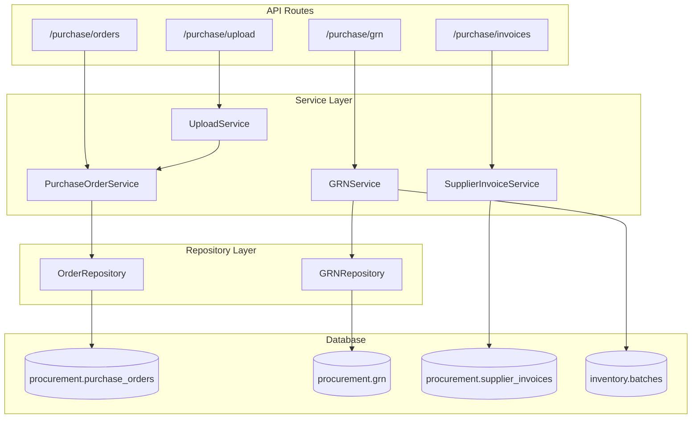

# Purchase Services

Services for procurement: purchase orders, GRN, supplier invoices, PDF parsing.

**Code Location**: `app/api/services/purchase/`

---

## Architecture



---

## Services

| Service | File | Description |
|---------|------|-------------|
| [GRNService](grn.md) | `grn/grn_service.py` | Goods receipt |
| [PurchaseOrderService](order.md) | `order/order_service.py` | Purchase orders |
| [SupplierInvoiceService](supplier-invoice.md) | `supplier_invoice/service.py` | AP tracking |
| [UploadService](upload.md) | `upload/service.py` | PDF parsing |

---

## GRNService

**Location**: `app/api/services/purchase/grn/grn_service.py`

### Methods

| Method | Description |
|--------|-------------|
| `create_grn()` | Create new GRN |
| `get_grn()` | Get GRN with items |
| `list_grns()` | List GRNs with filters |
| `approve_grn()` | Approve and update stock |
| `create_inventory_batches()` | Create inventory batches |

### Example

```python
from app.api.services.purchase.grn.grn_service import GRNService

grn_id = GRNService.create_grn(
    db=db,
    org_id=str(context.org_id),
    grn_data={
        "po_id": purchase_order_id,
        "supplier_id": supplier_id,
        "grn_date": date.today(),
        "items": received_items
    },
    created_by=context.user_id
)
db.commit()
```

### Performance (P2 Optimizations)

- **Bulk Insert**: `create_grn_items_bulk()` - 50 items in 1 query
- **Bulk UPSERT**: `create_inventory_batches_bulk()` - 50 batches in 1 query
- **Result**: 98% query reduction (152 → 8 queries for 50-item GRN)

---

## PurchaseOrderService

**Location**: `app/api/services/purchase/order/order_service.py`

### Methods

| Method | Description |
|--------|-------------|
| `create_purchase_order()` | Create new PO |
| `get_purchase_order()` | Get PO with items |
| `list_purchase_orders()` | List POs with filters |
| `approve_purchase_order()` | Approve PO |
| `cancel_purchase_order()` | Cancel PO |
| `generate_po_number()` | Generate unique number |

---

## SupplierInvoiceService

**Location**: `app/api/services/purchase/supplier_invoice/service.py`

### Methods

| Method | Description |
|--------|-------------|
| `get_supplier_invoices()` | List invoices with filters |
| `get_returnable_invoices()` | Get invoices for returns |
| `get_invoice_details()` | Get invoice with items |

---

## UploadService

**Location**: `app/api/services/purchase/upload/service.py`

### PDF Processing Flow


### Methods

| Method | Description |
|--------|-------------|
| `get_supplier_by_gstin()` | Find supplier by GST |
| `get_supplier_by_name_fuzzy()` | Fuzzy name matching |
| `create_supplier()` | Create new supplier |
| `create_purchase_order()` | Create PO from parsed data |
| `check_duplicate_invoice()` | Prevent duplicates |

---

## Database Tables

| Table | Description |
|-------|-------------|
| `procurement.purchase_orders` | PO headers |
| `procurement.purchase_order_items` | PO line items |
| `procurement.goods_receipt_notes` | GRN headers |
| `procurement.grn_items` | GRN line items |
| `procurement.supplier_invoices` | Supplier invoice headers |
| `inventory.batches` | Created by GRN |

---

## Dependencies

```
GRNService
├── DocumentNumberService
├── InventoryService (stock addition)
└── GRNRepository (bulk operations)

PurchaseOrderService
└── DocumentNumberService

UploadService
├── ProductService
└── PurchaseOrderService
```

---

## Error Codes

| Error | HTTP | Description |
|-------|------|-------------|
| `PO_NOT_FOUND` | 404 | PO doesn't exist |
| `SUPPLIER_NOT_FOUND` | 404 | Supplier doesn't exist |
| `DUPLICATE_INVOICE` | 409 | Invoice already exists |
| `GRN_ALREADY_APPROVED` | 400 | Cannot modify |
| `QUANTITY_EXCEEDS_PO` | 400 | Received > ordered |
| `PARSE_FAILED` | 422 | PDF extraction failed |

---

**See also**: [Purchase API](../../api/purchase/) · [Canonical field dictionary](../../../architecture/canonical-field-dictionary.json)
