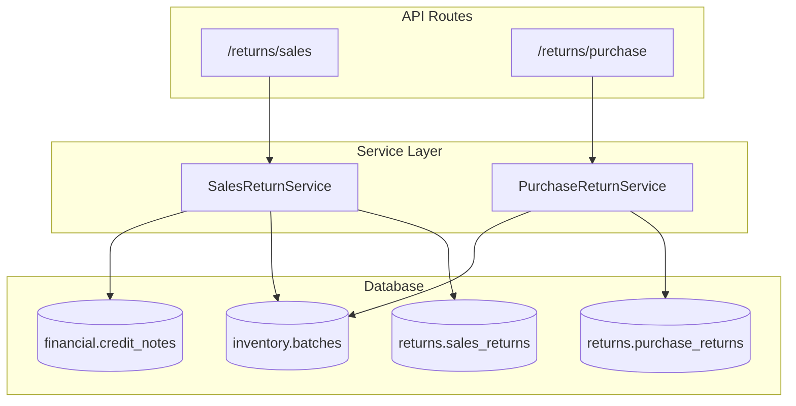
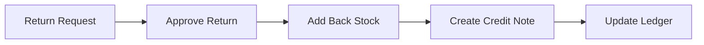

# Returns Services

Services for sales and purchase returns processing.

**Code Location**: `app/api/services/returns/`

---

## Architecture



---

## Services

| Service | File | Description |
|---------|------|-------------|
| [SalesReturnService](sales-returns.md) | `sales_return_service.py` | Customer returns |
| [PurchaseReturnService](purchase-returns.md) | `purchase_return_service.py` | Supplier returns |

---

## SalesReturnService

**Location**: `app/api/services/returns/sales_return_service.py`

### Methods

| Method | Description |
|--------|-------------|
| `create_sales_return()` | Create return request |
| `get_sales_return()` | Get return with items |
| `list_sales_returns()` | List with filters |
| `approve_return()` | Approve and process |
| `get_returnable_invoices()` | Invoices for return |
| `create_credit_note()` | Generate credit note |

### Return Flow



---

## PurchaseReturnService

**Location**: `app/api/services/returns/purchase_return_service.py`

### Methods

| Method | Description |
|--------|-------------|
| `create_purchase_return()` | Create return to supplier |
| `get_purchase_return()` | Get return details |
| `list_purchase_returns()` | List with filters |
| `process_return()` | Process and update stock |

---

## Database Tables

| Table | Description |
|-------|-------------|
| `returns.sales_returns` | Sales return headers |
| `returns.sales_return_items` | Return line items |
| `returns.purchase_returns` | Purchase return headers |
| `returns.purchase_return_items` | Return line items |

---

## Dependencies

```
SalesReturnService
├── InventoryService (stock addition)
├── CreditNoteService
└── LedgerService

PurchaseReturnService
├── InventoryService (stock deduction)
└── SupplierInvoiceService
```

---

## Error Codes

| Error | HTTP | Description |
|-------|------|-------------|
| `INVOICE_NOT_FOUND` | 404 | Invoice doesn't exist |
| `ALREADY_RETURNED` | 400 | Already fully returned |
| `QUANTITY_EXCEEDS` | 400 | Return qty > invoice qty |
| `RETURN_NOT_FOUND` | 404 | Return doesn't exist |

---

**See also**: [Returns API](../../api/returns/) · [Returns Schema](../../database/schemas/returns.md)
