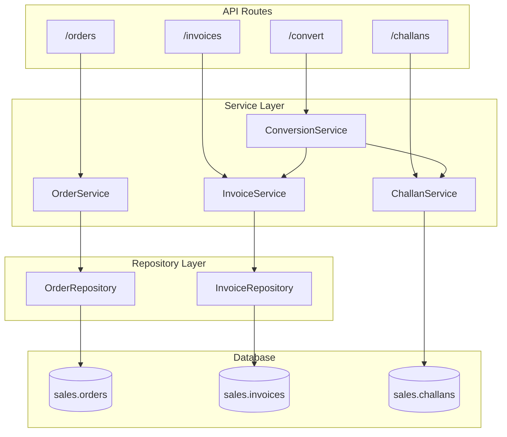
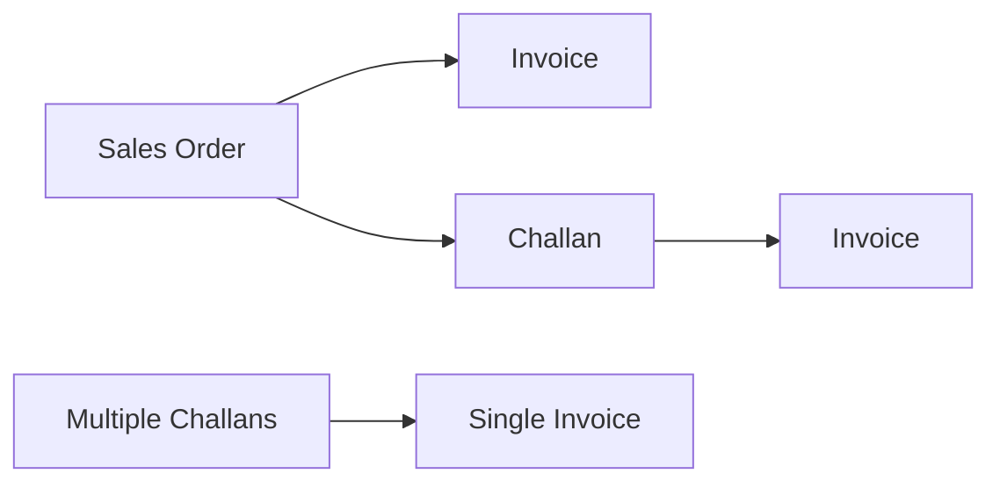

# Sales Services

Services for sales operations: orders, invoices, challans, conversions.

**Code Location**: `app/api/services/sales/`

---

## Architecture



---

## Services

| Service | File | Description |
|---------|------|-------------|
| [InvoiceService](invoice.md) | `invoice/invoice_service.py` | Invoice lifecycle |
| [OrderService](order.md) | `order/order_service.py` | Sales orders |
| [ChallanService](challan.md) | `challan/service.py` | Delivery challans |
| [ConversionService](conversion.md) | `conversion/service.py` | Document conversions |

---

## InvoiceService

**Location**: `app/api/services/sales/invoice/invoice_service.py`

### Methods

| Method | Description |
|--------|-------------|
| `create_invoice()` | Create new sales invoice |
| `get_invoice()` | Get invoice with items |
| `list_invoices()` | List invoices with filters |
| `update_invoice()` | Update invoice details |
| `cancel_invoice()` | Cancel/void invoice |
| `calculate_totals()` | Calculate invoice totals |
| `update_payment_status()` | Update based on payments |
| `generate_invoice_number()` | Generate unique number |

### Example

```python
from app.api.services.sales.invoice.invoice_service import InvoiceService

invoice_id = InvoiceService.create_invoice(
    db=db,
    org_id=str(context.org_id),
    invoice_data={
        "customer_id": customer_id,
        "invoice_date": date.today(),
        "items": [
            {"product_id": 1, "quantity": 10, "unit_price": Decimal("100.00")}
        ]
    },
    created_by=context.user_id
)
db.commit()
```

### Business Rules

1. **Inventory Deduction**: Stock deducted on creation
2. **Credit Check**: Must not exceed customer credit limit
3. **GST Calculation**: Auto CGST/SGST or IGST based on state
4. **Number Generation**: Auto-incremented per org

### Performance

- Uses bulk insert for items (P2 optimization)
- 50 items: 1 query instead of 50 (98% reduction)

---

## OrderService

**Location**: `app/api/services/sales/order/order_service.py`

### Methods

| Method | Description |
|--------|-------------|
| `create_order()` | Create new sales order |
| `get_order()` | Get order with items |
| `list_orders()` | List orders with filters |
| `update_order()` | Update order details |
| `update_order_status()` | Change order status |
| `cancel_order()` | Cancel order |
| `confirm_order()` | Confirm order for processing |
| `get_pending_orders()` | Orders pending dispatch |

---

## ChallanService

**Location**: `app/api/services/sales/challan/service.py`

### Methods (20 total)

| Method | Description |
|--------|-------------|
| `create_challan()` | Create delivery challan |
| `list_challans()` | List challans with filters |
| `dispatch_challan()` | Mark as dispatched |
| `deliver_challan()` | Mark as delivered |
| `get_challan_analytics()` | Get delivery analytics |

---

## ConversionService

**Location**: `app/api/services/sales/conversion/service.py`

### Conversion Flows



### Methods

| Method | Description |
|--------|-------------|
| `get_order_for_conversion()` | Get order with customer |
| `check_order_invoiced()` | Check if already invoiced |
| `create_invoice()` | Create invoice from order |
| `copy_order_items_to_invoice()` | Copy items with GST |
| `create_challan()` | Create challan from order |
| `get_eligible_challans()` | Get uninvoiced challans |

---

## Database Tables

| Table | Description |
|-------|-------------|
| `sales.orders` | Order headers |
| `sales.order_items` | Order line items |
| `sales.invoices` | Invoice headers |
| `sales.invoice_items` | Invoice line items |
| `sales.delivery_challans` | Challan headers |
| `sales.delivery_challan_items` | Challan line items |

---

## Dependencies

```
InvoiceService
├── DocumentNumberService
├── GSTService (tax calculation)
└── InventoryService (stock deduction)

OrderService
└── DocumentNumberService

ChallanService
└── DocumentNumberService

ConversionService
├── InvoiceService
└── ChallanService
```

---

## Error Codes

| Error | HTTP | Description |
|-------|------|-------------|
| `ORDER_NOT_FOUND` | 404 | Order doesn't exist |
| `CUSTOMER_NOT_FOUND` | 404 | Customer doesn't exist |
| `ALREADY_INVOICED` | 400 | Order already invoiced |
| `INSUFFICIENT_STOCK` | 400 | Not enough stock |
| `DUPLICATE_INVOICE_NUMBER` | 409 | Number exists |

---

**See also**: [Sales API](../../api/sales/) · [Sales Schema](../../database/schemas/sales.md)
