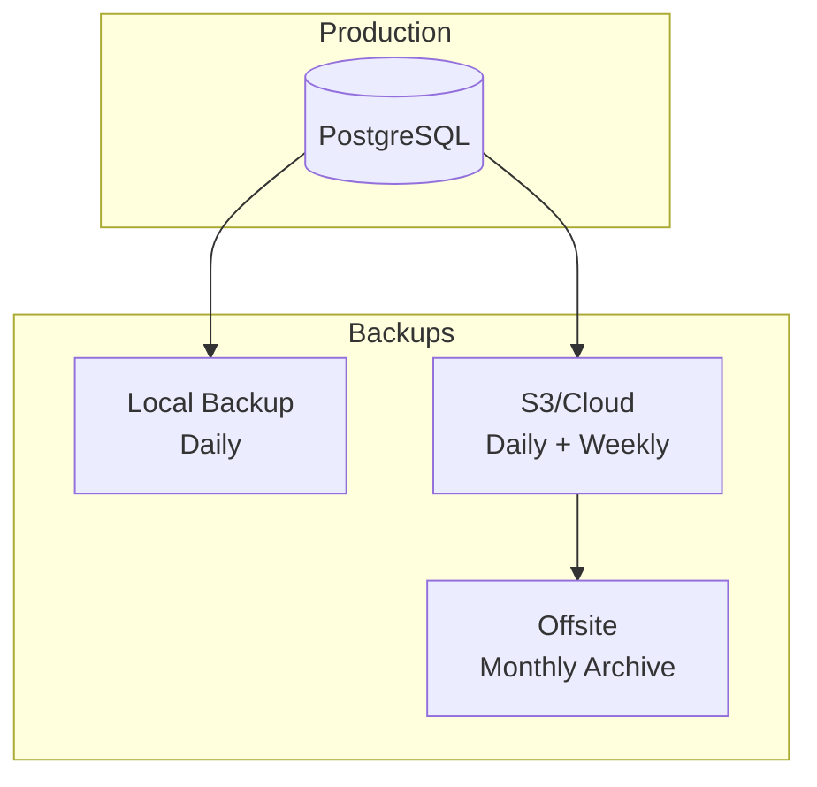

# Backup & Recovery

Database backup strategies and disaster recovery procedures.

---

## Backup Strategy

### 3-2-1 Rule

- **3** copies of data
- **2** different storage types
- **1** offsite location



---

## Backup Types

### Full Backup

Complete database dump:

```bash
# Create full backup
pg_dump -Fc -v -d pharmacy_prod > backup_full_$(date +%Y%m%d_%H%M%S).dump

# With compression
pg_dump -Fc -Z9 -d pharmacy_prod > backup_full_$(date +%Y%m%d).dump.gz
```

### Incremental Backup (WAL Archiving)

Continuous archiving for point-in-time recovery:

```bash
# postgresql.conf
archive_mode = on
archive_command = 'cp %p /backup/wal/%f'
```

### Logical Backup

Schema-only or selective backup:

```bash
# Schema only
pg_dump -s -d pharmacy_prod > schema_backup.sql

# Single table
pg_dump -t sales.invoices -d pharmacy_prod > invoices_backup.dump

# Specific schemas
pg_dump -n sales -n inventory -d pharmacy_prod > business_backup.dump
```

---

## Automated Backup Scripts

### Daily Backup Script

```bash
#!/bin/bash
# backup.sh

# Configuration
DB_NAME="pharmacy_prod"
BACKUP_DIR="/backup/daily"
S3_BUCKET="s3://pharmacy-backups/daily"
RETENTION_DAYS=7

# Create timestamp
TIMESTAMP=$(date +%Y%m%d_%H%M%S)
BACKUP_FILE="${BACKUP_DIR}/${DB_NAME}_${TIMESTAMP}.dump"

# Create backup
echo "Starting backup: ${TIMESTAMP}"
pg_dump -Fc -Z6 -d $DB_NAME > $BACKUP_FILE

# Verify backup
if [ $? -eq 0 ]; then
    echo "Backup successful: $(ls -lh $BACKUP_FILE)"
    
    # Upload to S3
    aws s3 cp $BACKUP_FILE $S3_BUCKET/
    
    # Cleanup old local backups
    find $BACKUP_DIR -name "*.dump" -mtime +$RETENTION_DAYS -delete
    
    echo "Backup completed successfully"
else
    echo "ERROR: Backup failed!"
    exit 1
fi
```

### Cron Schedule

```bash
# /etc/cron.d/pharmacy-backup

# Daily backup at 2 AM
0 2 * * * backup /opt/scripts/backup.sh >> /var/log/backup.log 2>&1

# Weekly full backup (Sunday 3 AM)
0 3 * * 0 backup /opt/scripts/weekly_backup.sh >> /var/log/backup.log 2>&1

# Monthly archive (1st of month, 4 AM)
0 4 1 * * backup /opt/scripts/monthly_archive.sh >> /var/log/backup.log 2>&1
```

---

## Backup Verification

### Automated Verification

```bash
#!/bin/bash
# verify_backup.sh

BACKUP_FILE=$1
TEST_DB="pharmacy_verify_$(date +%s)"

# Create test database
createdb $TEST_DB

# Restore backup
pg_restore -d $TEST_DB $BACKUP_FILE

# Run verification queries
psql -d $TEST_DB -c "SELECT COUNT(*) FROM sales.invoices;" > /dev/null 2>&1
RESULT=$?

# Cleanup
dropdb $TEST_DB

if [ $RESULT -eq 0 ]; then
    echo "✓ Backup verification passed: $BACKUP_FILE"
    exit 0
else
    echo "✗ Backup verification FAILED: $BACKUP_FILE"
    exit 1
fi
```

### Monthly Verification

```bash
# Schedule monthly verification
0 5 1 * * backup /opt/scripts/verify_latest_backup.sh
```

---

## Recovery Procedures

### Full Database Restore

```bash
# 1. Stop application
sudo systemctl stop pharmacy-api

# 2. Drop and recreate database
dropdb pharmacy_prod
createdb pharmacy_prod

# 3. Restore from backup
pg_restore -d pharmacy_prod -v backup_full_20260109.dump

# 4. Verify restoration
psql -d pharmacy_prod -c "SELECT COUNT(*) FROM sales.invoices;"

# 5. Restart application
sudo systemctl start pharmacy-api
```

### Point-in-Time Recovery

```bash
# 1. Stop PostgreSQL
sudo systemctl stop postgresql

# 2. Clear current data directory
rm -rf /var/lib/postgresql/14/main/*

# 3. Restore base backup
tar -xf base_backup.tar -C /var/lib/postgresql/14/main/

# 4. Configure recovery
cat > /var/lib/postgresql/14/main/recovery.signal << EOF
EOF

cat >> /var/lib/postgresql/14/main/postgresql.conf << EOF
restore_command = 'cp /backup/wal/%f %p'
recovery_target_time = '2026-01-09 14:30:00'
EOF

# 5. Start PostgreSQL
sudo systemctl start postgresql

# 6. Verify and promote
psql -c "SELECT pg_is_in_recovery();"  # Should be 't'
psql -c "SELECT pg_wal_replay_resume();"
```

### Single Table Restore

```bash
# 1. Restore to temporary table
pg_restore -d pharmacy_prod -t invoices -s backup.dump

# 2. Or restore to different table name
pg_restore -d pharmacy_prod --data-only -t invoices backup.dump

# 3. Verify and swap if needed
```

---

## Disaster Recovery Plan

### RTO and RPO

| Metric | Target | Description |
|--------|--------|-------------|
| **RPO** (Recovery Point Objective) | 1 hour | Max data loss acceptable |
| **RTO** (Recovery Time Objective) | 2 hours | Max downtime acceptable |

### Recovery Runbook

#### Level 1: Application Failure

```
Time: 0-15 minutes
1. Check health endpoints
2. Review error logs
3. Restart application service
4. Verify recovery
```

#### Level 2: Database Issues

```
Time: 15-60 minutes
1. Check PostgreSQL status
2. Review pg_stat_activity
3. Restart PostgreSQL if needed
4. Check connection pool
5. Apply patches if required
```

#### Level 3: Data Corruption

```
Time: 1-2 hours
1. Stop application
2. Assess damage scope
3. Restore from latest backup
4. Apply WAL logs to minimize loss
5. Verify data integrity
6. Restart application
7. Notify stakeholders
```

#### Level 4: Total Infrastructure Failure

```
Time: 2-4 hours
1. Provision new infrastructure
2. Restore from S3 backup
3. Update DNS/Load balancer
4. Verify all systems
5. Resume operations
6. Post-mortem analysis
```

---

## Cloud Backup (AWS S3)

### Upload Script

```bash
#!/bin/bash
# s3_backup.sh

BACKUP_FILE=$1
S3_BUCKET="s3://pharmacy-backups"
DATE=$(date +%Y/%m/%d)

# Upload with server-side encryption
aws s3 cp $BACKUP_FILE ${S3_BUCKET}/${DATE}/ \
    --sse AES256 \
    --storage-class STANDARD_IA

# Verify upload
aws s3 ls ${S3_BUCKET}/${DATE}/$(basename $BACKUP_FILE)
```

### S3 Lifecycle Policy

```json
{
  "Rules": [
    {
      "ID": "DailyBackupLifecycle",
      "Status": "Enabled",
      "Filter": {"Prefix": "daily/"},
      "Transitions": [
        {"Days": 30, "StorageClass": "GLACIER"}
      ],
      "Expiration": {"Days": 90}
    },
    {
      "ID": "MonthlyArchive",
      "Status": "Enabled",
      "Filter": {"Prefix": "monthly/"},
      "Transitions": [
        {"Days": 30, "StorageClass": "DEEP_ARCHIVE"}
      ],
      "Expiration": {"Days": 365}
    }
  ]
}
```

---

## Redis Backup

### Redis Persistence

```conf
# redis.conf
save 900 1      # Save if 1 key changed in 15 min
save 300 10     # Save if 10 keys changed in 5 min
save 60 10000   # Save if 10000 keys changed in 1 min

appendonly yes
appendfsync everysec
```

### Redis Backup Script

```bash
#!/bin/bash
# backup_redis.sh

REDIS_DIR="/var/lib/redis"
BACKUP_DIR="/backup/redis"
TIMESTAMP=$(date +%Y%m%d_%H%M%S)

# Create backup
redis-cli BGSAVE
sleep 5

# Copy RDB file
cp ${REDIS_DIR}/dump.rdb ${BACKUP_DIR}/redis_${TIMESTAMP}.rdb

# Upload to S3
aws s3 cp ${BACKUP_DIR}/redis_${TIMESTAMP}.rdb s3://pharmacy-backups/redis/
```

---

## Monitoring Backups

### Backup Status Check

```bash
#!/bin/bash
# check_backup.sh

BACKUP_DIR="/backup/daily"
MAX_AGE=86400  # 24 hours

LATEST=$(find $BACKUP_DIR -name "*.dump" -type f -printf '%T@ %p\n' | sort -n | tail -1)
LATEST_TIME=$(echo $LATEST | cut -d' ' -f1 | cut -d'.' -f1)
NOW=$(date +%s)
AGE=$((NOW - LATEST_TIME))

if [ $AGE -gt $MAX_AGE ]; then
    echo "CRITICAL: Last backup is $((AGE/3600)) hours old"
    exit 2
else
    echo "OK: Last backup is $((AGE/3600)) hours old"
    exit 0
fi
```

### Alerting

```yaml
# Prometheus alert
- alert: BackupTooOld
  expr: time() - backup_last_success_timestamp > 86400
  for: 1h
  labels:
    severity: critical
  annotations:
    summary: "Database backup is overdue"
```

---

## Recovery Testing

### Monthly Recovery Drill

```markdown
## Recovery Drill Checklist

- [ ] Download backup from S3
- [ ] Provision test infrastructure
- [ ] Restore database
- [ ] Verify data integrity
- [ ] Test application functionality
- [ ] Document issues found
- [ ] Update runbook if needed
- [ ] Destroy test infrastructure
```

### Documentation

After each drill, update:
1. Recovery runbook
2. Time estimates
3. Known issues
4. Contact list

---

## Checklist

### Backup Setup

- [ ] Automated daily backups
- [ ] Weekly full backups
- [ ] Monthly archives
- [ ] S3/offsite storage configured
- [ ] Backup encryption enabled
- [ ] Retention policies set

### Verification

- [ ] Backup verification automated
- [ ] Monthly recovery drills
- [ ] Documentation current
- [ ] Alert rules configured

### Recovery Readiness

- [ ] Runbook documented
- [ ] Team trained on procedures
- [ ] Contact list current
- [ ] Test restores successful

---

## See Also

- [Production Deployment](production.md)
- [Monitoring](monitoring.md)
- [Database Schema](../backend/database/)
