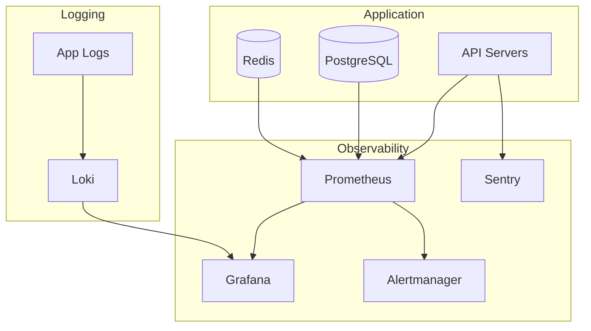

# Monitoring & Logging

Observability setup for production systems.

---

## Monitoring Stack



---

## Metrics

### Application Metrics

```python
# metrics.py
from prometheus_client import Counter, Histogram, Gauge

# Request metrics
REQUEST_COUNT = Counter(
    'api_requests_total',
    'Total requests',
    ['method', 'endpoint', 'status']
)

REQUEST_LATENCY = Histogram(
    'api_request_duration_seconds',
    'Request latency',
    ['method', 'endpoint']
)

# Business metrics
ACTIVE_USERS = Gauge('active_users', 'Active users in last 5 min')
INVOICES_CREATED = Counter('invoices_created_total', 'Invoices created')
PAYMENTS_PROCESSED = Counter('payments_processed_total', 'Payments processed')
```

### Middleware

```python
# middleware.py
import time
from starlette.middleware.base import BaseHTTPMiddleware

class MetricsMiddleware(BaseHTTPMiddleware):
    async def dispatch(self, request, call_next):
        start = time.perf_counter()
        response = await call_next(request)
        duration = time.perf_counter() - start
        
        # Record metrics
        REQUEST_COUNT.labels(
            method=request.method,
            endpoint=request.url.path,
            status=response.status_code
        ).inc()
        
        REQUEST_LATENCY.labels(
            method=request.method,
            endpoint=request.url.path
        ).observe(duration)
        
        return response
```

### Prometheus Endpoint

```python
from prometheus_client import generate_latest, CONTENT_TYPE_LATEST

@app.get("/metrics")
async def metrics():
    return Response(generate_latest(), media_type=CONTENT_TYPE_LATEST)
```

---

## Logging

### Structured Logging

```python
# logging_config.py
import logging
import json
from datetime import datetime

class JSONFormatter(logging.Formatter):
    def format(self, record):
        log_record = {
            "timestamp": datetime.utcnow().isoformat(),
            "level": record.levelname,
            "logger": record.name,
            "message": record.getMessage(),
            "module": record.module,
            "function": record.funcName,
            "line": record.lineno,
        }
        
        if hasattr(record, 'request_id'):
            log_record['request_id'] = record.request_id
        
        if hasattr(record, 'org_id'):
            log_record['org_id'] = record.org_id
        
        if record.exc_info:
            log_record['exception'] = self.formatException(record.exc_info)
        
        return json.dumps(log_record)

# Configure
logging.config.dictConfig({
    'version': 1,
    'formatters': {
        'json': {'()': JSONFormatter}
    },
    'handlers': {
        'console': {
            'class': 'logging.StreamHandler',
            'formatter': 'json'
        },
        'file': {
            'class': 'logging.handlers.RotatingFileHandler',
            'filename': 'logs/app.log',
            'maxBytes': 10485760,  # 10MB
            'backupCount': 5,
            'formatter': 'json'
        }
    },
    'root': {
        'level': 'INFO',
        'handlers': ['console', 'file']
    }
})
```

### Request Logging

```python
# Request ID middleware
import uuid

class RequestIDMiddleware(BaseHTTPMiddleware):
    async def dispatch(self, request, call_next):
        request_id = request.headers.get('X-Request-ID', str(uuid.uuid4()))
        
        # Add to logging context
        logger = logging.getLogger()
        logger = logging.LoggerAdapter(logger, {'request_id': request_id})
        
        logger.info(f"Request: {request.method} {request.url.path}")
        
        response = await call_next(request)
        response.headers['X-Request-ID'] = request_id
        
        logger.info(f"Response: {response.status_code}")
        return response
```

### Log Levels

| Level | When to Use |
|-------|-------------|
| DEBUG | Detailed debugging (development only) |
| INFO | Request/response, business events |
| WARNING | Unexpected but handled |
| ERROR | Errors requiring attention |
| CRITICAL | System-critical failures |

---

## Error Tracking (Sentry)

### Setup

```python
# sentry.py
import sentry_sdk
from sentry_sdk.integrations.fastapi import FastApiIntegration
from sentry_sdk.integrations.sqlalchemy import SqlalchemyIntegration

sentry_sdk.init(
    dsn=os.environ.get("SENTRY_DSN"),
    environment=os.environ.get("APP_ENV", "development"),
    traces_sample_rate=0.1,  # 10% of transactions
    integrations=[
        FastApiIntegration(),
        SqlalchemyIntegration()
    ],
    before_send=filter_sensitive_data
)

def filter_sensitive_data(event, hint):
    """Remove sensitive data before sending to Sentry"""
    if 'request' in event:
        request = event['request']
        if 'headers' in request:
            # Remove auth headers
            request['headers'] = {
                k: v for k, v in request['headers'].items()
                if k.lower() not in ['authorization', 'cookie']
            }
    return event
```

### Custom Context

```python
from sentry_sdk import set_user, set_context

def set_sentry_context(user, org):
    set_user({
        "id": user.user_id,
        "username": user.username,
        "email": user.email
    })
    set_context("organization", {
        "org_id": org.org_id,
        "org_name": org.org_name
    })
```

---

## Alerting

### Alert Rules

```yaml
# alerts.yml (Prometheus Alertmanager)
groups:
  - name: api
    rules:
      - alert: HighErrorRate
        expr: rate(api_requests_total{status=~"5.."}[5m]) > 0.1
        for: 5m
        labels:
          severity: critical
        annotations:
          summary: "High error rate detected"
          description: "Error rate is {{ $value }} errors/sec"

      - alert: SlowResponses
        expr: histogram_quantile(0.95, rate(api_request_duration_seconds_bucket[5m])) > 2
        for: 10m
        labels:
          severity: warning
        annotations:
          summary: "Slow API responses"
          description: "95th percentile latency is {{ $value }}s"

      - alert: DatabaseConnectionsHigh
        expr: pg_stat_activity_count > 80
        for: 5m
        labels:
          severity: warning
        annotations:
          summary: "High database connections"

      - alert: DiskSpaceLow
        expr: node_filesystem_avail_bytes / node_filesystem_size_bytes < 0.1
        for: 10m
        labels:
          severity: critical
        annotations:
          summary: "Disk space below 10%"
```

### Notification Channels

```yaml
# alertmanager.yml
receivers:
  - name: 'slack-notifications'
    slack_configs:
      - channel: '#alerts-pharmacy'
        api_url: $SLACK_WEBHOOK_URL

  - name: 'pagerduty'
    pagerduty_configs:
      - service_key: $PAGERDUTY_KEY

route:
  receiver: 'slack-notifications'
  routes:
    - match:
        severity: critical
      receiver: 'pagerduty'
```

---

## Dashboards

### Key Metrics Dashboard

| Panel | Query |
|-------|-------|
| Request Rate | `rate(api_requests_total[5m])` |
| Error Rate | `rate(api_requests_total{status=~"5.."}[5m])` |
| Latency P95 | `histogram_quantile(0.95, rate(api_request_duration_seconds_bucket[5m]))` |
| Active DB Connections | `pg_stat_activity_count` |
| Redis Memory | `redis_memory_used_bytes` |

### Business Metrics Dashboard

| Panel | Query/Source |
|-------|--------------|
| Invoices Today | `invoices_created_total` |
| Revenue Today | Custom query from DB |
| Active Users | `active_users` |
| Top Products | Custom query from DB |

---

## Health Checks

### Comprehensive Health Check

```python
@app.get("/health/detailed")
async def detailed_health(db: Session = Depends(get_db)):
    checks = {}
    
    # Database
    try:
        db.execute(text("SELECT 1"))
        checks["database"] = {"status": "healthy"}
    except Exception as e:
        checks["database"] = {"status": "unhealthy", "error": str(e)}
    
    # Redis
    try:
        redis_client.ping()
        checks["redis"] = {"status": "healthy"}
    except Exception as e:
        checks["redis"] = {"status": "unhealthy", "error": str(e)}
    
    # Disk space
    disk = shutil.disk_usage("/")
    disk_percent = disk.used / disk.total * 100
    checks["disk"] = {
        "status": "healthy" if disk_percent < 90 else "warning",
        "used_percent": round(disk_percent, 2)
    }
    
    # Overall status
    overall = "healthy" if all(
        c.get("status") == "healthy" for c in checks.values()
    ) else "unhealthy"
    
    status_code = 200 if overall == "healthy" else 503
    
    return JSONResponse(
        status_code=status_code,
        content={
            "status": overall,
            "timestamp": datetime.utcnow().isoformat(),
            "checks": checks
        }
    )
```

---

## Log Aggregation (Loki)

### Docker Logging Driver

```yaml
# docker-compose.prod.yml
services:
  api:
    logging:
      driver: loki
      options:
        loki-url: "http://loki:3100/loki/api/v1/push"
        loki-batch-size: "400"
        labels: "service=pharmacy-api"
```

### Query Examples

```logql
# Errors in last hour
{service="pharmacy-api"} |= "ERROR"

# Slow requests
{service="pharmacy-api"} | json | duration > 1s

# Specific user's requests
{service="pharmacy-api"} |= "user_id=123"
```

---

## Checklist

### Monitoring Setup

- [ ] Prometheus scraping endpoints
- [ ] Grafana dashboards configured
- [ ] Alert rules defined
- [ ] Notification channels configured

### Logging Setup

- [ ] Structured JSON logging
- [ ] Log rotation configured
- [ ] Log aggregation (Loki/ELK)
- [ ] Sensitive data filtered

### Error Tracking

- [ ] Sentry DSN configured
- [ ] User context attached
- [ ] Source maps uploaded (frontend)
- [ ] Alert thresholds set

---

## See Also

- [Production Deployment](production.md)
- [Backup & Recovery](backup.md)

---

**Next**: [Backup & Recovery](backup.md)
