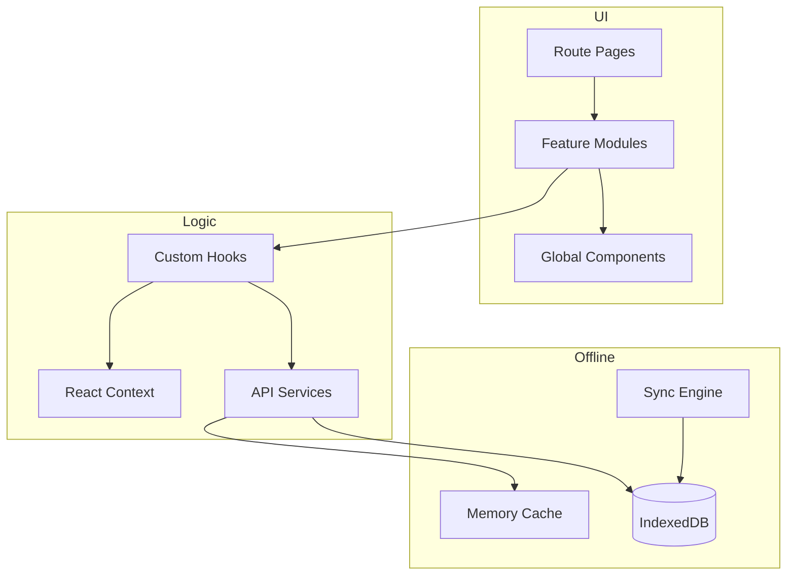

# Frontend Documentation

React/TypeScript frontend for the Pharmacy Management System.

---

## Documentation Locations

Frontend documentation is organized into two locations:

| Location | Purpose | Audience |
|----------|---------|----------|
| `docs/frontend/` | Technical overview, offline architecture | Backend devs, DevOps |
| `frontend/docs/` | Detailed developer docs, user guides | Frontend devs, end users |

---

## Quick Navigation

### In This Directory (`docs/frontend/`)

| Document | Description |
|----------|-------------|
| [Offline Architecture](offline/) | Cache-first, delta sync, IndexedDB schema |
| [Design System](design-system.md) | Colors, typography, components (summary) |

### In `frontend/docs/` (Main Frontend Docs)

| Category | Description |
|----------|-------------|
| [Getting Started](../../frontend/docs/01-getting-started/) | Setup, installation |
| [Architecture](../../frontend/docs/02-architecture/) | Tech stack, data flow |
| [Components](../../frontend/docs/03-components/) | Form, layout components |
| [State Management](../../frontend/docs/04-state-management/) | useReducer, Context patterns |
| [API Integration](../../frontend/docs/05-api-integration/) | Axios, endpoints, error handling |
| [Developer Guides](../../frontend/docs/06-guides/) | Coding conventions, new modules |
| [Testing](../../frontend/docs/07-testing/) | Unit, integration, E2E |
| [Security](../../frontend/docs/08-security/) | Auth, RBAC |
| [Design System](../../frontend/docs/design-system.md) | **Complete** (511 lines) |

### User Guides (`frontend/docs/user-guides/`)

End-user operational documentation:

| Category | Guides |
|----------|--------|
| Getting Started | Quick start, navigation, dashboard |
| Sales | Invoices, payments, returns, outstanding |
| Purchase | Purchase orders, GRN, supplier payments |
| Inventory | Products, batches, stock transfers |
| Reports | GST, sales, stock, outstanding |

---

## Technology Stack

| Technology | Version | Purpose |
|------------|---------|---------|
| React | 18.x | UI framework |
| TypeScript | 5.x | Type safety |
| Vite | 5.x | Build tool |
| Tailwind CSS | 3.x | Styling |
| IndexedDB | — | Offline storage |
| Axios | — | HTTP client |

---

## Architecture Overview



---

## Key Features

### Offline-First

- Full functionality without network
- Background sync when online
- Conflict detection and resolution
- See [Offline Architecture](offline/) for details

### Multi-Tenancy

- Organization isolation via `org_id`
- Branch-level filtering
- Role-based access control

### Keyboard Navigation

- Full keyboard support for workflows
- Tab navigation between fields
- Shortcuts for common actions

---

## Project Structure

```
frontend/
├── src/
│   ├── components/
│   │   ├── sales/            # Invoice, challan, orders
│   │   ├── purchase/         # PO, GRN
│   │   ├── inventory/        # Products, batches
│   │   └── global/           # Shared components
│   ├── services/
│   │   ├── api/              # API clients
│   │   └── offline/          # Offline services
│   ├── hooks/                # Custom hooks
│   ├── contexts/             # React Context
│   ├── types/                # TypeScript types
│   └── utils/                # Utilities
│
└── docs/                     # Detailed frontend docs
    ├── 01-getting-started/
    ├── 02-architecture/
    ├── 03-components/
    ├── ...
    ├── modules/              # Feature-specific docs
    └── user-guides/          # End-user guides
```

---

## See Also

- [Complete Design System](../../frontend/docs/design-system.md) (511 lines)
- [Complete Frontend Docs](../../frontend/docs/)
- [Backend API Reference](../backend/api/)
- [Backend Architecture](../backend/architecture/)
