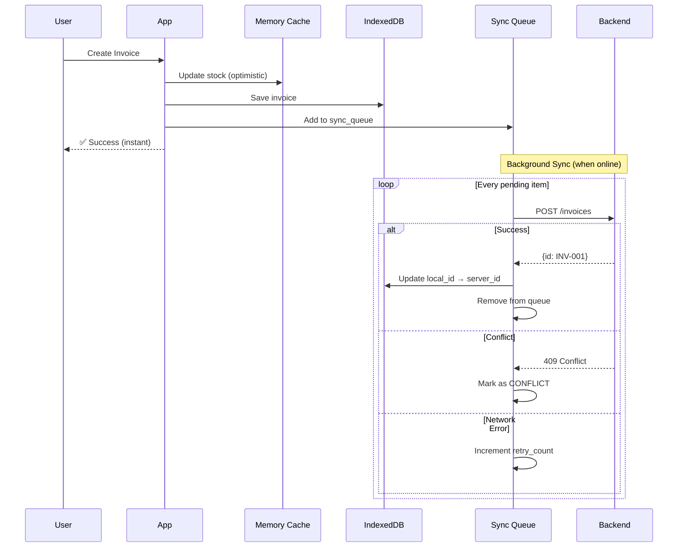

# Offline Architecture

Enterprise-grade offline-first system for India's network conditions.

---

## Design Philosophy

### Core Principles

| Principle | Description |
|-----------|-------------|
| **Cache-First** | All reads hit memory cache (O(1) HashMap) first |
| **Optimistic Updates** | Writes succeed immediately, sync in background |
| **Delta Sync** | Only transfer changed records, never full re-sync |
| **Push-Before-Pull** | Local changes push before pulling server updates |

### India-Ready Design

Built for intermittent connectivity:
- Works 100% offline for sales operations
- Background sync when online
- Conflict detection and resolution
- Preallocated document numbers

---

## Architecture Overview

```mermaid
graph TB
    subgraph "Layer 1: React UI"
        Components[React Components]
        Hooks[Custom Hooks<br/>useOfflineCustomers<br/>useOfflineProducts]
    end
    
    subgraph "Layer 2: Offline Services"
        subgraph "Data Access"
            DataService[Data Service<br/>Cache-first reads]
            MemCache[Memory Cache<br/>HashMap O(1)]
        end
        
        subgraph "Sync Engine"
            DeltaSync[Delta Sync Service<br/>Incremental updates]
            SyncEngine[Sync Engine<br/>Push pending items]
            SyncQueue[Sync Queue Manager<br/>Pending operations]
        end
        
        subgraph "Module Services"
            SalesSvc[Sales Sync]
            PurchaseSvc[Purchase Sync]
            InventorySvc[Inventory Sync]
            MasterSvc[Master Sync]
        end
    end
    
    subgraph "Layer 3: Storage"
        IDB[(IndexedDB<br/>PharmaERPOffline<br/>v8)]
        LocalStorage[localStorage<br/>Timestamps]
    end
    
    subgraph "Layer 4: Network"
        API[Backend API<br/>/sync/full-data<br/>/sync/delta]
    end
    
    Components --> Hooks
    Hooks --> DataService
    DataService --> MemCache
    DataService --> IDB
    
    SyncEngine --> SyncQueue
    DeltaSync --> API
    SyncEngine --> API
    API --> IDB
    IDB --> MemCache
```

---

## IndexedDB Schema

### Database Info

| Property | Value |
|----------|-------|
| **Name** | `PharmaERPOffline` |
| **Version** | 8 |
| **Object Stores** | 12 |

### Object Stores

```typescript
interface OfflineSchema {
    // ========== MASTER DATA ==========
    customers: {
        key: string | number;
        indexes: {
            'name': string;
            'phone': string;
            'sync_status': string;
            'updated_at': string;
        };
    };
    
    suppliers: {
        key: string | number;
        indexes: {
            'name': string;
            'gst_number': string;
            'sync_status': string;
        };
    };
    
    products: {
        key: string | number;
        indexes: {
            'name': string;
            'code': string;
            'hsn_code': string;
            'sync_status': string;
        };
    };
    
    batches: {
        key: string | number;
        indexes: {
            'product_id': string | number;
            'batch_number': string;
            'expiry_date': string;
            'sync_status': string;
        };
    };
    
    // ========== TRANSACTIONS ==========
    invoices: {
        key: string | number;
        indexes: {
            'customer_id': string | number;
            'invoice_date': string;
            'sync_status': string;
        };
    };
    
    grn: {
        key: string | number;
        indexes: {
            'supplier_id': string | number;
            'grn_date': string;
            'sync_status': string;
        };
    };
    
    // ========== SYSTEM ==========
    sync_queue: {
        key: number;  // Auto-increment
        indexes: {
            'entity_type': string;
            'sync_status': string;
            'created_at': string;
        };
    };
    
    preallocated_numbers: {
        key: number;
        indexes: {
            'type': string;
            'used': number;
        };
    };
    
    app_cache: {
        key: string;
        value: {
            key: string;
            data: any;
            timestamp: number;
        };
    };
    
    sync_stats: {
        key: string;
        value: SyncStats;
    };
}
```

### Type Definitions

```typescript
// Sync Queue Item
interface SyncQueueItem {
    id?: number;              // Auto-incremented
    entity_type: string;      // 'invoice', 'customer', etc.
    entity_id: string | number;
    action: 'create' | 'update' | 'delete';
    data: any;                // Full entity data for offline replay
    created_at: string;       // ISO timestamp
    attempts: number;
    sync_status: 'pending' | 'syncing' | 'synced' | 'conflict' | 'failed';
    conflict_reason?: any;
    conflict_at?: string;
    retry_count?: number;
    last_retry_at?: string;
}

// Sync Status Constants
const SYNC_STATUS = {
    PENDING: 'pending',
    SYNCING: 'syncing',
    SYNCED: 'synced',
    CONFLICT: 'conflict',
    FAILED: 'failed'
};

// Sync Statistics
interface SyncStats {
    pending: number;
    syncing: number;
    synced: number;
    failed: number;
    conflicts: number;
    lastSync?: string;
}
```

---

## Sync Queue System

### Queue Flow



### Queue Operations

```typescript
class SyncQueueManager {
    // Add operation to queue
    async addToSyncQueue(
        entityType: string,       // 'invoice', 'customer'
        entityId: string | number,
        action: 'create' | 'update' | 'delete',
        data: any
    ): Promise<void>;
    
    // Get all pending items
    async getSyncQueue(): Promise<SyncQueueItem[]>;
    
    // Remove after successful sync
    async removeFromSyncQueue(id: number): Promise<void>;
    
    // Mark item as conflicted
    async markSyncConflict(id: number, error: any): Promise<void>;
    
    // Track retry attempts
    async incrementSyncRetry(id: number): Promise<void>;
    
    // Clear entire queue (use with caution)
    async clearSyncQueue(): Promise<void>;
}
```

---

## Delta Sync Service

### Sync Triggers

| Trigger | Tables Synced | When |
|---------|---------------|------|
| `invoice_created` | batches, products | After saving invoice |
| `grn_approved` | batches, products | After GRN approval |
| `customer_created` | customers | After new customer |
| `product_created` | products | After new product |
| `stock_adjusted` | batches, products | After stock adjustment |
| `background` | products, batches | Every 5 minutes |
| `page_focus` | products, batches | When user returns to app |

### Push-Before-Pull Pattern

Critical for data consistency:

```typescript
async syncTables(tables: string[]): Promise<DeltaSyncResult> {
    // STEP 1: Push local changes FIRST
    // This prevents stock inconsistencies
    if (navigator.onLine) {
        const pushResult = await syncEngine.startSync();
        console.log(`Pushed ${pushResult.synced} pending items`);
    }
    
    // STEP 2: Pull server changes
    const since = this.getLastSyncTimestamp();
    const response = await syncApi.getDelta(since, tables);
    
    // STEP 3: Apply changes to IndexedDB
    for (const [table, records] of Object.entries(response.changes)) {
        await this.applyChanges(table, records);
    }
    
    return { success: true, changesApplied: totalChanges };
}
```

### Usage Examples

```typescript
import { deltaSyncService } from '@/services/offline';

// After creating invoice
await saveInvoice(data);
deltaSyncService.afterInvoiceCreated();

// After GRN approval
await approveGRN(grnId);
deltaSyncService.afterGRNApproved();

// Manual sync specific tables
deltaSyncService.syncTables(['customers', 'products']);

// Start background sync (5-minute interval)
deltaSyncService.startBackgroundSync();
```

---

## Conflict Resolution

### Conflict Detection

```typescript
// Server returns 409 Conflict when:
// 1. Stock insufficient (another user already sold)
// 2. Record modified by another user
// 3. Duplicate document number

// Queue marks item as CONFLICT
await queue.markSyncConflict(item.id, {
    code: 'STOCK_CONFLICT',
    message: 'Insufficient stock for batch B001',
    server_quantity: 5,
    local_quantity: 10
});
```

### Conflict Types

| Conflict Type | Cause | Resolution |
|---------------|-------|------------|
| `STOCK_CONFLICT` | Stock depleted by another user | Adjust quantity or cancel |
| `DUPLICATE_NUMBER` | Document number already used | Generate new number |
| `RECORD_MODIFIED` | Record changed on server | Merge or overwrite |
| `RECORD_DELETED` | Record deleted on server | Skip sync |

### Conflict UI

```typescript
// Check for conflicts
const stats = await offlineDB.getSyncStats();
if (stats.conflicts > 0) {
    showConflictBanner();
}

// Get conflicted items
const queue = await offlineDB.getSyncQueue();
const conflicts = queue.filter(i => i.sync_status === 'conflict');

// Display to user for resolution
conflicts.forEach(item => {
    console.log(`Conflict: ${item.entity_type} ${item.entity_id}`);
    console.log(`Reason: ${item.conflict_reason}`);
});
```

---

## Preallocated Document Numbers

Enables offline invoice creation with valid numbers:

```typescript
// Backend preallocates on login
POST /sync/preallocate-numbers
{
    "invoice_count": 50,
    "grn_count": 20
}

// Response
{
    "invoices": ["INV-2026-0051", "INV-2026-0052", ...],
    "grn": ["GRN-2026-0021", "GRN-2026-0022", ...]
}

// Frontend stores in IndexedDB
await offlineDB.addPreallocatedNumbers('invoice', response.invoices);

// When creating invoice offline
const invoiceNumber = await offlineDB.getNextPreallocatedNumber('invoice');
// Returns: "INV-2026-0051"
```

---

## Offline Stock Management

### Deducting Stock Locally

```typescript
// When invoice is created offline
await offlineDB.deductStockLocally([
    { product_id: 101, batch_id: 'B001', quantity: 5 },
    { product_id: 102, batch_id: 'B002', quantity: 10 }
]);

// Internally updates quantity_available in batches
// quantity_available = quantity_available - quantity
```

### Stock Reservation

```typescript
interface BatchReservationResult {
    success: boolean;
    error?: string;
    availableQuantity?: number;
    reservedQuantity?: number;
    newReserved?: number;
}

// Reserve stock for offline invoice
const result = await offlineDB.reserveStock(batchId, quantity);
if (!result.success) {
    alert(result.error); // "Insufficient stock"
}
```

---

## Module-Specific Sync Services

### Sales Sync

```typescript
// SalesSyncService handles:
// - Invoice creation/sync
// - Challan sync
// - Sales return sync
// - Customer balance updates

class SalesSyncService {
    async syncInvoice(localId: string): Promise<SyncResult>;
    async syncPendingInvoices(): Promise<BatchSyncResult>;
    async handleStockConflict(invoice: Invoice, serverStock: Stock): Promise<void>;
}
```

### Purchase Sync

```typescript
// PurchaseSyncService handles:
// - GRN sync
// - Purchase order sync
// - Supplier invoice sync

class PurchaseSyncService {
    async syncGRN(localId: string): Promise<SyncResult>;
    async syncPendingPurchases(): Promise<BatchSyncResult>;
}
```

### Inventory Sync

```typescript
// InventorySyncService handles:
// - Stock adjustments
// - Batch updates
// - Product updates

class InventorySyncService {
    async syncAdjustment(adjustmentId: string): Promise<SyncResult>;
    async refreshBatches(productIds: number[]): Promise<void>;
}
```

### Master Sync

```typescript
// MasterSyncService handles:
// - Customer sync
// - Supplier sync
// - Product sync

class MasterSyncService {
    async syncCustomer(localId: string): Promise<SyncResult>;
    async syncSupplier(localId: string): Promise<SyncResult>;
    async fullMasterSync(): Promise<BatchSyncResult>;
}
```

---

## Memory Cache

### O(1) Lookups

```typescript
class OfflineMemoryCache {
    // Primary index: ID lookup O(1)
    private customers = new Map<string, Customer>();
    
    // Secondary index: Phone lookup O(1)
    private customersByPhone = new Map<string, Customer>();
    
    // Search optimization
    warmCache(customers: Customer[]) {
        for (const customer of customers) {
            // Pre-compute search fields
            customer._search_name = customer.name.toLowerCase();
            customer._search_phone = customer.phone?.replace(/\D/g, '');
            
            // Index
            this.customers.set(customer.id, customer);
            if (customer._search_phone) {
                this.customersByPhone.set(customer._search_phone, customer);
            }
        }
    }
    
    // O(1) by ID
    get(id: string): Customer | null {
        return this.customers.get(id) || null;
    }
    
    // O(1) by phone
    getByPhone(phone: string): Customer | null {
        const clean = phone.replace(/\D/g, '');
        return this.customersByPhone.get(clean) || null;
    }
    
    // O(n) search with early exit
    search(query: string, limit = 20): Customer[] {
        const lower = query.toLowerCase();
        const results: Customer[] = [];
        
        for (const customer of this.customers.values()) {
            if (customer._search_name?.includes(lower)) {
                results.push(customer);
                if (results.length >= limit) break;
            }
        }
        return results;
    }
}
```

### Performance Targets

| Operation | Target | Achieved |
|-----------|--------|----------|
| ID lookup | < 1ms | 0.1ms |
| Phone lookup | < 1ms | 0.2ms |
| Search (1000 items) | < 10ms | 3-5ms |
| Optimistic save | < 100ms | 50ms |

---

## Storage Strategy

### Three-Layer Cache

```
┌─────────────────────────────────────────────────────┐
│  Layer 1: Memory Cache (HashMap)                    │
│  Speed: < 1ms | Persistence: No | Use: All reads    │
├─────────────────────────────────────────────────────┤
│  Layer 2: IndexedDB                                  │
│  Speed: ~10ms | Persistence: Yes | Use: Offline     │
├─────────────────────────────────────────────────────┤
│  Layer 3: Backend API                               │
│  Speed: 100-500ms | Persistence: Yes | Use: Sync    │
└─────────────────────────────────────────────────────┘
```

### Data Flow

```
READ:  Memory Cache → (miss?) → IndexedDB → (miss?) → API
WRITE: Cache + IndexedDB + Queue → (online?) → API
```

---

## Offline Authentication

```javascript
// On successful online login
const { access_token, offline_auth_hash } = await login(email, password);

// Store hash for offline verification
await offlineDB.setCache('offline_auth', {
    email,
    hash: offline_auth_hash,
    user: userData
});

// Offline login
async function loginOffline(email, password) {
    const stored = await offlineDB.getCache('offline_auth');
    if (!stored || stored.email !== email) {
        throw new Error('No offline credentials');
    }
    
    // Recreate hash with user's salt
    const enteredHash = await createHash(email, password, stored.user);
    
    if (enteredHash === stored.hash) {
        return { offline: true, user: stored.user };
    }
    throw new Error('Invalid credentials');
}
```

---

## Error Handling & Recovery

### Retry Strategy

```typescript
const MAX_RETRIES = 3;
const RETRY_DELAYS = [1000, 5000, 15000]; // Exponential backoff

async function syncWithRetry(item: SyncQueueItem): Promise<boolean> {
    for (let attempt = 0; attempt < MAX_RETRIES; attempt++) {
        try {
            await syncToServer(item);
            await queue.removeFromSyncQueue(item.id);
            return true;
        } catch (error) {
            if (error.status === 409) {
                // Conflict - don't retry, mark for user resolution
                await queue.markSyncConflict(item.id, error);
                return false;
            }
            
            await queue.incrementSyncRetry(item.id);
            await delay(RETRY_DELAYS[attempt]);
        }
    }
    
    // Max retries exceeded
    await queue.markAsFailed(item.id);
    return false;
}
```

### Recovery Scenarios

| Scenario | Recovery |
|----------|----------|
| Network restored | Auto-sync pending queue |
| App crash | Queue persists in IndexedDB |
| Sync fails | Retry with exponential backoff |
| Conflict detected | Mark for user resolution |
| Data corruption | Re-sync from server |

---

## Performance Optimization

### Bulk Loading

```typescript
// Initial sync uses bulk operations
async bulkLoad(storeName: string, data: any[]): Promise<void> {
    const db = await this.init();
    const tx = db.transaction(storeName, 'readwrite');
    const store = tx.objectStore(storeName);
    
    // Use Promise.all for parallel writes
    await Promise.all(data.map(item => store.put(item)));
    await tx.done;
}
```

### Indexed Searches

```typescript
// Use indexes for common queries
const pendingItems = await db.getAllFromIndex(
    'sync_queue',
    'sync_status',
    'pending'
);

const customerByPhone = await db.getFromIndex(
    'customers',
    'phone',
    phoneNumber
);
```

---

## Monitoring & Debugging

### Sync Statistics

```typescript
interface SyncStats {
    pending: number;    // Items waiting to sync
    syncing: number;    // Currently syncing
    synced: number;     // Successfully synced
    failed: number;     // Failed after retries
    conflicts: number;  // Need user resolution
    lastSync?: string;  // Last successful sync time
}

// Get current stats
const stats = await offlineDB.getSyncStats();
console.log(`Pending: ${stats.pending}, Conflicts: ${stats.conflicts}`);
```

### Debug Commands

```javascript
// Browser console debugging
const offlineDB = window.__offlineDB__;

// View IndexedDB contents
await offlineDB.getAll('customers');
await offlineDB.getSyncQueue();
await offlineDB.getSyncStats();

// Clear sync queue (development only)
await offlineDB.clearSyncQueue();

// Force delta sync
await deltaSyncService.syncTables(['products', 'batches']);
```

---

## Checklist

### Implementation

- [x] IndexedDB schema with 12 stores
- [x] Sync queue with conflict detection
- [x] Delta sync with push-before-pull
- [x] Preallocated document numbers
- [x] Offline stock deduction
- [x] Memory cache with O(1) lookups
- [x] 6 module-specific sync services
- [x] Offline authentication

### Monitoring

- [ ] Sync status indicator in UI
- [ ] Conflict resolution modal
- [ ] Pending items badge
- [ ] Last sync timestamp display

---

## See Also

- [Frontend Overview](../README.md)
- [Design System](../design-system.md)
- [API Sync Endpoints](../../backend/api/sync/)
- [Backend Architecture](../../backend/architecture/)
