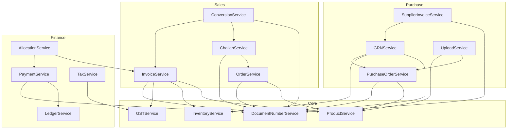

# Service Dependencies & Error Reference

Common patterns and references used across all services.

---

## Service Dependency Map



---

## Common Error Codes

### HTTP Status Codes

| Code | Meaning | When Used |
|------|---------|-----------|
| `200` | OK | Successful GET, PUT |
| `201` | Created | Successful POST |
| `400` | Bad Request | Validation failed, missing required fields |
| `401` | Unauthorized | Missing or invalid auth token |
| `403` | Forbidden | Valid token but insufficient permissions |
| `404` | Not Found | Resource doesn't exist or not in org |
| `409` | Conflict | Duplicate entry, concurrent modification |
| `422` | Unprocessable | Business rule violation |
| `500` | Server Error | Unexpected exception |

### Business Error Codes

| Error Code | Description | Service |
|------------|-------------|---------|
| `INVALID_GST` | Invalid GST number format | GSTService |
| `INVALID_HSN` | Invalid HSN code | ProductService |
| `DUPLICATE_INVOICE` | Invoice number already exists | InvoiceService |
| `DUPLICATE_PRODUCT` | Product with same name/code exists | ProductService |
| `INSUFFICIENT_STOCK` | Not enough stock for operation | InventoryService |
| `ALREADY_ALLOCATED` | Payment already fully allocated | AllocationService |
| `ALREADY_INVOICED` | Order/Challan already has invoice | ConversionService |
| `INVALID_STATUS` | Cannot perform action in current status | Multiple |
| `EXPIRED_PRODUCT` | Product is past expiry date | InventoryService |
| `INVALID_QUANTITY` | Return qty exceeds returnable | ReturnService |

---

## Database Schema Reference

### Core Tables by Domain

#### Sales Domain
| Table | Schema | Used By |
|-------|--------|---------|
| `sales.orders` | Order headers | OrderService |
| `sales.order_items` | Order line items | OrderService |
| `sales.invoices` | Invoice headers | InvoiceService |
| `sales.invoice_items` | Invoice line items | InvoiceService |
| `sales.delivery_challans` | Challan headers | ChallanService |
| `sales.delivery_challan_items` | Challan line items | ChallanService |

#### Purchase Domain
| Table | Schema | Used By |
|-------|--------|---------|
| `procurement.purchase_orders` | PO headers | PurchaseOrderService |
| `procurement.purchase_order_items` | PO line items | PurchaseOrderService |
| `procurement.goods_receipt_notes` | GRN headers | GRNService |
| `procurement.grn_items` | GRN line items | GRNService |
| `procurement.supplier_invoices` | Supplier invoice headers | SupplierInvoiceService |
| `procurement.supplier_invoice_items` | Invoice line items | SupplierInvoiceService |
| `procurement.purchase_returns` | Return headers | PurchaseReturnService |
| `procurement.purchase_return_items` | Return line items | PurchaseReturnService |

#### Finance Domain
| Table | Schema | Used By |
|-------|--------|---------|
| `financial.payments` | Payment records | PaymentService |
| `financial.payment_allocations` | Payment to invoice mapping | AllocationService |
| `financial.journal_entries` | Journal headers | JournalService |
| `financial.journal_entry_lines` | Journal lines | JournalService |
| `financial.chart_of_accounts` | Account master | JournalService |
| `financial.expense_claims` | Expense claims | ExpenseService |
| `financial.tax_entries` | Tax transactions | TaxService |

#### Inventory Domain
| Table | Schema | Used By |
|-------|--------|---------|
| `inventory.products` | Product master | ProductService |
| `inventory.batches` | Batch/lot tracking | InventoryService |
| `inventory.stock_movements` | Stock in/out log | InventoryService |
| `inventory.stock_writeoffs` | Write-off records | WriteoffService |

#### Master Domain
| Table | Schema | Used By |
|-------|--------|---------|
| `parties.customers` | Customer master | CustomerService |
| `parties.suppliers` | Supplier master | SupplierService |
| `master.employees` | Employee master | EmployeeService |
| `master.org_branches` | Branch master | DepartmentBranchService |
| `master.bank_accounts` | Bank accounts | BankAccountService |

---

## Usage Example Pattern

All services follow this pattern:

```python
from fastapi import APIRouter, Depends, HTTPException
from app.core.auth.tenant_service import get_tenant_aware_db, TenantAwareSession
from app.core.auth.org_context import get_org_context, OrgContext
from app.core.security.permissions import PermissionChecker
from app.api.services.{domain}.{service}.service import ServiceName

router = APIRouter()

@router.get("/items")
async def get_items(
    _: dict = Depends(PermissionChecker("resource", "view")),
    db: TenantAwareSession = Depends(get_tenant_aware_db),
    context: OrgContext = Depends(get_org_context)
):
    try:
        # Call service method - org_id filtering is automatic
        items = ServiceName.list_items(db, str(context.org_id))
        return {"items": items}
    except Exception as e:
        raise HTTPException(status_code=500, detail=str(e))
```

---

## Exception Handling Pattern

```python
from fastapi import HTTPException
import logging

logger = logging.getLogger(__name__)

@router.post("/create")
async def create_item(request: CreateRequest, db: TenantAwareSession, context: OrgContext):
    try:
        # Attempt operation
        result = ServiceName.create(db, data)
        db.commit()
        return result
        
    except HTTPException:
        db.rollback()
        raise  # Re-raise HTTP exceptions as-is
        
    except ValueError as e:
        db.rollback()
        raise HTTPException(status_code=400, detail=str(e))
        
    except Exception as e:
        db.rollback()
        logger.error(f"Error creating item: {e}")
        raise HTTPException(status_code=500, detail="Internal server error")
```
