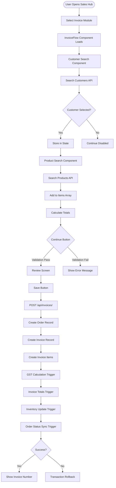

# Sales Invoice Creation - Visual Flow Diagram

## 🔄 Complete Data Flow



## 📊 State Management Flow

```
Frontend State Tree:
├── selectedCustomer
│   ├── customer_id
│   ├── customer_name
│   └── customer_details
├── invoice
│   ├── customer_id
│   ├── items[]
│   │   ├── product_id
│   │   ├── quantity
│   │   ├── unit_price
│   │   ├── discount_percent
│   │   └── line_total
│   ├── subtotal_amount
│   ├── tax_amount
│   └── final_amount
└── UI State
    ├── currentStep (1 or 2)
    ├── saving (boolean)
    └── message (success/error)
```

## 🗄️ Database Transaction Flow

```sql
BEGIN TRANSACTION;

-- Step 1: Insert Order
INSERT INTO sales.orders (...) RETURNING order_id;

-- Step 2: Insert Invoice  
INSERT INTO sales.invoices (...) RETURNING invoice_id;

-- Step 3: Insert Items (foreach item)
INSERT INTO sales.invoice_items (...);
  ↓
  TRIGGER: calculate_gst_on_invoice_item (BEFORE INSERT)
  ↓
  TRIGGER: update_invoice_totals (AFTER INSERT)
  ↓
  TRIGGER: inventory_update_on_sale (AFTER INSERT)

-- Step 4: Update Order Status
TRIGGER: sync_order_invoice_status (AFTER INSERT on invoices)

COMMIT;
```

## 🔴 Current Breakpoints

### Frontend Issues:
```
1. Customer Selection → Continue Button
   Problem: State not syncing
   Location: InvoiceFlow.js:792
   
2. Remove Customer → Clear State
   Problem: Partial state clear
   Location: InvoiceFlow.js:261-273
```

### Backend Issues:
```
1. Invoice Items → Database
   Problem: Items not persisting
   Location: invoices.py:169-232
   
2. Batch Selection → Inventory
   Problem: Batch_id often null
   Location: invoices.py:193-201
```

### Trigger Issues:
```
1. GST Calculation
   Status: ✅ Fixed
   
2. Invoice Totals
   Status: ✅ Working
   
3. Inventory Update  
   Status: ⚠️ Only works with batch_id
   
4. Order Status Sync
   Status: ✅ Fixed
```

## 🧪 Test Sequence

### Happy Path:
1. Open Sales Hub ✅
2. Click Invoice ✅
3. Search "Neha" ✅
4. Select Customer ✅
5. Search "Atlas" ✅
6. Add Product ✅
7. Set Quantity: 5 ✅
8. Click Continue ⚠️
9. Review Invoice ⚠️
10. Click Save ❌
11. Verify in DB ❌

### Current Status:
- **Steps 1-7:** Working
- **Step 8:** Continue button issue
- **Steps 9-11:** Blocked by step 8

## 🔧 Debug Points

### Frontend Logging:
```javascript
// Add to check state
console.log('selectedCustomer:', selectedCustomer);
console.log('invoice:', invoice);
console.log('validation:', validateInvoice());
```

### Backend Logging:
```python
logger.info(f"Creating invoice for customer {invoice_data.get('customer_id')}")
logger.info(f"Order created: {order_id}")
logger.info(f"Invoice created: {invoice_id}")
logger.info(f"Items created: {items_created}")
```

### Database Checks:
```sql
-- Real-time monitoring
SELECT COUNT(*) FROM sales.invoices WHERE created_at > NOW() - INTERVAL '1 minute';
SELECT COUNT(*) FROM sales.invoice_items WHERE created_at > NOW() - INTERVAL '1 minute';
SELECT COUNT(*) FROM sales.orders WHERE created_at > NOW() - INTERVAL '1 minute';
```