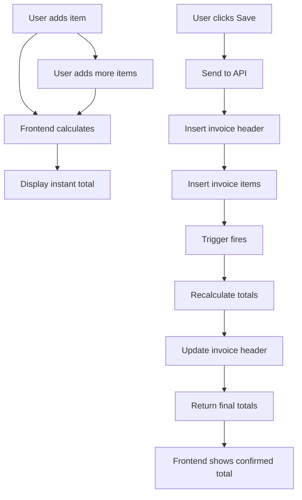

# 📊 Sales Invoice - Best Practices Implementation

## 🎯 Dual Calculation Strategy
**Frontend:** Calculate for immediate UI feedback  
**Backend:** Recalculate via trigger for data integrity

---

## 🖥️ FRONTEND IMPLEMENTATION

### 1. Real-time Calculation in React
**File:** `frontend/src/components/sales/InvoiceFlow.js`

```javascript
// Calculate totals whenever items change
useEffect(() => {
    const calculateTotals = () => {
        let subtotal = 0;
        let totalTax = 0;
        let totalDiscount = 0;
        
        invoice.items.forEach(item => {
            const itemSubtotal = item.quantity * item.unit_price;
            const discount = (itemSubtotal * item.discount_percent) / 100;
            const taxable = itemSubtotal - discount;
            const gst = (taxable * 18) / 100; // Assuming 18% GST
            
            subtotal += itemSubtotal;
            totalDiscount += discount;
            totalTax += gst;
        });
        
        setInvoice(prev => ({
            ...prev,
            subtotal_amount: subtotal,
            discount_amount: totalDiscount,
            tax_amount: totalTax,
            final_amount: subtotal - totalDiscount + totalTax
        }));
    };
    
    calculateTotals();
}, [invoice.items]);
```

### 2. Display Real-time Totals
```jsx
<div className="invoice-summary">
    <p>Subtotal: ₹{invoice.subtotal_amount.toFixed(2)}</p>
    <p>Discount: ₹{invoice.discount_amount.toFixed(2)}</p>
    <p>Tax: ₹{invoice.tax_amount.toFixed(2)}</p>
    <p className="total">Total: ₹{invoice.final_amount.toFixed(2)}</p>
</div>
```

---

## 🔧 BACKEND IMPLEMENTATION

### 1. API Endpoint (Receives but Doesn't Trust)
**File:** `backend/app/api/routes/invoices.py`

```python
@router.post("/invoices/")
async def create_invoice(invoice_data: dict, db: Session = Depends(get_db)):
    # Receive frontend calculations but don't use them for final storage
    frontend_total = invoice_data.get("final_amount", 0)
    
    # Create invoice header (totals will be NULL initially)
    invoice = {
        "customer_id": invoice_data["customer_id"],
        "payment_terms": invoice_data.get("payment_terms", "cash"),
        # Don't set totals - let trigger calculate them
    }
    
    # Insert invoice
    result = db.execute(text("""
        INSERT INTO sales.invoices (customer_id, payment_terms, ...)
        VALUES (:customer_id, :payment_terms, ...)
        RETURNING invoice_id
    """), invoice)
    
    invoice_id = result.scalar()
    
    # Insert items (trigger will calculate totals)
    for item in invoice_data["items"]:
        db.execute(text("""
            INSERT INTO sales.invoice_items (...)
            VALUES (...)
        """), item)
    
    # Verify backend calculation matches frontend
    final_total = db.execute(text("""
        SELECT final_amount FROM sales.invoices WHERE invoice_id = :id
    """), {"id": invoice_id}).scalar()
    
    if abs(final_total - frontend_total) > 0.01:
        logger.warning(f"Total mismatch: Frontend={frontend_total}, Backend={final_total}")
    
    return {"invoice_id": invoice_id, "final_amount": final_total}
```

### 2. Database Trigger (Source of Truth)
**Already Implemented in:** `DEPLOY_INVOICE_TRIGGERS.sql`

The trigger:
- Fires AFTER INSERT on invoice_items
- Calculates totals from actual database data
- Updates invoice header with accurate totals
- Ensures data integrity

---

## 🔄 COMPLETE FLOW



---

## ✅ ADVANTAGES

### User Experience
- ✅ Instant feedback while adding items
- ✅ No lag for calculations
- ✅ Smooth, responsive UI

### Data Integrity
- ✅ Server validates all calculations
- ✅ Protection against tampering
- ✅ Consistent calculations across all clients

### Debugging
- ✅ Can compare frontend vs backend totals
- ✅ Log mismatches for investigation
- ✅ Easy to identify calculation bugs

---

## 🧪 TESTING CHECKLIST

### Frontend Tests
- [ ] Add item → Total updates instantly
- [ ] Change quantity → Total recalculates
- [ ] Apply discount → Total adjusts
- [ ] Remove item → Total decreases

### Backend Tests
- [ ] Insert items → Trigger fires
- [ ] Totals match expected values
- [ ] Mismatch logging works
- [ ] Edge cases handled (0 items, negative values)

### Integration Tests
- [ ] Frontend total matches backend total
- [ ] Large invoices calculate correctly
- [ ] Decimal precision maintained
- [ ] Tax calculations accurate

---

## 🚨 MONITORING

### Add Logging for Mismatches
```python
# In API response
if abs(backend_total - frontend_total) > 0.01:
    logger.error(f"""
        Invoice {invoice_id} total mismatch:
        Frontend: {frontend_total}
        Backend: {backend_total}
        Difference: {backend_total - frontend_total}
        Items: {len(items)}
    """)
```

### Track Metrics
- Percentage of mismatches
- Average difference amount
- Which products cause issues
- Which users have most mismatches

---

## 📋 IMPLEMENTATION STATUS

### Current State
- ✅ Backend trigger ready
- ✅ Frontend shows totals
- ⚠️ Frontend calculations need GST logic
- ⚠️ Mismatch logging not implemented

### Next Steps
1. Add proper GST calculation to frontend
2. Implement mismatch logging
3. Add total validation before save
4. Test with various tax scenarios

---

**Best Practice Achieved:** Frontend for speed, Backend for truth! 🎯