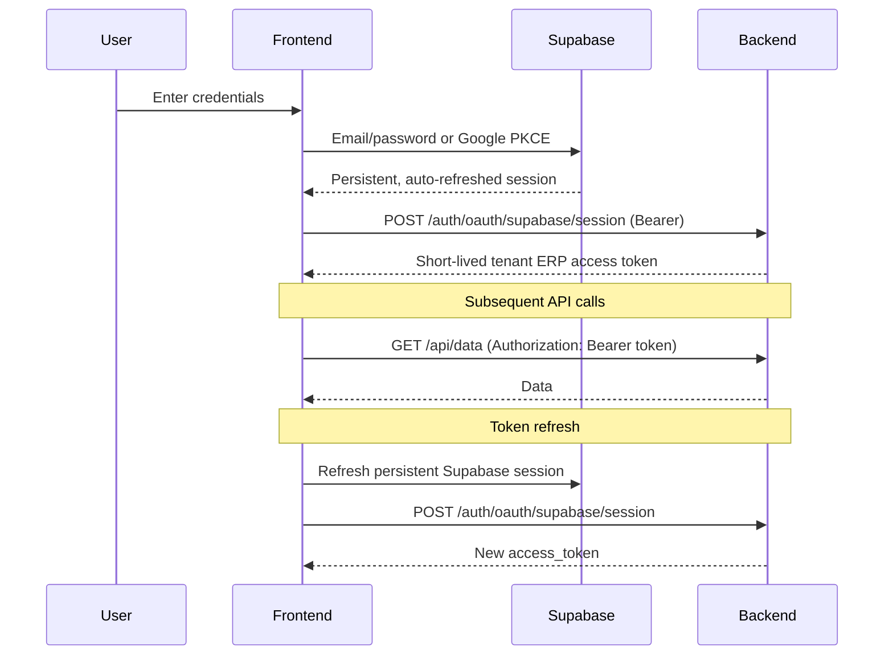

# 🔐 Security Guide

> **Security best practices** for the frontend application

---

## 🎯 Overview

Frontend security focuses on:
1. **Authentication** - Secure login and token management
2. **Authorization** - Role-based access control
3. **Data Protection** - Input validation, XSS prevention
4. **Secure Communication** - HTTPS, CORS

---

## 🔑 Authentication

### JWT Token Flow



### Token Storage And Refresh

```typescript
const supabase = createClient(url, anonKey, {
    auth: {
        persistSession: true,
        autoRefreshToken: true,
        detectSessionInUrl: true,
        flowType: 'pkce',
    },
});

// SIGNED_IN and TOKEN_REFRESHED exchange the verified Supabase bearer for a
// fresh one-hour ERP token. No ERP refresh token or password is stored.
```

---

## 🛡️ Authorization (RBAC)

### Role-Based Access Control

```typescript
// types/auth.types.ts
export type Role = 'owner' | 'manager' | 'pharmacist' | 'salesperson' | 'viewer';

export interface Permission {
    module: string;
    action: 'view' | 'create' | 'edit' | 'delete';
}

export interface User {
    id: number;
    email: string;
    role: Role;
    permissions: Permission[];
    organization_id: string;
    branch_id?: string;
}
```

### Permission Checking

```typescript
// hooks/usePermission.ts
import { useAuth } from '../contexts/AuthContext';

export function usePermission() {
    const { user } = useAuth();

    const hasPermission = (module: string, action: string): boolean => {
        if (!user) return false;
        
        // Owner has all permissions
        if (user.role === 'owner') return true;
        
        return user.permissions.some(
            p => p.module === module && p.action === action
        );
    };

    const hasRole = (roles: Role[]): boolean => {
        return user ? roles.includes(user.role) : false;
    };

    return { hasPermission, hasRole, user };
}
```

### Protected Components

```tsx
// components/ProtectedRoute.tsx
interface ProtectedRouteProps {
    children: React.ReactNode;
    requiredPermission?: { module: string; action: string };
    requiredRoles?: Role[];
}

export function ProtectedRoute({
    children,
    requiredPermission,
    requiredRoles
}: ProtectedRouteProps) {
    const { hasPermission, hasRole, user } = usePermission();

    if (!user) {
        return <Navigate to="/login" />;
    }

    if (requiredPermission) {
        const { module, action } = requiredPermission;
        if (!hasPermission(module, action)) {
            return <AccessDenied />;
        }
    }

    if (requiredRoles && !hasRole(requiredRoles)) {
        return <AccessDenied />;
    }

    return <>{children}</>;
}
```

### Usage

```tsx
// App.tsx
<Route
    path="/settings/users"
    element={
        <ProtectedRoute requiredRoles={['owner', 'manager']}>
            <UserManagement />
        </ProtectedRoute>
    }
/>

// Button with permission check
function DeleteButton({ invoiceId }) {
    const { hasPermission } = usePermission();

    if (!hasPermission('invoices', 'delete')) {
        return null;
    }

    return <button onClick={() => deleteInvoice(invoiceId)}>Delete</button>;
}
```

---

## 🛡️ XSS Prevention

### Sanitize User Input

```typescript
// ❌ Dangerous: Direct HTML insertion
element.innerHTML = userInput;

// ✅ Safe: React automatically escapes
<div>{userInput}</div>

// ✅ Safe: Using DOMPurify for rich text
import DOMPurify from 'dompurify';

function RichText({ html }: { html: string }) {
    const clean = DOMPurify.sanitize(html, {
        ALLOWED_TAGS: ['b', 'i', 'em', 'strong', 'p', 'br'],
        ALLOWED_ATTR: []
    });
    
    return <div dangerouslySetInnerHTML={{ __html: clean }} />;
}
```

### Content Security Policy

```html
<!-- index.html -->
<meta
    http-equiv="Content-Security-Policy"
    content="
        default-src 'self';
        script-src 'self';
        style-src 'self' 'unsafe-inline';
        img-src 'self' data: https:;
        connect-src 'self' https://api.example.com;
    "
/>
```

---

## ✅ Input Validation

### Client-Side Validation

```typescript
// validators.ts
export const validators = {
    email: (value: string): string | null => {
        const pattern = /^[^\s@]+@[^\s@]+\.[^\s@]+$/;
        return pattern.test(value) ? null : 'Invalid email format';
    },

    phone: (value: string): string | null => {
        const clean = value.replace(/\D/g, '');
        return clean.length === 10 ? null : 'Phone must be 10 digits';
    },

    gst: (value: string): string | null => {
        const pattern = /^[0-9]{2}[A-Z]{5}[0-9]{4}[A-Z]{1}[1-9A-Z]{1}Z[0-9A-Z]{1}$/;
        return pattern.test(value) ? null : 'Invalid GST format';
    },

    required: (value: any): string | null => {
        if (value === null || value === undefined || value === '') {
            return 'This field is required';
        }
        return null;
    },

    minLength: (min: number) => (value: string): string | null => {
        return value.length >= min ? null : `Minimum ${min} characters`;
    },

    maxLength: (max: number) => (value: string): string | null => {
        return value.length <= max ? null : `Maximum ${max} characters`;
    },

    positiveNumber: (value: number): string | null => {
        return value > 0 ? null : 'Must be a positive number';
    }
};
```

### Form Validation Example

```tsx
function CustomerForm() {
    const [errors, setErrors] = useState<Record<string, string>>({});

    const validate = (data: CustomerData): boolean => {
        const newErrors: Record<string, string> = {};

        const emailError = validators.email(data.email);
        if (emailError) newErrors.email = emailError;

        const phoneError = validators.phone(data.phone);
        if (phoneError) newErrors.phone = phoneError;

        if (data.gst_number) {
            const gstError = validators.gst(data.gst_number);
            if (gstError) newErrors.gst_number = gstError;
        }

        setErrors(newErrors);
        return Object.keys(newErrors).length === 0;
    };

    const handleSubmit = (e: React.FormEvent) => {
        e.preventDefault();
        if (validate(formData)) {
            saveCustomer(formData);
        }
    };
}
```

---

## 🔒 Sensitive Data Handling

### Never Log Sensitive Data

```typescript
// ❌ Bad
console.log('User logged in:', { email, password });

// ✅ Good
console.log('User logged in:', { email });
```

### Mask Sensitive Fields

```typescript
function maskPhone(phone: string): string {
    return phone.replace(/(\d{3})\d{4}(\d{3})/, '$1****$2');
}

function maskGST(gst: string): string {
    return gst.slice(0, 2) + '****' + gst.slice(-4);
}
```

### Clear Sensitive Data on Logout

```typescript
function logout() {
    // Clear tokens
    tokenService.clearTokens();
    
    // Clear sensitive cached data
    sessionStorage.clear();
    
    // Clear IndexedDB if needed
    indexedDB.deleteDatabase('PharmaERPOffline');
    
    // Redirect to login
    window.location.href = '/login';
}
```

---

## 🔐 Secure Communication

### HTTPS Only

```typescript
// Enforce HTTPS in production
if (
    import.meta.env.PROD &&
    window.location.protocol !== 'https:'
) {
    window.location.href = window.location.href.replace('http:', 'https:');
}
```

### CORS Configuration

Backend handles CORS, but frontend should:

```typescript
// Only call allowed origins
const API_URL = import.meta.env.VITE_API_URL;
// Never construct URLs from user input
```

---

## 🛡️ Security Checklist

### Authentication
- [ ] Tokens stored securely
- [ ] Auto-refresh before expiry
- [ ] Logout clears all tokens
- [ ] Session timeout implemented

### Authorization
- [ ] Role-based access control
- [ ] UI elements hidden for unauthorized users
- [ ] Server-side authorization always checked

### Input Validation
- [ ] All inputs validated client-side
- [ ] Never trust client-side validation alone
- [ ] Sanitize before displaying user content

### Sensitive Data
- [ ] No sensitive data in logs
- [ ] Sensitive fields masked in UI
- [ ] Data cleared on logout

### Communication
- [ ] HTTPS enforced
- [ ] API keys in environment variables
- [ ] No secrets in frontend code

---

## 📚 Further Reading

- [OWASP Top 10](https://owasp.org/www-project-top-ten/)
- [React Security Best Practices](https://reactjs.org/docs/security.html)
