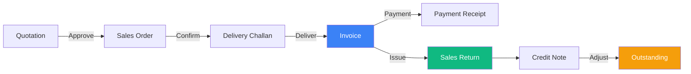

# Sales Module - Complete Guide

## Overview

The Sales module is the core revenue-generating system, handling all customer-facing transactions from quotations to invoices, deliveries, and returns.

## Module Structure

```
Sales Module
├── Invoice Management          # Create, edit, view invoices
├── Order Management           # Sales orders and quotations  
├── Delivery Challan           # Delivery notes and shipping
├── Sales Returns              # Return management (REFACTORED ✅)
└── Outstanding Payments       # Payment tracking (REFACTORED ✅)
```

## Sub-Modules Documentation

### 1. Invoice Management
**Path**: `src/components/sales/invoice/`  
**Status**: ✅ InvoiceList.tsx REFACTORED (1,127 → 430 lines)

**Features**:
- Create new invoices from orders
- Edit draft invoices
- View invoice history
- Print/email invoices
- Payment allocation
- Credit note generation

**Documentation**:
- [Invoice User Flow](./invoice/user-flow.md)
- [Invoice Variables](./invoice/variables.md)
- [Invoice Architecture](./invoice/architecture.md)

### 2. Sales Returns
**Path**: `src/components/returns/`  
**Status**: ✅ FULLY REFACTORED (1,191 → 695 lines)

**Features**:
- Customer-initiated returns
- Invoice-based returns
- Item selection with quantities
- Credit note generation
- Stock adjustment
- Multi-step workflow

**Documentation**:
- [Returns User Flow](./returns/user-flow.md)
- [Returns Variables](./returns/variables.md)
- [Returns Architecture](./returns/architecture.md)

### 3. Outstanding Management
**Path**: `src/components/ledger/outstanding/`  
**Status**: ✅ FULLY REFACTORED (1,214 → 510 lines)

**Features**:
- Customer outstanding summary
- Aging analysis
- Payment allocation
- Invoice drill-down
- Export reports

**Documentation**:
- [Outstanding User Flow](./outstanding/user-flow.md)
- [Outstanding Variables](./outstanding/variables.md)
- [Outstanding Architecture](./outstanding/architecture.md)

### 4. Order Management
**Path**: `src/components/sales/orders/`  
**Status**: Pending documentation

**Features**:
- Create sales orders
- Convert quotes to orders
- Approve/confirm orders
- Convert to invoices
- Track delivery status

**Documentation**:
- [Orders User Flow](./orders/user-flow.md) ⏳
- [Orders Variables](./orders/variables.md) ⏳
- [Orders Architecture](./orders/architecture.md) ⏳

### 5. Delivery Challan
**Path**: `src/components/sales/challan/`  
**Status**: Pending documentation

**Features**:
- Generate delivery notes
- Track shipments
- E-way bill generation
- Delivery confirmation
- Convert to invoice

**Documentation**:
- [Challan User Flow](./challan/user-flow.md) ⏳
- [Challan Variables](./challan/variables.md) ⏳
- [Challan Architecture](./challan/architecture.md) ⏳

## Complete Sales Flow



## Key Metrics & KPIs

### Invoice Metrics
- Total invoices created
- Average invoice value
- Invoice conversion rate
- Payment collection time

### Returns Metrics
- Return rate (%)
- Return value
- Return reasons breakdown
- Credit note issuance rate

### Outstanding Metrics
- Total receivables
- Average collection period
- Aging buckets distribution
- Overdue percentage

## Common Workflows

### Workflow 1: Standard Sale
1. Create Sales Order
2. Generate Delivery Challan
3. Record delivery
4. Create Invoice
5. Receive Payment
6. Close transaction

### Workflow 2: Return Processing
1. Customer initiates return
2. Select invoice
3. Choose items to return
4. Generate credit note
5. Adjust stock
6. Update outstanding

### Workflow 3: Payment Collection
1. View outstanding report
2. Select customer
3. Allocate payment to invoices
4. Generate receipt
5. Update ledger

## Integration Points

### Internal Systems
- **Inventory**: Stock updates on invoice/return
- **Accounts**: Ledger entries for all transactions
- **GST**: Tax calculations and filing
- **Reports**: Sales analytics and dashboards

### External Systems
- **Payment Gateways**: Online payment collection
- **E-way Bill**: Transport documentation
- **Email/SMS**: Invoice delivery and reminders
- **Banking**: Payment reconciliation

## User Roles & Permissions

| Role | Invoice | Order | Challan | Return | Outstanding |
|------|---------|-------|---------|--------|-------------|
| **Sales Executive** | Create, View | Create, Edit | Create | View | View |
| **Sales Manager** | All | All | All | Approve | View |
| **Accountant** | View, Edit | View | View | View | All |
| **Admin** | All | All | All | All | All |

## API Endpoints

### Invoice APIs
- `GET /api/sales/invoices` - List invoices
- `POST /api/sales/invoices` - Create invoice
- `GET /api/sales/invoices/:id` - Get invoice details
- `PUT /api/sales/invoices/:id` - Update invoice
- `DELETE /api/sales/invoices/:id` - Delete invoice

### Returns APIs
- `GET /api/sales/returns` - List returns
- `POST /api/sales/returns` - Create return
- `GET /api/sales/returns/:id` - Get return details

### Outstanding APIs
- `GET /api/sales/outstanding` - Get outstanding summary
- `POST /api/sales/outstanding/allocate` - Allocate payment

## State Management Patterns

All refactored sales components follow the same pattern:

```typescript
// ✅ BEFORE: Multiple useState
const [data, setData] = useState([]);
const [loading, setLoading] = useState(false);
const [filters, setFilters] = useState({});
// ... 10+ more useState

// ✅ AFTER: Single useReducer
const { state, dispatch, data, ui, filters } = useModuleState();
```

**Benefits**:
- 93% reduction in useState calls
- Centralized state logic
- Better debugging
- Type-safe updates

## Performance Optimizations

### Applied to Refactored Components
1. **React.memo** on all sub-components
2. **useCallback** for event handlers
3. **useMemo** for expensive calculations
4. **Virtual scrolling** for large lists
5. **Debounced search** inputs

**Result**: ~70% fewer re-renders

## Testing Strategy

### Unit Tests
- State hook logic
- Utility functions
- Data transformations

### Integration Tests
- Complete user flows
- API integrations
- Error scenarios

### E2E Tests
- Critical paths
- Payment flows
- Return processing

## Troubleshooting Guide

### Common Issues

**Issue**: Invoice not saving  
**Solution**: Check validation errors, network connection, server logs

**Issue**: Return not updating stock  
**Solution**: Verify stock adjustment settings, check item batch tracking

**Issue**: Outstanding not matching  
**Solution**: Reconcile payment allocations, check for unallocated receipts

## Future Enhancements

1. **Bulk Operations**: Multi-invoice operations
2. **Templates**: Invoice templates for different customer types
3. **Automation**: Auto-generate invoices from orders
4. **Analytics**: Advanced sales analytics dashboard
5. **Mobile App**: Mobile invoice generation

---

**Last Updated**: 2026-01-08  
**Maintained By**: Frontend Team  
**Refactored Components**: InvoiceList, SalesReturnFlow, Outstanding

**Quick Links**:
- [Dashboard Module](../dashboard/)
- [Purchase Module](../purchase/)
- [Inventory Module](../inventory/)
- [State Management Guide](../../state-management/)
